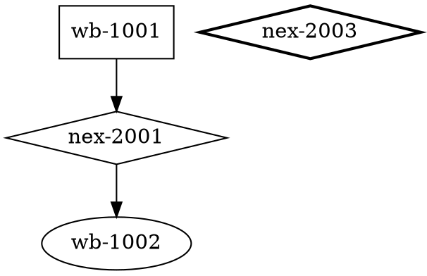

# Output Schemas


## validate

```json
{
  "is_valid": false,
  "violations": [
    {
      "type": "dangling_reference",
      "feature_id": "wb-XXXX",
      "message": "Human-readable description"
    },
    {
      "type": "orphan_nexus",
      "feature_id": "nex-XXXX",
      "message": "Human-readable description"
    },
    {
      "type": "cycle",
      "feature_ids": ["cat-XXXX", "nex-YYYY", "cat-ZZZZ", "nex-WWWW"],
      "message": "Human-readable description"
    },
    {
      "type": "missing_divide",
      "feature_id": "wb-XXXX",
      "message": "Human-readable description"
    }
  ]
}
```

- `dangling_reference`: `feature_id` is the flowpath id whose `toid` references a non-existent nexus.
- `orphan_nexus`: `feature_id` is the nexus id.
- `cycle`: `feature_ids` is an array of node ids forming the cycle in the bipartite catchment-nexus graph.
- `missing_divide`: `feature_id` is the flowpath id whose `divide_id` references a non-existent divide.
- Every violation must have a non-empty `message` string.

## drainage

```json
{
  "wb-1001": 5.20,
  "wb-1002": 13.60
}
```

Flat JSON object. Keys are flowpath ids of valid (non-error) flowpaths only. Values are floats rounded to 2 decimal places representing total accumulated upstream drainage area in sq km.

## subset

```json
{
  "flowpaths": [
    {"id": "wb-XXXX", "toid": "nex-YYYY", "divide_id": "cat-XXXX", "areasqkm": 5.2, "lengthkm": 3.1, "type": "network", "hydroseq": 110, "mainstem": 10001}
  ],
  "divides": [
    {"divide_id": "cat-XXXX", "id": "wb-XXXX", "toid": "nex-YYYY", "areasqkm": 5.2, "type": "network", "has_flowline": 1}
  ],
  "nexuses": [
    {"id": "nex-YYYY", "toid": "cat-XXXX", "type": "nexus"}
  ]
}
```

Each record contains all columns from its database source table (`flowpaths`, `divides`, `nexus` respectively).

## realize

```json
{
  "global": {
    "formulations": [
      {
        "name": "bmi_multi",
        "params": {
          "model_type_name": "<from template>",
          "forcing_file": "",
          "init_config": "",
          "allow_exceed_end_time": true,
          "main_output_variable": "Q_OUT",
          "modules": [
            {
              "name": "bmi_c++",
              "params": {
                "model_type_name": "bmi_c++_sloth",
                "library_file": "/models/sloth/libslothmodel.so",
                "init_config": "/dev/null",
                "allow_exceed_end_time": true,
                "main_output_variable": "z",
                "uses_forcing_file": false,
                "model_params": {
                  "sloth_ice_fraction_schaake(1,double,m,node)": 0.0,
                  "...": "..."
                }
              }
            },
            {
              "name": "bmi_fortran",
              "params": {
                "model_type_name": "bmi_fortran_noahowp",
                "library_file": "/models/noahowp/libsurfacebmi.so",
                "forcing_file": "",
                "init_config": "/configs/noahowp/{{id}}.namelist.input",
                "allow_exceed_end_time": true,
                "main_output_variable": "QINSUR",
                "variables_names_map": {
                  "PRCPNONC": "atmosphere_water__liquid_equivalent_precipitation_rate",
                  "...": "..."
                },
                "uses_forcing_file": false
              }
            },
            {
              "name": "bmi_c",
              "params": {
                "model_type_name": "bmi_c_cfe",
                "library_file": "/models/cfe/libcfebmi.so",
                "forcing_file": "",
                "init_config": "/configs/cfe/{{id}}_bmi_config.ini",
                "allow_exceed_end_time": true,
                "main_output_variable": "Q_OUT",
                "registration_function": "register_bmi_cfe",
                "variables_names_map": {"...": "..."},
                "uses_forcing_file": false
              }
            }
          ],
          "uses_forcing_file": false
        }
      }
    ],
    "forcing": {
      "file_pattern": ".*{{id}}.*\\.csv",
      "path": "/data/forcing/",
      "provider": "CsvPerFeature"
    }
  },
  "time": {
    "start_time": "2020-01-01 00:00:00",
    "end_time": "2020-12-31 23:00:00",
    "output_interval": 3600
  },
  "catchments": {
    "cat-XXXX": {
      "formulations": [
        "<same structure as global formulations, but {{id}} resolved to this divide id in all init_config paths>"
      ],
      "forcing": {
        "<forcing section from template>"
      }
    }
  }
}
```

Key rules:
- `global` and `time` sections are derived directly from `/app/models.json`.
- Module order in `global.formulations[0].params.modules` must match the template: SLOTH (bmi_c++), NoahOWP (bmi_fortran), CFE (bmi_c).
- `global.formulations` retains `{{id}}` placeholders unresolved.
- Per-catchment entries substitute `{{id}}` with the divide id only in `init_config` values.
- Each catchment must produce distinct `init_config` paths (2 per catchment: NoahOWP and CFE configs).
- All parameter fields from the template (model_params, variables_names_map, registration_function, etc.) are preserved exactly.

## route-config

```yaml
supernetwork_parameters:
  title: "Upstream network of <nexus_id>"
  geo_file_type: HYFeaturesNetwork
  terminal_nexus: "<nexus_id>"
  columns:
    key: id
    downstream: toid
    dx: length_m
    n: n
    s0: So
    bw: BtmWdth
    tw: TopWdth
    musk: MusK
    musx: MusX

segments:
  - id: "wb-XXXX"
    downstream: "wb-YYYY"
    length_m: 3100.0
    n: 0.060
    So: 0.0012
    BtmWdth: 3.5
    TopWdth: 7.0
    TopWdthCC: 10.0
    nCC: 0.120
    MusK: 3600.0
    MusX: 0.20
    ChSlp: 0.030
    Qi: 0.0
    Kchan: 0.0
    hydroseq: 110

compute_parameters:
  parallel_compute_method: serial
  compute_kernel: V02-structured
  assume_short_ts: true
  subnetwork_target_size: 10000

output_parameters:
  stream_output_directory: "/app/output/"
  stream_output_time: 1
  stream_output_type: ".nc"
```

Required segment fields: `id`, `downstream`, `length_m`, `n`, `So`, `BtmWdth`, `TopWdth`, `TopWdthCC`, `nCC`, `MusK`, `MusX`, `ChSlp`, `Qi`, `Kchan`, `hydroseq`.

- Attribute values are joined from the `flowpath_attributes` table in the database.
- `downstream` is resolved through the bipartite topology: flowpath -> nexus -> catchment -> downstream flowpath within the subset. Empty string `""` at the pour point (segments draining to the terminal nexus).
- Segments are sorted by `hydroseq` in descending order (upstream-first processing order).
- `supernetwork_parameters.title` follows the pattern `"Upstream network of <nexus_id>"`.
- `compute_parameters` and `output_parameters` use the exact fixed values shown above.

## graph



- Flowpath nodes use `shape=box`.
- Nexus nodes use `shape=diamond`.
- The pour-point (terminal) nexus additionally has `style=bold`.
- Directed edges represent routing flow: flowpath to its downstream nexus, and nexus to its downstream flowpath.
- Only edges within the upstream subset are included.
- The terminal nexus has no outgoing edges (it is the pour point of the subset).
- Output must be syntactically valid DOT and render successfully with `dot -Tsvg`.
