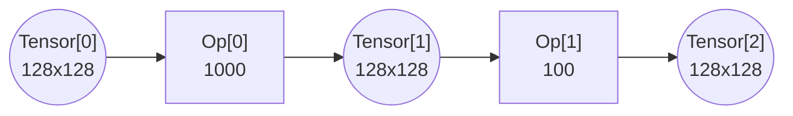
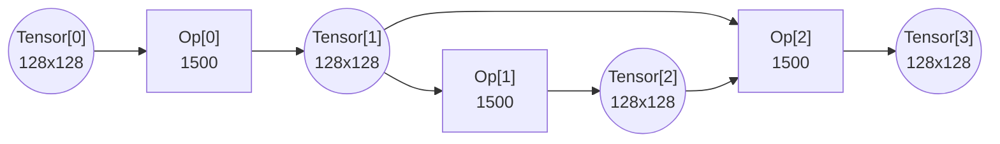
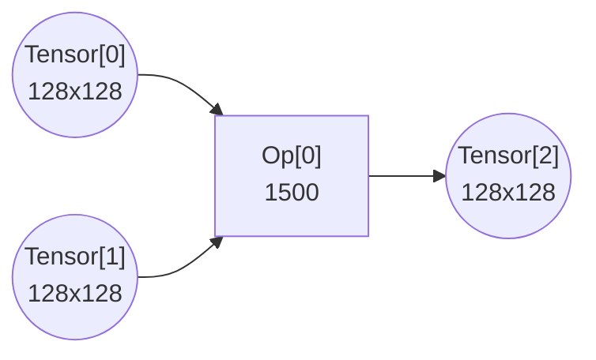
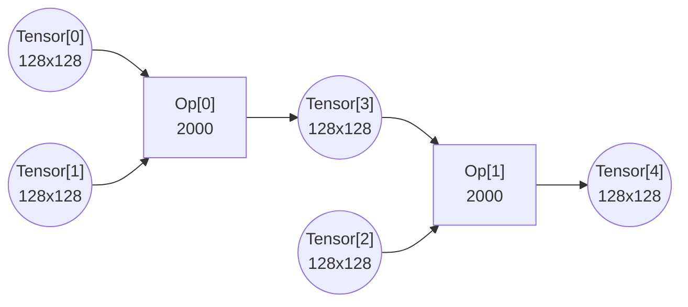
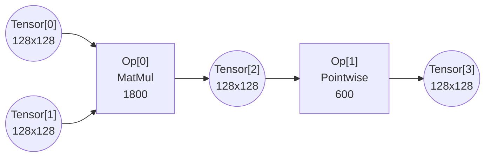

# Problem Description

Executing massive computational graphs on hardware with limited on-chip memory is one of the fundamental challenges in modern high-performance computing. When the tensors in a workload are orders of magnitude larger than the accelerator's fast memory, the system cannot simply "load and run." Instead, a complex dance of data movement must be orchestrated, breaking the computation into manageable pieces that fit within the hardware's strict physical constraints.

Your objective is to design a scheduler that analyzes a Directed Acyclic Graph (DAG) of operations and generates an execution strategy that minimizes total latency while respecting all memory capacity limits.

## The Memory Hierarchy

The system simulates a three-tier memory hierarchy common in AI accelerators.

The slow Memory has effectively infinite capacity but **asymmetric bandwidth**: reads and writes may proceed at different rates. All graph inputs start here, and all graph outputs must end here. Moving data between the slow memory and the fast memory incurs a time cost that depends on the direction of transfer.

The fast memory is a high-speed scratchpad with finite capacity (e.g., 50KB). Compute cores can only read/write data that is resident in the fast memory. Accessing this memory has infinite bandwidth (0 time cost), but data stored here consumes capacity.

Ephemeral data exists when operations are grouped into a single subgraph. The intermediate data flowing between them is considered "ephemeral". It passes directly from one operation to the next without ever touching the fast memory. This data consumes zero capacity and incurs zero time cost.

## The Compute Capability

To offset the potentially strict memory limitations, the hardware features a powerful subgraph execution engine. This allows you to execute a sequence of connected operations as a single group, or "subgraph." When operations are grouped into a subgraph, the intermediate data flowing between them becomes ephemeral, passing directly from one operation to the next without ever consuming valuable fast memory.

### Execution Granularity

To maximize performance, you must define exactly how the hardware slices the computation for each subgraph. This is controlled by a 3D configuration tuple `[w, h, k]`. This single configuration creates a unified execution grid that every operation in the subgraph must conform to.

The first two dimensions, `w` and `h`, define the spatial granularity. These values dictate the size of the output slice (`w x h`) produced by the subgraph. Whether the operation is a matrix multiplication or a simple pointwise operation, the hardware will process data in spatial slices of this size to maintain grouping compatibility.

The third dimension, `k`, defines the reduction depth. This is primarily for MatMul operations, where the hardware must compute a dot product over a potentially large inner dimension (`K`). For MatMul, the hardware processes the dot product in steps of size `k`. If `k` is smaller than the full reduction dimension, the system automatically enters an "output stationary" mode. It locks the output slice in the fast memory as an accumulator and iterates through the input matrices in slices per the granule, paying the compute cost for each step. For Pointwise operations, since they have no reduction dimension, `k` is ignored (effectively treating it as 1), and the operation simply executes once per spatial tile.

## The Execution Model

For every computation iteration, the system executes at your specified execution granularity. A slice of input data is loaded from the fast memory, the computation is performed, and the output slice is written back. This creates the primary physical constraint of the problem: The Working Set Limit. For any chosen execution granularity, the sum of the required input slices and the resulting output slices must fit simultaneously within the fast memory capacity. If the working set exceeds this limit, the execution will crash with an Out-Of-Memory (OOM) error.

Note that the hardware has a native execution granularity (e.g., 128x128) that applies uniformly across all three dimensions: the array's streaming depth in the reduction dimension equals its spatial extent, so `native_granularity: [128, 128]` means the native `w`, `h`, **and** `k` are all 128. The spatial dimensions (`w`, `h`) map to the physical array — if you select a spatial granularity smaller than the native size, the hardware 'pads' the execution, meaning you pay the full compute cost of the native size but produce less useful output, thereby increasing the total number of execution steps required. The reduction dimension (`k`) is streamed temporally through the array — choosing `k` below native simply runs fewer cycles, dividing compute proportionally without waste.

### Modeling Simplification for Experts

This problem uses an abstract hardware model to focus on scheduling logic rather than low-level cycle counting. First, regarding effective capacity, we treat `fast_memory_capacity` as the effective usable space for a single logical working set. We assume the hardware manages any additional physical overheads (like double-buffering) transparently. Second, regarding strict serialization, while the hardware pipelines operations within a subgraph to hide latency, we enforce strict serialization between subgraphs. This means subgraph N+1 cannot begin its memory operations until subgraph N has fully completed both its computation and memory transfers, **plus** a fixed transition overhead.

## The Objective

Performance is determined by a throughput-oriented roofline model. For every execution step of a subgraph, the latency is dictated by the bottleneck resource: either the time required to perform the arithmetic (compute bound) or the time required to transfer the boundary data (memory bound). The memory time for each step is the sum of the **read time** (data loaded from slow memory, divided by the read bandwidth) and the **write time** (data evicted to slow memory, divided by the write bandwidth).

Execution between distinct subgraphs is strictly serialized. Additionally, there is a fixed **transition cost** incurred between each pair of consecutive subgraphs, modeling pipeline drain and context-switch overhead. With N subgraphs, the total latency equals the sum of all subgraph latencies plus (N-1) transition costs.

Your task is to produce a valid execution schedule — a complete list of subgraphs and their respective execution granularity — that covers every operation in the graph at least once, while minimizing the sum of these latencies.

## Input / Output Format

### Input

The problem is specified in a JSON file containing the graph topology and hardware specs. Specifically, `tensor[i]` is a graph input if no operation produces it, and `tensor[j]` is a graph output if no operation consumes it. At the beginning of the computation, all graph inputs already reside in the slow memory. At the end of the computation, all graph outputs need to reside in the slow memory.

```json
{
  "widths": [128, 128, ...],       // width of tensor[i]
  "heights": [128, 128, ...],      // height of tensor[i]
  "inputs": [[0, 1], ...],         // inputs[k] is a list of tensor indexes consumed by Operation[k]
                                   // Note: For MatMul, order matters (Left, Right)
  "outputs": [[2], ...],           // outputs[k] is a list of tensor ids produced by Operation[k]
  "base_costs": [1000, 500, ...],  // base_costs[k] is the cost of Operation[k]
  "op_types": ["MatMul", "Pointwise"], // The type of Operation[k]
  "fast_memory_capacity": 25000,
  "slow_memory_read_bandwidth": 10,   // Bandwidth for loading data FROM slow memory
  "slow_memory_write_bandwidth": 8,   // Bandwidth for evicting data TO slow memory
  "transition_cost": 100,             // Fixed latency between consecutive subgraphs
  "native_granularity": [128, 128]    // Hardware native execution granularity [w, h]
}
```

### Output

You must provide a JSON object containing parallel lists that define the execution schedule.

```json
{ 
  "subgraphs": [
    [0, 1], // Step 1: Group nodes 0 and 1
    [2]     // Step 2: Run node 2 
  ],
  "granularities": [
    [64, 64, 128], // Step 1: MatMul (64x64 output, 128 depth) 
    [128, 128, 1]  // Step 2: Pointwise (128x128 output, k=1)
  ],
  "tensors_to_retain": [ // REQUIRED: Output tensors to keep in Fast Memory
    [1],                 // Step 1: Keep Tensor 1 resident (for Step 2)
    []                   // Step 2: Evict all outputs to Slow Memory
  ],
  "traversal_orders": [ // OPTIONAL: Permutation of slice indices
    [0, 1, 3, 2],       // Step 1: Custom "Snake" order
    null                // Step 2: Default (Raster) [0, 1, 2, 3...] 
  ],
  "subgraph_latencies": [ // REQUIRED: The calculated latency for each step
    2048.0, 
    1024.0
  ]
}
```

Regarding the "granularities" list, the `[w, h, k]` tuple acts as a master key that deterministically sets the shape of all inputs required by the subgraph (recalling that width corresponds to columns and height corresponds to rows). The output and pointwise input will both have width `w` and height `h`. For MatMul inputs, the Left-Hand Side (LHS) input requires width `k` (reduction depth) and height `h`, while the Right-Hand Side (RHS) Input requires width `w` and height `k`.

Regarding the "tensors_to_retain" list, a list of lists where tensors_to_retain[k] specifies which output tensors from Subgraph k should remain resident in the fast memory after the subgraph finishes. Any tensor not in this list is automatically evicted to the slow memory (if it is an output) or discarded (if it was an input). **Note on Data Reuse:** `tensors_to_retain` strictly controls **Inter-Subgraph** persistence (keeping data resident *across* the boundary from one step to the next). For **Intra-Subgraph** reuse (keeping data resident *during* the execution of a single step, e.g., by optimizing `traversal_orders`), the hardware manages residency automatically/implicitly. You do **not** need to list tensors for intra-subgraph reuse in this field.

Regarding the "traversal_orders" list, when you choose a spatial granularity `(w, h)` smaller than the output tensor, the system implicitly creates a grid of tiles indexed in Row-Major (Raster) Order. For example, a `128x128` tensor with `64x64` granularity creates indices 0 (top-left), 1 (top-right), 2 (bottom-left), and 3 (bottom-right). The "traversal_orders" field allows you to specify the exact sequence of execution (e.g., `[0, 1, 3, 2]`) to optimize data reuse (like a "Snake" pattern). If omitted, the system defaults to Raster order.

Regarding the "subgraph_latencies" list, you must provide the total latency for that schedule entry. If a chosen granularity implies multiple tiles (e.g., 4 spatial tiles or 4 split-k steps), the reported latency must be the sum of all those steps.

## Examples

This section provides six examples to demonstrate the core trade-offs of the challenge.

### Example 1: Baseline

````

````

Input

```json
{
  "widths": [128,128,128],
  "heights": [128,128,128],
  "inputs": [[0], [1]],
  "outputs": [[1], [2]],
  "base_costs": [1000, 100],
  "op_types": ["Pointwise","Pointwise"],
  "fast_memory_capacity": 35000,
  "slow_memory_read_bandwidth": 10,
  "slow_memory_write_bandwidth": 8,
  "transition_cost": 100,
  "native_granularity": [128, 128]
}
```

#### Strategy A: Always Spill to Slow Memory

Output

```json
{
  "subgraphs":[[0],[1]],
  "granularities": [[128,128,1],[128,128,1]],
  "tensors_to_retain": [[],[]],
  "traversal_orders": [null, null],
  "subgraph_latencies": [3686.4, 3686.4]
}
```

* Compute: efficient. The execution granularity (`128x128`) is the same as the hardware's native granularity (`128x128`).
* Subgraph 0:
  * Read `Tensor0` from slow memory. `ReadTime0 = 128x128/10 = 1638.4`
  * Run `Op0`. `ComputeTime0 = 1000`
  * Evict `Tensor1` to slow memory. `WriteTime0 = 128x128/8 = 2048.0`
  * `MemoryTime0 = ReadTime0 + WriteTime0 = 1638.4 + 2048.0 = 3686.4`
  * `SubgraphLatency0 = max(ComputeTime0, MemoryTime0) = max(1000, 3686.4) = 3686.4`
* Subgraph 1:
  * Read `Tensor1` from slow memory. `ReadTime1 = 128x128/10 = 1638.4`
  * Run `Op1`. `ComputeTime1 = 100`
  * Evict `Tensor2` to slow memory. `WriteTime1 = 128x128/8 = 2048.0`
  * `MemoryTime1 = 1638.4 + 2048.0 = 3686.4`
  * `SubgraphLatency1 = max(100, 3686.4) = 3686.4`
* Graph total:
  * `TotalLatency = SubgraphLatency0 + transition_cost + SubgraphLatency1 = 3686.4 + 100 + 3686.4 = 7472.8` (Memory Bound).

#### Strategy B: Mega-Group with Large Granularity (128 x 128)

Output: 

```json
{
  "subgraphs":[[0,1]],
  "granularities": [[128,128,1]],
  "tensors_to_retain": [[]],
  "traversal_orders": [null],
  "subgraph_latencies": [3686.4]
}
```

* Compute: efficient. The execution granularity (`128x128`) is the same as the hardware's native granularity (`128x128`).
* Subgraph 0:
  * Read `Tensor0` from slow memory. `ReadTime0 = 128x128/10 = 1638.4`
  * Group and run `Op0` and `Op1`. `ComputeTime0 = 1000+100 = 1100`
  * Evict `Tensor2` to slow memory (Tensor1 is ephemeral). `WriteTime0 = 128x128/8 = 2048.0`
  * `MemoryTime0 = 1638.4 + 2048.0 = 3686.4`
  * `SubgraphLatency0 = max(1100, 3686.4) = 3686.4`
* Graph total:
  * `TotalLatency = 3686.4` (Memory Bound, single subgraph so no transition cost).

#### Strategy C: Mega-Group with Small Granularity (64 x 64)

Output: 

```json
{
  "subgraphs":[[0,1]],
  "granularities": [[64,64,1]],
  "tensors_to_retain": [[]],
  "traversal_orders": [null],
  "subgraph_latencies": [4400.0]
}
```

* Compute: inefficient. Because the granularity is small, a `128x128` pointwise op now takes 4 passes to fully compute on `64x64` granularity.
* Subgraph 0:
  * Now has to execute 4 times. Each time:
    * Read `1/4` `Tensor0` from slow memory. `ReadTime = 64x64/10 = 409.6`
    * Group and run `Op0` and `Op1`. `ComputeTime = 1000+100 = 1100`
    * Evict `1/4` `Tensor2` to slow memory. `WriteTime = 64x64/8 = 512.0`
    * `MemoryTime = 409.6 + 512.0 = 921.6`
    * `TileLatency = max(1100, 921.6) = 1100`
* Graph total:
  * `TotalLatency = 4 x 1100 = 4400` (Compute Bound, single subgraph).

### Example 2: Larger Tensors

The tensors are now `256x256`.   
Input:

```json
{
  "widths": [256,256,256],
  "heights": [256,256,256],
  "inputs": [[0], [1]],
  "outputs": [[1], [2]],
  "base_costs": [1000, 100],
  "op_types": ["Pointwise","Pointwise"],
  "fast_memory_capacity": 35000,
  "slow_memory_read_bandwidth": 10,
  "slow_memory_write_bandwidth": 8,
  "transition_cost": 100,
  "native_granularity": [128, 128]
}
```

#### Strategy A: Always Spill to Slow Memory

Output:

```json
{
  "subgraphs":[[0],[1]],
  "granularities": [[128,128,1],[128,128,1]],
  "tensors_to_retain": [[],[]],
  "traversal_orders": [null, null],
  "subgraph_latencies": [14745.6, 14745.6]
}
```

* Compute: efficient. The `256x256` pointwise operations will take 4 passes to fully compute on the `128x128` native granularity.
* Subgraph 0:
  * Now has to execute 4 times. Each time:
    * Read `1/4` `Tensor0` from slow memory. `ReadTime = 128x128/10 = 1638.4`
    * Run `Op0`. `ComputeTime = 1000`
    * Evict `1/4` `Tensor1` to slow memory. `WriteTime = 128x128/8 = 2048.0`
    * `MemoryTime = 1638.4 + 2048.0 = 3686.4`
    * `TileLatency = max(1000, 3686.4) = 3686.4`
  * `SubgraphLatency0 = 4 x 3686.4 = 14745.6`
* Subgraph 1:
  * Also has to execute 4 times. Each time:
    * Read `1/4` `Tensor1` from slow memory. `ReadTime = 128x128/10 = 1638.4`
    * Run `Op1`. `ComputeTime = 100`
    * Evict `1/4` `Tensor2` to slow memory. `WriteTime = 128x128/8 = 2048.0`
    * `MemoryTime = 1638.4 + 2048.0 = 3686.4`
    * `TileLatency = max(100, 3686.4) = 3686.4`
  * `SubgraphLatency1 = 4 x 3686.4 = 14745.6`
* Graph total:
  * `TotalLatency = 14745.6 + 100 + 14745.6 = 29591.2` (Memory Bound).

#### Strategy B: Mega-Group with Native Granularity (128 x 128)

Output: 

```json
{
  "subgraphs":[[0,1]],
  "granularities": [[128,128,1]],
  "tensors_to_retain": [[]],
  "traversal_orders": [null],
  "subgraph_latencies": [14745.6]
}
```

* Compute: efficient. The execution granularity (`128x128`) is the same as the hardware's native granularity (`128x128`).
* Subgraph 0:
  * Now has to execute 4 times. Each time:
    * Read `1/4` `Tensor0` from slow memory. `ReadTime = 128x128/10 = 1638.4`
    * Group and run `Op0` and `Op1`. `ComputeTime = 1100`
    * Evict `1/4` `Tensor2` to slow memory. `WriteTime = 128x128/8 = 2048.0`
    * `MemoryTime = 1638.4 + 2048.0 = 3686.4`
    * `TileLatency = max(1100, 3686.4) = 3686.4`
  * `SubgraphLatency0 = 4 x 3686.4 = 14745.6`
* Graph total:
  * `TotalLatency = 14745.6` (Memory Bound, single subgraph, 2X faster than Strategy A)

### Example 3: Spilling vs. Recomputation

A "Diamond" graph (skip connection) where an intermediate (`Tensor1`) is needed by two downstream branches. `Op2` needs both `Tensor1` and `Tensor2` to start.



Input:

```json
{
  "widths": [128,128,128,128],
  "heights": [128,128,128,128],
  "inputs": [[0],[1],[1,2]],
  "outputs": [[1],[2],[3]],
  "base_costs": [1500,1500,1500],
  "op_types": ["Pointwise","Pointwise","Pointwise"],
  "fast_memory_capacity": 50000,
  "slow_memory_read_bandwidth": 10,
  "slow_memory_write_bandwidth": 8,
  "transition_cost": 100,
  "native_granularity": [128, 128]
}
```

#### Strategy A: Spilling (The "Cache" Approach)

Output:

```json
{
  "subgraphs":[[0],[1],[2]],
  "granularities": [[128,128,1],[128,128,1],[128,128,1]],
  "tensors_to_retain": [[],[],[]],
  "traversal_orders": [null,null,null],
  "subgraph_latencies": [3686.4, 3686.4, 5324.8]
}
```

* Subgraph 0: compute `Tensor1`; evict it to the slow memory.
  * Read `Tensor0` from slow memory. `ReadTime0 = 128x128/10 = 1638.4`
  * Run `Op0`. `ComputeTime0 = 1500`
  * Evict `Tensor1` to slow memory. `WriteTime0 = 128x128/8 = 2048.0`
  * `MemoryTime0 = 1638.4 + 2048.0 = 3686.4`
  * `SubgraphLatency0 = max(1500, 3686.4) = 3686.4`
* Subgraph 1: compute `Tensor2`. Evict it to the slow memory.
  * Read `Tensor1` from slow memory. `ReadTime1 = 1638.4`
  * Run `Op1`. `ComputeTime1 = 1500`
  * Evict `Tensor2` to slow memory. `WriteTime1 = 2048.0`
  * `MemoryTime1 = 1638.4 + 2048.0 = 3686.4`
  * `SubgraphLatency1 = max(1500, 3686.4) = 3686.4`
* Subgraph 2: compute `Tensor3`. Feed `Tensor1` (evicted) and `Tensor2` (evicted).
  * Read `Tensor1` from slow memory. `ReadTime2 = 1638.4`
  * Read `Tensor2` from slow memory. `ReadTime2 += 1638.4` (total `ReadTime2 = 3276.8`)
  * Run `Op2`. `ComputeTime2 = 1500`
  * Evict `Tensor3` to slow memory. `WriteTime2 = 2048.0`
  * `MemoryTime2 = 3276.8 + 2048.0 = 5324.8`
  * `SubgraphLatency2 = max(1500, 5324.8) = 5324.8`
* Graph total:
  * `TotalLatency = 3686.4 + 100 + 3686.4 + 100 + 5324.8 = 12897.6` (Memory Bound)

#### Strategy B: Recomputation (The "Flash" Approach)

We discard `Tensor1` to save memory, then recompute it when needed.
Output: 

```json
{
  "subgraphs":[[0,1],[0,2]],
  "granularities": [[128,128,1],[128,128,1]],
  "tensors_to_retain": [[2],[]],
  "traversal_orders": [null, null],
  "subgraph_latencies": [3000,3686.4]
}
```

* Subgraph 0: compute `Tensor2`. Keep it resident.
  * Read `Tensor0` from slow memory. `ReadTime0 = 1638.4`
  * Run `Op0` and `Op1`. `ComputeTime0 = 1500 + 1500 = 3000`
  * `Tensor2` is retained, no eviction. `WriteTime0 = 0`
  * `MemoryTime0 = 1638.4 + 0 = 1638.4`
  * `SubgraphLatency0 = max(3000, 1638.4) = 3000`
* Subgraph 1: compute `Tensor3`.
  * Read `Tensor0` from slow memory (recompute Op0). `ReadTime1 = 1638.4`
  * `Tensor2` already resident from Subgraph 0. No read cost.
  * Run `Op0` and `Op2`. `ComputeTime1 = 1500 + 1500 = 3000`
  * Evict `Tensor3` to slow memory. `WriteTime1 = 2048.0`
  * `MemoryTime1 = 1638.4 + 2048.0 = 3686.4`
  * `SubgraphLatency1 = max(3000, 3686.4) = 3686.4`
* Graph total:
  * `TotalLatency = 3000 + 100 + 3686.4 = 6786.4` (47% faster than Strategy A).

#### Strategy C: Selective Residency (The "Hybrid" Approach)

We keep `Tensor1` resident, `Tensor2` ephemeral.
Output: 

```json
{
  "subgraphs":[[0],[1,2]],
  "granularities": [[128,128,1],[128,128,1]],
  "tensors_to_retain": [[1],[]],
  "traversal_orders": [null, null],
  "subgraph_latencies": [1638.4,3000]
}
```

* Subgraph 0: compute `Tensor1`. Keep it resident.
  * Read `Tensor0` from slow memory. `ReadTime0 = 1638.4`
  * Run `Op0`. `ComputeTime0 = 1500`
  * `Tensor1` is retained, no eviction. `WriteTime0 = 0`
  * `MemoryTime0 = 1638.4 + 0 = 1638.4`
  * `SubgraphLatency0 = max(1500, 1638.4) = 1638.4`
* Subgraph 1: compute `Tensor3`. `Tensor1` already in fast memory.
  * `Tensor1` already resident. No read cost.
  * Run `Op1` and `Op2` (Tensor2 is ephemeral). `ComputeTime1 = 1500 + 1500 = 3000`
  * Evict `Tensor3` to slow memory. `WriteTime1 = 2048.0`
  * `MemoryTime1 = 0 + 2048.0 = 2048.0`
  * `SubgraphLatency1 = max(3000, 2048.0) = 3000`
* Graph total:
  * `TotalLatency = 1638.4 + 100 + 3000 = 4738.4` (63% faster than Strategy A).

### Example 4: Revisit

This example demonstrates how execution order impacts bandwidth. For MatMul, processing tiles in a "zig-zag" order allows us to keep data resident in the fast memory, avoiding expensive re-loads ("Revisits").



Input

```json
{
  "widths": [128,128,128],
  "heights": [128,128,128],
  "inputs": [[0,1]],
  "outputs": [[2]],
  "base_costs": [1500],
  "op_types": ["MatMul"],
  "fast_memory_capacity": 25000,
  "slow_memory_read_bandwidth": 10,
  "slow_memory_write_bandwidth": 8,
  "transition_cost": 100,
  "native_granularity": [128, 128]
}
```

We will divide `tensor0` (`128x128`) into 2 stacked row strips:

* Row strip 0 (`64x128`). `ReadTime = 64x128/10 = 819.2`
* Row strip 1 (`64x128`). `ReadTime = 64x128/10 = 819.2`

Similarly, we divide `tensor1` (`128x128`) into 2 concatenated column strips:

* Column strip 0 (`128x64`). `ReadTime = 128x64/10 = 819.2`
* Column strip 1 (`128x64`). `ReadTime = 128x64/10 = 819.2`

Output tiles are `64x64`. `WriteTime per tile = 64x64/8 = 512.0`.

#### Strategy A: Naive Tiling (High Revisit)

We process tiles in standard raster order (top-left -> top-right -> bottom-left -> bottom-right).
Output

```json
{
  "subgraphs": [[0]],
  "granularities": [[64,64,128]],
  "tensors_to_retain": [[]],
  "traversal_orders": [null],
  "subgraph_latencies": [7300.8]
}
```

Smaller granularity is required, because all 3 tensors can't co-exist in the fast memory due to capacity limitation.

The `128x128` output is computed in 4 equal steps.

* Step 1 (top-left):
  * Read row strip 0 from slow memory. `ReadTime = 819.2`
  * Read column strip 0 from slow memory. `ReadTime += 819.2` (total `ReadTime = 1638.4`).
  * Run `Op0`. `ComputeTime = 1500`
  * Evict `1/4` `Tensor2` to slow memory. `WriteTime = 64x64/8 = 512.0`
  * `MemoryTime = 1638.4 + 512.0 = 2150.4`
  * `TileLatency = max(1500, 2150.4) = 2150.4`
* Step 2 (top-right):
  * Reuse resident row strip 0.
  * Read column strip 1 from slow memory. `ReadTime = 819.2`
  * Run `Op0`. `ComputeTime = 1500`
  * Evict `1/4` `Tensor2` to slow memory. `WriteTime = 512.0`
  * `MemoryTime = 819.2 + 512.0 = 1331.2`
  * `TileLatency = max(1500, 1331.2) = 1500`
* Step 3 (bottom-left):
  * Read row strip 1 from slow memory. `ReadTime = 819.2`
  * Read column strip 0 from slow memory (must reload). `ReadTime += 819.2` (total `1638.4`).
  * Run `Op0`. `ComputeTime = 1500`
  * Evict `1/4` `Tensor2` to slow memory. `WriteTime = 512.0`
  * `MemoryTime = 1638.4 + 512.0 = 2150.4`
  * `TileLatency = max(1500, 2150.4) = 2150.4`
* Step 4 (bottom-right):
  * Reuse resident row strip 1.
  * Read column strip 1 from slow memory. `ReadTime = 819.2`
  * Run `Op0`. `ComputeTime = 1500`
  * Evict `1/4` `Tensor2` to slow memory. `WriteTime = 512.0`
  * `MemoryTime = 819.2 + 512.0 = 1331.2`
  * `TileLatency = max(1500, 1331.2) = 1500`
* Graph total:
  * `TotalLatency = 2150.4 + 1500 + 2150.4 + 1500 = 7300.8` (Memory bound, 2 reuses).

#### Strategy B: Optimized Traversal (Data Reuse)

We process tiles in a "zig-zag" order (top-left -> top-right -> bottom-right -> bottom-left) to maximize residency.
Output

```json
{
  "subgraphs": [[0]],
  "granularities": [[64,64,128]],
  "tensors_to_retain": [[]],
  "traversal_orders": [[0, 1, 3, 2]],
  "subgraph_latencies": [6650.4]
}
```

The `128x128` output is divided into 4 chunks.

* Step 1 (top-left, tile 0):
  * Read row strip 0 from slow memory. `ReadTime = 819.2`
  * Read column strip 0 from slow memory. `ReadTime += 819.2` (total `1638.4`).
  * Run `Op0`. `ComputeTime = 1500`
  * Evict `1/4` `Tensor2` to slow memory. `WriteTime = 512.0`
  * `MemoryTime = 1638.4 + 512.0 = 2150.4`
  * `TileLatency = max(1500, 2150.4) = 2150.4`
* Step 2 (top-right, tile 1):
  * Reuse resident row strip 0.
  * Read column strip 1 from slow memory. `ReadTime = 819.2`
  * Run `Op0`. `ComputeTime = 1500`
  * Evict. `WriteTime = 512.0`
  * `MemoryTime = 819.2 + 512.0 = 1331.2`
  * `TileLatency = max(1500, 1331.2) = 1500`
* Step 3 (bottom-right, tile 3):
  * Read row strip 1 from slow memory. `ReadTime = 819.2`
  * Reuse resident column strip 1.
  * Run `Op0`. `ComputeTime = 1500`
  * Evict. `WriteTime = 512.0`
  * `MemoryTime = 819.2 + 512.0 = 1331.2`
  * `TileLatency = max(1500, 1331.2) = 1500`
* Step 4 (bottom-left, tile 2):
  * Reuse resident row strip 1.
  * Read column strip 0 from slow memory. `ReadTime = 819.2`
  * Run `Op0`. `ComputeTime = 1500`
  * Evict. `WriteTime = 512.0`
  * `MemoryTime = 819.2 + 512.0 = 1331.2`
  * `TileLatency = max(1500, 1331.2) = 1500`
* Graph total:
  * `TotalLatency = 2150.4 + 1500 + 1500 + 1500 = 6650.4` (Largely compute bound, ~9% faster than Strategy A).

### Example 5: Chained Matrix Multiplication (Split-K)

This example demonstrates advanced subgraph grouping for chained MatMuls (`(A @ B) @ C`). It shows how manipulating the `k` dimension controls the size of the intermediate tensor in fast memory.



* **Scenario:** We calculate `(Tensor0 @ Tensor1) @ Tensor2`.
* **Constraint:** The fast memory capacity (45,000) is tight. It cannot hold three full `128x128` tensors (16,384 each) simultaneously.

Input:

```json
{
  "widths": [128,128,128,128,128],
  "heights": [128,128,128,128,128],
  "inputs": [[0,1], [3,2]],
  "outputs": [[3], [4]],
  "base_costs": [2000, 2000],
  "op_types": ["MatMul", "MatMul"],
  "fast_memory_capacity": 45000,
  "slow_memory_read_bandwidth": 10,
  "slow_memory_write_bandwidth": 8,
  "transition_cost": 100,
  "native_granularity": [128, 128]
}
```

#### Strategy A: Materialization (Large K)

We group the operations but use the full reduction depth (`k=128`). This forces the system to fully compute and store `Tensor3` (the intermediate) before starting `Op1`.
Output

```json
NA
```

* Memory check (FAIL): to execute `Op0`, we need `Tensor0` (`128x128`), `Tensor1` (`128x128`), and the Output `Tensor3` (`128x128`) resident. The Working Set is `49,152` (`3x128x128`).
* `49,152 > 45,000`. OOM.

#### Strategy B: Split-K Pipelining (Small K)

We group the operations with a small reduction depth (`k=32`). This forces the system to accumulate the result in 4 steps, minimizing intermediate memory usage.
Output

```json
{
  "subgraphs": [[0, 1]],
  "granularities": [[128, 128, 32]],
  "tensors_to_retain": [[]],
  "traversal_orders": [null],
  "subgraph_latencies": [7324.8]
}
```

* Memory check: we keep `Tensor0` (`128x128`) and the accumulator `Tensor4` (`128x128`) resident. We stream `Tensor1` (`128x32` strip) and `Tensor2` (`128x32` strip). Total Working Set is `40,960`.
* `40,960 < 45,000`. No OOM.

The `128x128` output (`Tensor4`) is computed in 4 accumulation steps.

* Step 1 (`k=0..31`):
  * Read `Tensor0` (`128x128`) from slow memory. `ReadTime = 16384/10 = 1638.4`
  * Read `Tensor1` (col strip 0: `128x32`) from slow memory. `ReadTime += 4096/10 = 409.6`
  * Read `Tensor2` (row strip 0: `32x128`) from slow memory. `ReadTime += 4096/10 = 409.6`
  * Total `ReadTime = 2457.6`
  * Run `Op0` and `Op1`. `ComputeTime = 2000*(32/128) + 2000*(32/128) = 500+500 = 1000`
  * No eviction yet (not last k-step). `WriteTime = 0`
  * `MemoryTime = 2457.6 + 0 = 2457.6`
  * `TileLatency = max(1000, 2457.6) = 2457.6` (Memory bound)
* Step 2 (`k=32..63`):
  * Reuse resident `Tensor0` and accumulator `Tensor4`.
  * Read `Tensor1` (col strip 1: `128x32`). `ReadTime = 409.6`
  * Read `Tensor2` (row strip 1: `32x128`). `ReadTime += 409.6`
  * Total `ReadTime = 819.2`
  * Run `Op0` and `Op1`. `ComputeTime = 1000`
  * `MemoryTime = 819.2 + 0 = 819.2`
  * `TileLatency = max(1000, 819.2) = 1000` (Compute bound)
* Step 3 (`k=64..95`):
  * Same as Step 2.
  * `TileLatency = max(1000, 819.2) = 1000` (Compute bound)
* Step 4 (`k=96..127`):
  * Reuse resident `Tensor0` and accumulator.
  * Read `Tensor1` (col strip 3) and `Tensor2` (row strip 3). `ReadTime = 819.2`
  * Evict `Tensor4` to slow memory. `WriteTime = 16384/8 = 2048.0`
  * `MemoryTime = 819.2 + 2048.0 = 2867.2`
  * `TileLatency = max(1000, 2867.2) = 2867.2` (Memory bound)
* Graph total:
  * `TotalLatency = 2457.6 + 1000 + 1000 + 2867.2 = 7324.8` (single subgraph).

### Example 6: MatMul with Retention and Transition

This example combines MatMul tiling with inter-subgraph tensor retention and demonstrates how transition costs and asymmetric bandwidth interact with cross-subgraph scheduling.



Input:

```json
{
  "widths": [128,128,128,128],
  "heights": [128,128,128,128],
  "inputs": [[0,1], [2]],
  "outputs": [[2], [3]],
  "base_costs": [1800, 600],
  "op_types": ["MatMul", "Pointwise"],
  "fast_memory_capacity": 40000,
  "slow_memory_read_bandwidth": 10,
  "slow_memory_write_bandwidth": 8,
  "transition_cost": 75,
  "native_granularity": [128, 128]
}
```

#### Strategy A: Full Granularity (OOM)

Attempting `[128,128,128]` for Op0:

* Memory check (FAIL): Working set = LHS(`128x128`) + RHS(`128x128`) + Output(`128x128`) = `49,152 > 40,000`. OOM.

#### Strategy B: Tiled MatMul with Retention (Efficient)

We tile Op0 at `[64,64,128]`, retain `Tensor2` in fast memory, then run Op1 at `[128,128,1]`.

Output:

```json
{
  "subgraphs": [[0], [1]],
  "granularities": [[64,64,128], [128,128,1]],
  "tensors_to_retain": [[2], []],
  "traversal_orders": [null, null],
  "subgraph_latencies": [7200, 2048.0]
}
```

* Subgraph 0 (Op0, 64x64 tiles, retain Tensor2):
  * Working set: LHS strip(`64x128`=8192) + RHS strip(`128x64`=8192) + Output tile(`64x64`=4096) = 20480 < 40000. OK.
  * 4 tiles, raster order. Compute per tile = `1800 * 1 * min(128,128)/128 = 1800`.
  * Tile 0 (row=0, col=0):
    * Read LHS row strip 0 and RHS col strip 0. `ReadTime = 819.2 + 819.2 = 1638.4`
    * `Tensor2` is retained, no eviction. `WriteTime = 0`
    * `MemoryTime = 1638.4`
    * `TileLatency = max(1800, 1638.4) = 1800`
  * Tile 1 (row=0, col=1):
    * Reuse LHS row strip 0. Read RHS col strip 1. `ReadTime = 819.2`
    * `WriteTime = 0`
    * `TileLatency = max(1800, 819.2) = 1800`
  * Tile 2 (row=1, col=0):
    * Read LHS row strip 1 and RHS col strip 0 (must reload). `ReadTime = 1638.4`
    * `WriteTime = 0`
    * `TileLatency = max(1800, 1638.4) = 1800`
  * Tile 3 (row=1, col=1):
    * Reuse LHS row strip 1. Read RHS col strip 1. `ReadTime = 819.2`
    * `WriteTime = 0`
    * `TileLatency = max(1800, 819.2) = 1800`
  * `SubgraphLatency0 = 4 x 1800 = 7200` (Compute bound).
* Subgraph 1 (Op1, 128x128, Tensor2 already resident):
  * Working set: retained Tensor2 (`128x128`=16384) + Output Tensor3 (`128x128`=16384) = 32768 < 40000. OK.
  * 1 tile.
    * `Tensor2` already in fast memory. `ReadTime = 0`
    * Evict `Tensor3` to slow memory. `WriteTime = 128x128/8 = 2048.0`
    * `MemoryTime = 0 + 2048.0 = 2048.0`
    * `ComputeTime = 600`
    * `SubgraphLatency1 = max(600, 2048.0) = 2048.0`
* Graph total:
  * `TotalLatency = 7200 + 75 + 2048.0 = 9323.0` (Transition cost saves vs. wasteful spilling).

#### Strategy C: Tiled MatMul without Retention (Wasteful)

Same as Strategy B, but `Tensor2` is not retained — it must be evicted and re-loaded.

Output:

```json
{
  "subgraphs": [[0], [1]],
  "granularities": [[64,64,128], [128,128,1]],
  "tensors_to_retain": [[], []],
  "traversal_orders": [null, null],
  "subgraph_latencies": [7900.8, 3686.4]
}
```

* Subgraph 0 (Op0, 64x64, evict Tensor2):
  * 4 tiles, raster order. Now `Tensor2` is evicted per tile.
  * Tile 0 (row=0, col=0):
    * `ReadTime = 1638.4`, `WriteTime = 64x64/8 = 512.0`
    * `MemoryTime = 2150.4`
    * `TileLatency = max(1800, 2150.4) = 2150.4`
  * Tile 1 (row=0, col=1):
    * `ReadTime = 819.2`, `WriteTime = 512.0`
    * `MemoryTime = 1331.2`
    * `TileLatency = max(1800, 1331.2) = 1800`
  * Tile 2 (row=1, col=0):
    * `ReadTime = 1638.4`, `WriteTime = 512.0`
    * `MemoryTime = 2150.4`
    * `TileLatency = max(1800, 2150.4) = 2150.4`
  * Tile 3 (row=1, col=1):
    * `ReadTime = 819.2`, `WriteTime = 512.0`
    * `MemoryTime = 1331.2`
    * `TileLatency = max(1800, 1331.2) = 1800`
  * `SubgraphLatency0 = 2150.4 + 1800 + 2150.4 + 1800 = 7900.8`
* Subgraph 1 (Op1, 128x128, must reload Tensor2):
  * Read `Tensor2` from slow memory. `ReadTime = 128x128/10 = 1638.4`
  * Evict `Tensor3` to slow memory. `WriteTime = 128x128/8 = 2048.0`
  * `MemoryTime = 1638.4 + 2048.0 = 3686.4`
  * `ComputeTime = 600`
  * `SubgraphLatency1 = max(600, 3686.4) = 3686.4`
* Graph total:
  * `TotalLatency = 7900.8 + 75 + 3686.4 = 11662.2` (25% slower than Strategy B due to wasted eviction+reload).
