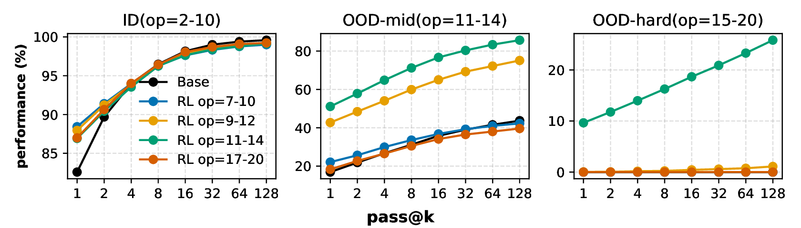
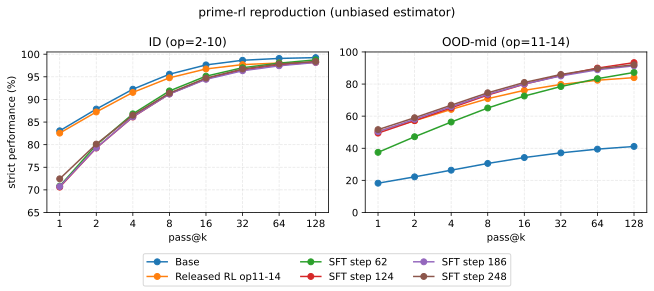
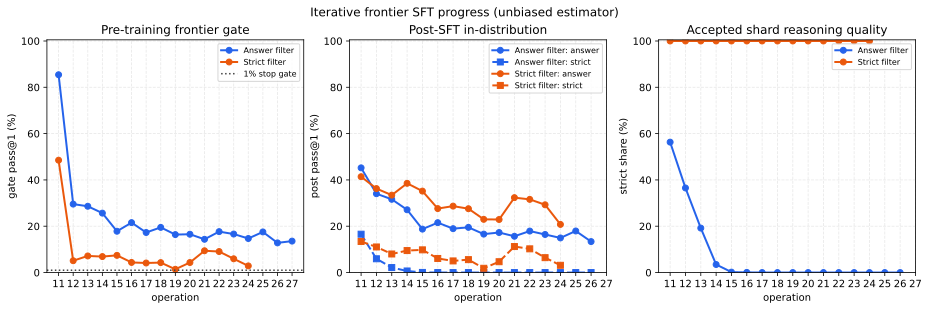
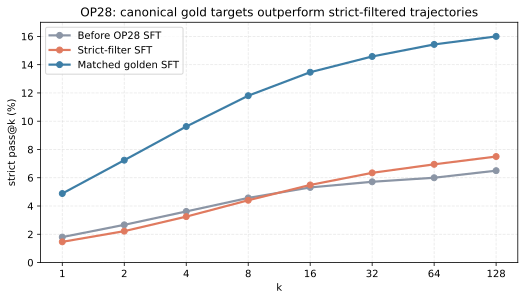
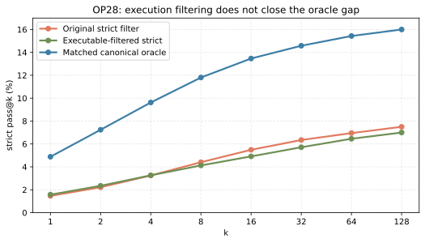
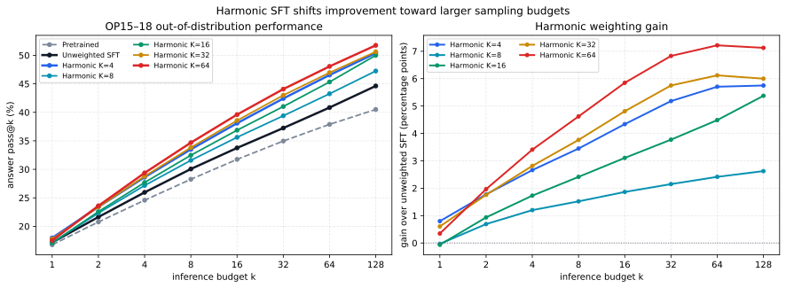
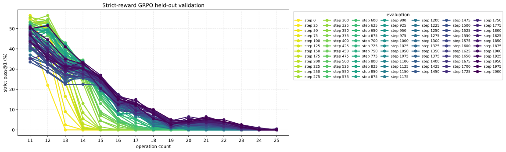

# RSCI experiment monodoc

Last updated: 2026-08-03 UTC.

## Objective

Reproduce the ID (op2-10) and OOD-mid/edge (op11-14) panels of Figure 3 in
*On the Interplay of Pre-Training, Mid-Training, and RL on Reasoning Language
Models*, then compare a one-off op11-14 SFT treatment against the published
base and released op11-14 RL oracle under the same evaluation.

The earlier `context_pretrain/idzoo_0.99zoo_0.01teacher/base` checkpoint is a
different contextual-generalization experiment. Its 10/10 deterministic smoke
result validates inference wiring only and is not a Figure 3 measurement.



*Paper Figure 3 rendered from the arXiv source PDF.*



*Regenerated from audited `metrics.json` files with `plot_curves.py`. It
contains the released base, released RL oracle, and all four SFT checkpoints.*

## Frozen Figure 3 protocol

- Paper source: arXiv `2512.07783`; local source figure `figures/rl_ext.pdf`.
- Released code: `Interplay-LM-Reasoning/Interplay-LM-Reasoning` commit
  `ab728f05d81de9af38d0ca155a84166b037e355a`.
- Model repository revision: `Interplay-LM-Reasoning/extrapolation_rl`
  `4861bd030e6fb92d94be3a1cecab89c2fac4b94a`.
- Dataset repository revision: `Interplay-LM-Reasoning/composition`
  `a09d5c14c02bfa339143fb00a93274d1a84aa31d`.
- Base: `id2-10_0.2easy_0.3medium_0.5hard/base`.
- Released oracle: `id2-10_0.2easy_0.3medium_0.5hard/rl/op11-14_uniform`.
- Data: released `val/opN-200.jsonl`, 200 prompts for every operation.
- Sampling: `n=128`, temperature `0.7`, top-p `1.0`, top-k `-1`, output cap
  `2048`, stop at `</answer>`, special tokens retained.
- Curves: pass@k for k = 1, 2, 4, 8, 16, 32, 64, 128.
- Primary score: strict process verification. Parameter names, values,
  dependency edges, and final answer must match. Extra predicted nodes are
  allowed exactly as in the released scorer; missing nodes are failures.
- Figure comparison aggregation: the standard unbiased pass@k estimator over
  strict outcomes. Ordered empirical pass@k from the released strict
  post-processing script and answer-only curves are retained as diagnostics.
- ID panel weighting: 20% op2-4, 30% op5-7, and 50% op8-10, matching the
  pre-training/evaluation recipe in the paper. Uniform per-op means are retained
  as diagnostics. OOD-mid is uniform across op11-14.

The local strict parser was compared against the released parser on all 3,800
validation rows (op2-20): all graphs and answers matched.

## SFT treatment

- Training pool: released `heldout/op{11,12,13,14}-50k.jsonl`, 200K gold
  examples total. This pool is disjoint from `val/`.
- Format: user is `<question> ... </question>`; assistant is
  `<solution> ... </solution> <answer> ... </answer>`.
- Objective: assistant-only cross entropy.
- Starting model: the Figure 3 base above.
- Updates: 248. The data manifest simulates prime-rl's rank sharding, shuffle,
  concatenation packing, and gradient accumulation; 248 steps consume one
  complete shuffled epoch.
- Global token batch: 256 sequences x 2048 tokens = 512K tokens, matching the
  paper's continued-pretraining batch size.
- Optimizer: AdamW, lr `1e-4`, weight decay `0.1`, max norm `1.0`.
- Schedule: cosine, 37-step warmup (15%), minimum lr `3e-5`.
- Checkpoints: steps 62, 124, 186, and 248 as HF-compatible safetensors.

This is explicitly an SFT comparison, not a claim that supervised gold data is
the same treatment as the paper's GRPO run.

## Exact commands

Artifact fetch:

```bash
unset HTTP_PROXY HTTPS_PROXY ALL_PROXY http_proxy https_proxy all_proxy
uv run user/tianhaowu/rsci/fetch_interplay_artifacts.py \
  --cache-dir /checkpoint/ram-h100-2/tianhaowu/rsci/hf/hub
```

Base Figure 3 panels:

```bash
sbatch user/tianhaowu/rsci/scripts/run_eval.sbatch \
  user/tianhaowu/rsci/configs/eval/figure3_base_id_op2_10.toml
sbatch user/tianhaowu/rsci/scripts/run_eval.sbatch \
  user/tianhaowu/rsci/configs/eval/figure3_base_ood_mid_op11_14.toml
```

Released RL oracle panels:

```bash
sbatch user/tianhaowu/rsci/scripts/run_eval.sbatch \
  user/tianhaowu/rsci/configs/eval/figure3_rl_op11_14_id_op2_10.toml
sbatch user/tianhaowu/rsci/scripts/run_eval.sbatch \
  user/tianhaowu/rsci/configs/eval/figure3_rl_op11_14_ood_mid_op11_14.toml
```

SFT dry-run, smoke, and main run:

```bash
bash user/tianhaowu/rsci/scripts/run_sft.sh \
  user/tianhaowu/rsci/configs/sft/figure3_op11_14_smoke.toml --dry-run
bash user/tianhaowu/rsci/scripts/run_sft.sh \
  user/tianhaowu/rsci/configs/sft/figure3_op11_14_smoke.toml
bash user/tianhaowu/rsci/scripts/run_sft.sh \
  user/tianhaowu/rsci/configs/sft/figure3_op11_14_200k_1epoch.toml
bash user/tianhaowu/rsci/scripts/run_sft_checkpoint_evals.sh
```

Final figure:

```bash
EVAL_ROOT=/checkpoint/ram-h100-2/tianhaowu/rsci/evals/figure3
uv run user/tianhaowu/rsci/plot_curves.py \
  --series Base "$EVAL_ROOT/base/id-op2-10/metrics.json" "$EVAL_ROOT/base/ood-mid-op11-14/metrics.json" \
  --series "Released RL op11-14" "$EVAL_ROOT/rl-op11-14/id-op2-10/metrics.json" "$EVAL_ROOT/rl-op11-14/ood-mid-op11-14/metrics.json" \
  --series "SFT step 62" "$EVAL_ROOT/sft-op11-14/step62/id-op2-10/metrics.json" "$EVAL_ROOT/sft-op11-14/step62/ood-mid-op11-14/metrics.json" \
  --series "SFT step 124" "$EVAL_ROOT/sft-op11-14/step124/id-op2-10/metrics.json" "$EVAL_ROOT/sft-op11-14/step124/ood-mid-op11-14/metrics.json" \
  --series "SFT step 186" "$EVAL_ROOT/sft-op11-14/step186/id-op2-10/metrics.json" "$EVAL_ROOT/sft-op11-14/step186/ood-mid-op11-14/metrics.json" \
  --series "SFT step 248" "$EVAL_ROOT/sft-op11-14/step248/id-op2-10/metrics.json" "$EVAL_ROOT/sft-op11-14/step248/ood-mid-op11-14/metrics.json" \
  --estimator unbiased \
  --output user/tianhaowu/rsci/figures/figure3_reproduction.svg
```

## Job ledger

| Job | Purpose | State/result |
| --- | --- | --- |
| `9781255` | Context-model 10-row greedy smoke | Complete: strict answer accuracy 10/10 |
| `9782435` | Hugging Face repository metadata | Complete: exact revisions and paths recorded above |
| `9782585` | Fetch Figure 3 base, oracle, val, heldout | Complete in 1m40s |
| `9783077` | Build 200K prime-rl SFT parquet on CPU | Failed before script start: ARM `uv` resolution attempted blocked vLLM wheel download |
| login process `4836` | Initial x86 parquet build | Completed; manifest token batching bug found during audit |
| login process `37025` | Rebuild parquet with per-row token counts and one-epoch simulation | Complete: 200K rows, 135,349,142 tokens, max length 2,005, 248 steps/epoch |
| `9783086` | Figure 3 base, OOD-mid op11-14 | Complete in 6m05s, 102,400 generations |
| `9783089` | Figure 3 base, ID op2-10 | Complete in 7m23s, 230,400 generations |
| `9784018` | One-GPU SFT smoke submission | Cancelled before start; superseded to test the actual 8-GPU topology |
| `9784156` | One-step prime-rl SFT smoke on 8 GPUs | Cancelled before start; resubmitted at the cluster's high-priority QoS |
| `9784306` | Initial eight-GPU SFT smoke launch | Failed before training: generated template attempted an unnecessary, blocked optional vLLM download |
| `9785555` | Offline-template SFT smoke | Completed one finite update, then hit the one-step cosine/warmup edge case; failed output preserved |
| `9785973` | Corrected one-step SFT smoke | Complete in 2m30s: loss 0.1735, gradient norm 1.99, zero NaNs, stable `step_1` weights |
| `9786234` | 200K op11-14 SFT, one epoch | Complete in 6m10s: 248 updates, final loss 0.1140, gradient norm 0.0257, zero NaNs, epoch 1 |
| `9784097` | Released op11-14 RL oracle, OOD-mid op11-14 | Complete in 5m36s, 102,400 generations |
| `9784098` | Released op11-14 RL oracle, ID op2-10 | Complete in 6m59s, 230,400 generations |
| `9786481`, `9786483` | SFT step 62, ID and OOD-mid | Complete in 8m03s and 5m13s |
| `9786567`, `9786568` | SFT step 124, ID and OOD-mid | Complete in 7m35s and 5m26s |
| `9786641`, `9786642` | SFT step 186, ID and OOD-mid | Complete in 7m19s and 5m21s |
| `9786760`, `9786761` | SFT step 248, ID and OOD-mid | Complete in 7m11s and 5m31s |
| `9905185` | Fresh pretrained base, OP11–20 | Complete in 6m10s, 256,000 generations |
| `9908981` | Strict-filter OP20 checkpoint, OP11–20 | Complete in 6m59s, 256,000 generations |

## Result paths

- Context smoke:
  `/checkpoint/ram-h100-2/tianhaowu/rsci/evals/context-pretrain-id-op2-10-smoke10-special-tokens/metrics.json`
- Figure 3 base ID:
  `/checkpoint/ram-h100-2/tianhaowu/rsci/evals/figure3/base/id-op2-10/metrics.json`
- Figure 3 base OOD-mid:
  `/checkpoint/ram-h100-2/tianhaowu/rsci/evals/figure3/base/ood-mid-op11-14/metrics.json`
- Fresh Figure 3 base OP11–20:
  `/checkpoint/ram-h100-2/tianhaowu/rsci/evals/figure3/base/ood-op11-20/metrics.json`
- Strict-filter OP20 checkpoint OP11–20:
  `/checkpoint/ram-h100-2/tianhaowu/rsci/evals/figure3/strict-frontier-op20/ood-op11-20/metrics.json`
- Figure 3 released RL ID:
  `/checkpoint/ram-h100-2/tianhaowu/rsci/evals/figure3/rl-op11-14/id-op2-10/metrics.json`
- Figure 3 released RL OOD-mid:
  `/checkpoint/ram-h100-2/tianhaowu/rsci/evals/figure3/rl-op11-14/ood-mid-op11-14/metrics.json`
- SFT data manifest:
  `/checkpoint/ram-h100-2/tianhaowu/rsci/data/sft/op11-14-200k/manifest.json`
- SFT output:
  `/checkpoint/ram-h100-2/tianhaowu/rsci/sft/figure3-op11-14-200k-1epoch/`
- SFT checkpoint evaluations:
  `/checkpoint/ram-h100-2/tianhaowu/rsci/evals/figure3/sft-op11-14/step{62,124,186,248}/{id-op2-10,ood-mid-op11-14}/metrics.json`

Every checkpoint evaluation was audited for its stable weight marker, exact
model path, operations, prompt and generation counts, decoding settings,
paper-weighted ID aggregate, source-config hashes, and finalized strict result
file. All eight passed.

## Measured Figure 3 comparison

Strict unbiased pass@k (%):

| Panel | @1 | @2 | @4 | @8 | @16 | @32 | @64 | @128 |
| --- | ---: | ---: | ---: | ---: | ---: | ---: | ---: | ---: |
| Base ID, paper-weighted | 83.1 | 87.9 | 92.3 | 95.6 | 97.6 | 98.7 | 99.1 | 99.3 |
| Base OOD-mid, uniform | 18.2 | 22.2 | 26.3 | 30.5 | 34.2 | 37.1 | 39.5 | 41.1 |
| Released RL op11-14, ID paper-weighted | 82.6 | 87.2 | 91.6 | 94.8 | 96.7 | 97.7 | 98.1 | 98.2 |
| Released RL op11-14, OOD-mid uniform | 50.6 | 57.2 | 64.2 | 70.9 | 76.1 | 79.8 | 82.4 | 84.0 |
| SFT 62, ID paper-weighted | 70.8 | 79.9 | 86.8 | 91.9 | 95.1 | 97.0 | 98.0 | 98.7 |
| SFT 62, OOD-mid uniform | 37.5 | 47.2 | 56.3 | 65.1 | 72.5 | 78.5 | 83.4 | 87.2 |
| SFT 124, ID paper-weighted | 70.6 | 79.3 | 86.1 | 91.2 | 94.6 | 96.5 | 97.6 | 98.3 |
| SFT 124, OOD-mid uniform | 49.4 | 57.2 | 65.2 | 73.2 | 79.9 | 85.4 | 90.0 | 93.4 |
| SFT 186, ID paper-weighted | 70.7 | 79.3 | 86.2 | 91.2 | 94.5 | 96.3 | 97.4 | 98.2 |
| SFT 186, OOD-mid uniform | 50.4 | 58.1 | 65.9 | 73.6 | 80.0 | 85.1 | 88.9 | 91.4 |
| SFT 248, ID paper-weighted | 72.4 | 80.1 | 86.5 | 91.4 | 94.7 | 96.7 | 97.8 | 98.4 |
| SFT 248, OOD-mid uniform | 51.6 | 59.0 | 66.9 | 74.6 | 81.0 | 86.0 | 89.6 | 92.0 |

For comparison, the plotted paper base is visually about 82.5-99.5% on ID
and 16-44% on OOD-mid; the released RL curve is visually about 51-86% on
OOD-mid. The reproduced curves have the same shapes and saturation. Only one
of 332,800 base generations exceeded 1,024 generated tokens (1,099 tokens),
and that generation was already a strict failure, so applying the paper's
stated 1,024-token cap does not change either base curve.

The unweighted ID mean is intentionally not used for the paper comparison: it
is 87.6% at pass@1 because it overweights easy op2-7 examples relative to the
paper's 20%/30%/50% evaluation recipe.

## Fresh pretrained OP11–20 evaluation

Job `9905185` evaluated the fixed op2–10 pretrained base on all released
OP11–20 validation problems in one run: 200 prompts per operation and 128
temperature-0.7 trajectories per prompt, for exactly 256,000 generations.
Both the generation and strict-result files contain 256,000 rows. Twelve
predictions had no parseable answer and were counted as failures; the outer job
completed `0:0` in 6m10s with no request, verifier, CUDA/NCCL, OOM, or numerical
error.

| Operation | Answer @1 | Answer @128 | Strict @1 | Strict @128 |
| ---: | ---: | ---: | ---: | ---: |
| OP11 | 85.80% | 99.50% | 49.207% | 91.00% |
| OP12 | 51.69% | 89.00% | 23.902% | 65.50% |
| OP13 | 25.02% | 50.00% | 0.320% | 7.00% |
| OP14 | 22.77% | 47.00% | 0.012% | 0.50% |
| OP15 | 16.07% | 45.50% | 0.000% | 0.00% |
| OP16 | 18.71% | 42.50% | 0.000% | 0.00% |
| OP17 | 16.27% | 36.50% | 0.000% | 0.00% |
| OP18 | 16.14% | 42.00% | 0.000% | 0.00% |
| OP19 | 15.49% | 36.50% | 0.000% | 0.00% |
| OP20 | 13.46% | 39.00% | 0.000% | 0.00% |

Uniformly averaged over all 2,000 problems, the complete pass curves are:

| Metric | pass@1 | pass@2 | pass@4 | pass@8 | pass@16 | pass@32 | pass@64 | pass@128 |
| --- | ---: | ---: | ---: | ---: | ---: | ---: | ---: | ---: |
| Answer | 28.14% | 33.18% | 37.35% | 40.98% | 44.25% | 47.29% | 50.12% | 52.75% |
| Strict | 7.34% | 8.92% | 10.57% | 12.26% | 13.75% | 14.92% | 15.78% | 16.40% |

Strict pass@1 collapses from 49.21% at OP11 to 23.90% at OP12, 0.320% at
OP13, and three correct trajectories out of 25,600 at OP14. There are no
strict-correct trajectories among all 153,600 OP15–20 rollouts. The remaining
13–19% answer-only pass@1 at OP15–20 is therefore not evidence of solving the
reasoning graphs; it includes the reverse-mode small-answer guessing behavior
identified by the OP40 audit.

### Matched strict-filter OP20 comparison

For a checkpoint-matched comparison, job `9908981` evaluated the strict-filter
OP20 minimum-validation-loss checkpoint (`step_718`, held-out loss
`0.06133161`) on the exact same OP11–20 prompts and sampling protocol. This
checkpoint resets from the original pretrained base and trains for one packed
epoch on 500,000 cumulative strict-correct trajectories from OP11 through
OP20. Both output files contain exactly 256,000 rows; 165 unparsed predictions
were counted as failures, and the job completed `0:0` in 6m59s.

| Op | Base strict @1 | Strict OP20 @1 | Delta | Base strict @128 | Strict OP20 @128 | Delta |
| ---: | ---: | ---: | ---: | ---: | ---: | ---: |
| 11 | 49.207% | 21.781% | -27.426 pp | 91.00% | 78.50% | -12.50 pp |
| 12 | 23.902% | 15.711% | -8.191 pp | 65.50% | 73.50% | +8.00 pp |
| 13 | 0.320% | 11.020% | +10.699 pp | 7.00% | 48.00% | +41.00 pp |
| 14 | 0.012% | 11.039% | +11.027 pp | 0.50% | 39.50% | +39.00 pp |
| 15 | 0.000% | 12.754% | +12.754 pp | 0.00% | 31.00% | +31.00 pp |
| 16 | 0.000% | 8.781% | +8.781 pp | 0.00% | 26.00% | +26.00 pp |
| 17 | 0.000% | 6.258% | +6.258 pp | 0.00% | 17.00% | +17.00 pp |
| 18 | 0.000% | 6.156% | +6.156 pp | 0.00% | 14.50% | +14.50 pp |
| 19 | 0.000% | 1.961% | +1.961 pp | 0.00% | 7.00% | +7.00 pp |
| 20 | 0.000% | 4.734% | +4.734 pp | 0.00% | 10.50% | +10.50 pp |

Uniformly averaged across OP11–20, the strict curves are:

| Model | pass@1 | pass@2 | pass@4 | pass@8 | pass@16 | pass@32 | pass@64 | pass@128 |
| --- | ---: | ---: | ---: | ---: | ---: | ---: | ---: | ---: |
| Pretrained | 7.34% | 8.92% | 10.57% | 12.26% | 13.75% | 14.92% | 15.78% | 16.40% |
| Strict OP20 | 10.02% | 13.05% | 16.50% | 20.36% | 24.32% | 28.04% | 31.39% | 34.55% |
| Delta | +2.68 pp | +4.14 pp | +5.93 pp | +8.10 pp | +10.57 pp | +13.12 pp | +15.61 pp | +18.15 pp |

Answer-only pass@1/pass@128 also rises from 28.14%/52.75% to
34.26%/75.65%, but strict accuracy is the meaningful comparison. Strict
filtering expands the frontier dramatically: the pretrained model has zero
strict successes at OP15–20, while the OP20 checkpoint reaches 1.96–12.75%
pass@1 across those operations. This is not uniform improvement, however:
OP11 strict pass@1 drops by 27.43 points and OP12 drops by 8.19 points. The
cumulative treatment therefore trades easy-range single-sample accuracy for
hard-range competence and much broader pass@128 coverage.

## Initial conclusion

The released oracle reproduction validates the local protocol: its OOD-mid
curve (50.6-84.0%) closely follows the paper's plotted green curve. Under that
same protocol, one epoch of gold op11-14 SFT reaches 51.6% OOD pass@1 and 92.0%
pass@128. It therefore matches the released RL oracle at low k and exceeds it
at high k, but its ID pass@1 is 72.4% instead of the oracle's 82.6% (and the
base's 83.1%). The trained model still clearly generalizes in distribution:
ID pass@128 is 98.4%, and even single-sample strict accuracy remains 72.4%.

The checkpoint trajectory shows most OOD adaptation by step 124. Later steps
move OOD pass@1 only from 49.4% to 51.6%, while ID pass@1 stays near 71-72%.
This first run supports an RL-versus-SFT tradeoff hypothesis—RL preserves ID
behavior better for comparable OOD pass@1—but it does not yet identify the
mechanism. KL from the starting model was not measured, and gold one-off SFT is
not iterative-frontier SFT or curriculum RL.

Strict verification materially changes the conclusion. At the final SFT
checkpoint, answer-only OOD pass@1 is 86.9%, but dependency-graph-strict
pass@1 is 51.6%. This large gap is why subsequent self-improvement experiments
must retain the strict verifier and explicitly inject verifier errors before
drawing conclusions about verifier robustness.

This is one seed and one treatment. It does not answer whether improvement can
continue indefinitely or establish a model-bound oracle; those require the
planned iterative frontier, one-off RL, curriculum RL, verifier-noise, and
multiple-seed sweeps on top of this validated pipeline.

## Iterative frontier treatments

Two cumulative self-generated SFT tracks are now frozen under
`configs/frontier/`:

1. **Answer-correct:** keep a trajectory when its final answer is correct,
   regardless of dependency-graph errors.
2. **Strict-correct:** keep a trajectory only when the released strict scorer
   accepts its complete gold dependency graph and final answer.

At frontier opN, the current teacher samples 128 completions per newly
generated prompt until the track has exactly 50K trainable accepted
trajectories. A prompt may contribute multiple trajectories. The opN shard is
combined with every earlier 50K shard in the same track. Each round initializes
from the fixed original op2-10 pretrained model—not the previous trained
weights—and trains for one packed epoch on that cumulative dataset. The trained
round model is preserved and becomes the teacher that generates opN+1.

Checkpoint selection uses validation loss on an additional 5K accepted
trajectories from a deterministic, prompt-disjoint stream with the same
operation, prompt distribution, teacher, sampling, and answer/strict filter as
the round's 50K training shard. Validation trajectories never enter training.
Every matched validation/checkpoint interval is preserved; the minimum-loss
checkpoint becomes the post-eval model and next-operation teacher.

The answer track gates continuation on answer-only unbiased pass@1; the strict
track gates on strict-graph unbiased pass@1. The fixed 200-prompt validation set
records both verifiers at pass@1, 2, 4, 8, 16, 32, 64, and 128 before each
frontier decision and after each round's in-distribution training. A track stops
before collecting a new shard when its gate is at most 1%.

The op11 starting score reuses the already-audited base Figure 3 generation
artifact because the model, validation rows, sampling parameters, and verifier
are identical. Later frontier evaluations are generated by the loop. Exact
configs, source hashes, accepted traces, cumulative dataset manifests, SLURM
job IDs, checkpoints, and metrics live under
`/checkpoint/ram-h100-2/tianhaowu/rsci/frontier-sft/`.

### Iterative smoke ledger

The first smoke attempt correctly stopped before collection because the eval
config requested a nonexistent `op11-2.jsonl`; released validation shards are
named by their full 200-row size. The evaluator now supports a deterministic
`prompt_limit_per_operation` over `op11-200.jsonl`. Failed v1 artifacts were
preserved, and v2 uses fresh roots.

| Job | Treatment | Phase | Status/result |
| --- | --- | --- | --- |
| `9808072` | answer-correct v1 | Watcher | Failed as expected on missing `op11-2.jsonl` |
| `9808073` | strict-correct v1 | Watcher | Failed as expected on missing `op11-2.jsonl` |
| `9808194`, `9808507` | answer-correct v2 | Watcher + resumed watcher | Complete |
| `9808195`, `9808508` | strict-correct v2 | Watcher + resumed watcher | Complete |
| `9808234` | answer-correct v2 | 2-prompt pre-eval | Complete: 256 generations; answer pass@1 50.0% |
| `9808233` | strict-correct v2 | 2-prompt pre-eval | Complete: 256 generations; strict pass@1 50.39% |
| `9808316` | answer-correct v2 | 128-trace collection | Complete: exactly 128 selected from 252 trainable correct generations |
| `9808315` | strict-correct v2 | 128-trace collection | Complete: exactly 128 selected from 245 trainable strict generations |
| `9808479` | answer-correct v2 | One-step SFT from original base | Failed: one-step cosine schedule had zero-length decay |
| `9808480` | strict-correct v2 | One-step SFT from original base | Failed: one-step cosine schedule had zero-length decay |
| `9808520` | answer-correct v2 | SFT retry with zero warmup | Complete: loss 0.1543; stable step-1 model |
| `9808519` | strict-correct v2 | SFT retry with zero warmup | Complete: loss 0.1487; stable step-1 model |
| `9808572` | answer-correct v2 | 2-prompt post-SFT eval | Complete: answer/strict pass@1 4.69%/0% |
| `9808571` | strict-correct v2 | 2-prompt post-SFT eval | Complete: answer/strict pass@1 13.28%/1.95% |

Both v2 cumulative manifests contain exactly 128 op11 rows, no overlength
rows, source-shard and parquet hashes, and a one-step packed SFT plan. The first
training attempt reached the trainer on all eight ranks, then exposed a
smoke-only scheduler edge case: rounding 15% warmup up to one left zero cosine
decay steps and PyTorch divided by zero. Warmup now uses the same floor rule as
the 248-step reproduction (37 steps), giving zero warmup for a one-step smoke;
the watcher preserves failed attempts and writes a versioned retry config.
Both retries completed without NaNs and wrote HF-compatible stable checkpoints.
The two post-evals each contain 256 generations and all requested pass@k
values. The 128-row smoke repeats its tiny shard across eight accumulation
microbatches (`progress/epoch=8`) and predictably overfits; its scores are wiring
diagnostics, not scientific estimates. Both end-to-end smoke states finalized
at 2026-08-01 08:19 UTC.

The minimum-validation extension was then exercised from fresh roots. In v3,
both 64-row held-out shards were correctly prompt-disjoint, but validation at
micro-batch 4 could not fill one 8,192-token pack on every rank. Answer SFT job
`9809458` therefore logged `Validation at step 1 had no valid tokens`; the
selector produced no result, as intended. The v3 watchers `9809281`/`9809282`
and remaining strict validation job `9809459` were cancelled without altering
their artifacts. This added a pre-training token-capacity guard and changed the
smoke-only validation micro-batch to 1.

The corrected v4 smoke completed end to end:

| Jobs | Treatment/phase | Result |
| --- | --- | --- |
| `9809504`, `9809505` | answer/strict watchers | Complete; both states are `max_operation_exhausted` |
| `9809545`, `9809544` | 128-trace training collection | Exactly 128 accepted in each track |
| `9809575`, `9809574` | 64-trace held-out collection | Offset 1,000,000; zero prompt-digest overlap in each track |
| `9809747`, `9809752` | one-step SFT + final validation | Finite losses 0.21474494 / 0.22230619; stable step-1 checkpoints |
| `9809783`, `9809784` | selected-checkpoint post-eval | Complete with all pass@k metrics |

The answer and strict selectors each found exactly the expected step-1
candidate, verified its `STABLE` marker, and recorded it as `trained_model`.
Their two-prompt post-evals measured answer/strict pass@1 of 5.08%/0% and
3.12%/0%, respectively. Those scores reflect deliberate one-step overfitting
on 128 traces; the important result is that collection, disjointness audit,
cumulative validation data, finite final-step loss, stable checkpoint
selection, and selected-model evaluation all completed without bypasses.

### Production iterative ledger

The preserved op11 training shards were generated with `f415de55d`. Production
uses 50,000 accepted training traces, 5,000 prompt-disjoint same-distribution
held-out traces, and 200 fixed evaluation prompts per operation.



*Regenerated from the live manifests and metrics. The post-SFT panel uses the
minimum-held-out-validation-loss checkpoints; superseded final-checkpoint
diagnostics are retained on disk but are not plotted.*

| Watcher job | Treatment | Root | Status |
| --- | --- | --- | --- |
| `9808634` | answer-correct | `frontier-sft/answer-correct` | Cancelled after superseded final-checkpoint diagnostic |
| `9808635` | strict-correct | `frontier-sft/strict-correct` | Cancelled after superseded final-checkpoint diagnostic |
| `9809870` | answer-correct | `frontier-sft/answer-correct` | Released op11-20 phase complete; state archived before op21 extension |
| `9809892` | strict-correct | `frontier-sft/strict-correct` | Released op11-20 phase complete; state archived before op21 extension |
| `9867485` | answer-correct | `frontier-sft/answer-correct` | Running continuation; OP39 complete and OP40 evaluation data generating at this update |
| `9875426` | answer-correct | `frontier-sft/answer-correct` | Dependency-gated OP41-50 handoff; pending after `9867485` |
| `9891926` | answer-correct | `frontier-sft/answer-correct` | Cancelled before execution after OP51 generator smoke rejected the original single-range OP51-60 plan |
| `9892694` | answer-correct | `frontier-sft/answer-correct` | Dependency-gated OP51-55 waiting handoff; pending after `9875426` |
| `9892698` | answer-correct | `frontier-sft/answer-correct` | Dependency-gated OP56-58 waiting handoff; pending after `9892694` |
| `9892700` | answer-correct | `frontier-sft/answer-correct` | Dependency-gated OP59 waiting handoff; pending after `9892698` |
| `9892706` | answer-correct | `frontier-sft/answer-correct` | Dependency-gated OP60 waiting handoff; pending after `9892700` |

The audited op11 baseline was materialized under each root with provenance to
the original 200-prompt Figure 3 artifact. Answer collection job `9808666` and
strict collection job `9808667` were submitted at 08:23 UTC; both target
exactly 50,000 accepted traces with 128 samples per generated prompt.

Answer op11 collection completed with exactly 50,000 selected traces from
67,584 generations over 528 prompts. All selected traces have the correct final
answer, but only 28,157 (56.31%) pass the strict graph verifier. This measured
43.69-point contamination rate is the intended difference between the two
treatments, not a verifier or filtering bug. Its exact cumulative parquet has
50,000 rows, zero overlength rows, and a 73-step packed one-epoch plan. SFT job
`9808808` completed from the fixed original base with final loss 0.1145, no
NaNs, `progress/epoch=1`, and stable checkpoint `weights/step_73`.

The 200-prompt answer-track post-eval (`9808874`) measured answer pass@1
45.74% and strict pass@1 16.91%, down from the base's 85.42% / 48.52% on op11.
Pass@128 remains 96.5% answer and 77.0% strict. The treatment therefore
overfits/degrades op11 despite using answer-correct traces. A plausible
mechanism is the combination of only 528 unique prompts represented by 50K
trajectories and 43.69% graph-incorrect accepted traces; the matched strict
treatment separates those factors.

Strict op11 collection completed with exactly 50,000 strict traces from 118,784
generations over 928 prompts. All 50,000 pass both answer and graph checks. The
unfiltered pool contained 88,756 answer-correct but only 50,062 strict-correct
generations, independently confirming the large answer/reasoning gap measured
in the answer-filtered shard. Its exact cumulative parquet has 50,000 rows,
zero overlength rows, and a 72-step packed one-epoch plan. Reset-from-base SFT
job `9808836` completed with final loss 0.1290, no NaNs,
`progress/epoch=1`, and stable checkpoint `weights/step_72`. Both matched
post-SFT evaluations completed successfully.

The strict-track 200-prompt post-eval (`9808928`) measured answer pass@1
42.29% and strict pass@1 13.55%, with pass@128 86.0% / 52.0%. Strict filtering
therefore did not prevent the op11 collapse and was slightly worse than the
answer track's 45.74% / 16.91% pass@1. Verifier contamination alone is not a
sufficient explanation; repeated trajectories from fewer than 1K unique
prompts and the one-epoch SFT dynamics remain confounded. These diagnostics
triggered the checkpoint-selection correction below.

These op11 post-evals used the final one-epoch checkpoints and are retained as
diagnostics, not selected-model results. On the researcher's clarification,
watchers `9808634`/`9808635`, answer op12 collection `9808998`, and strict op12
pre-eval `9808972` were cancelled at 08:46 UTC before further data entered the
loop. The valid 50K op11 shards and all diagnostics are preserved. Production
was held until same-distribution held-out validation and minimum-loss
checkpoint selection were implemented and audited.

Minimum-validation implementation `bdd430eba` passed both v4 smoke tracks and
was pushed before production resumed. The upgrade archived each original
`state.json` and `frontier.toml` as `state_final_checkpoint_v1.json` and
`frontier_final_checkpoint_v1.toml`, reset `current_operation` to op11, retained
the exact 50K op11 shard and its cumulative parquet, and verified that no op12
training manifest existed. New watchers `9809870`/`9809892` started at 09:38
UTC. Their first new jobs, `9809931`/`9809930`, collect the additional 5K
answer/strict held-out trajectories from prompt stream offset 1,000,000.

Both held-out collections completed exactly. Answer used 64 new prompts and
8,192 generations for 5,000 answer-correct traces, of which 2,746 (54.92%)
were also strict; strict used 112 new prompts and 14,336 generations for 5,000
strict traces. The prompt audit found zero overlap with the 528 answer-track or
928 strict-track training prompts. SFT jobs `9810090`/`9810133` initialized
from the fixed original base, retained all 11 matched checkpoints, and finished
without NaNs. Held-out loss reached its minimum at the final candidate in both
tracks: answer step 73 at 0.11748475 and strict step 72 at 0.13402714.

Selected-checkpoint evals `9810183`/`9810186` measured answer/strict pass@1 of
45.22%/16.56% for the answer filter and 41.39%/13.43% for the strict filter;
answer/strict pass@128 were 95.5%/78.0% and 84.5%/50.0%. This independently
confirms the earlier final-checkpoint diagnostic while satisfying the requested
selection rule. The superseded op12 directories were preserved as
`op12_final_checkpoint_v1`; clean op12 pre-evals `9810203`/`9810205` use the
selected `model_min_val` checkpoints.

### Final op11-20 frontier results

Both production loops completed the released op11-20 range. Values below are
unbiased pass@1 from 200 prompts and 128 samples per prompt. “Pre gate” is
answer accuracy for the answer-filter track and strict accuracy for the
strict-filter track. Both post-training verifiers are reported for every
minimum-held-out-loss checkpoint.

| Track | Op | Pre gate | Selected step / held-out loss | Post answer | Post strict | Training prompts / generations | Strict share of 50K shard |
| --- | ---: | ---: | --- | ---: | ---: | --- | ---: |
| answer | 11 | 85.42% | 73 / 0.11748475 | 45.22% | 16.56% | 528 / 67,584 | 56.31% |
| answer | 12 | 29.56% | 143 / 0.10994613 | 34.03% | 5.95% | 800 / 102,400 | 36.53% |
| answer | 13 | 28.62% | 216 / 0.10077211 | 31.62% | 2.15% | 1,120 / 143,360 | 19.19% |
| answer | 14 | 25.66% | 292 / 0.08912811 | 27.11% | 0.68% | 1,616 / 206,848 | 3.47% |
| answer | 15 | 17.83% | 370 / 0.07924649 | 18.75% | 0.06% | 1,904 / 243,712 | 0.184% |
| answer | 16 | 21.56% | 448 / 0.07206764 | 21.54% | 0.00% | 2,048 / 262,144 | 0.068% |
| answer | 17 | 17.29% | 528 / 0.06683663 | 18.95% | 0.00% | 2,128 / 272,384 | 0.002% |
| answer | 18 | 19.50% | 610 / 0.06268419 | 19.52% | 0.00% | 2,256 / 288,768 | 0.000% |
| answer | 19 | 16.39% | 691 / 0.05903623 | 16.60% | 0.00% | 2,224 / 284,672 | 0.000% |
| answer | 20 | 16.54% | 774 / 0.05606105 | 17.28% | 0.00% | 2,512 / 321,536 | 0.000% |
| strict | 11 | 48.52% | 72 / 0.13402714 | 41.39% | 13.43% | 928 / 118,784 | 100% |
| strict | 12 | 5.10% | 126 / 0.12522373 | 36.26% | 11.05% | 1,424 / 182,272 | 100% |
| strict | 13 | 7.17% | 189 / 0.11890249 | 33.43% | 8.02% | 1,584 / 202,752 | 100% |
| strict | 14 | 6.90% | 270 / 0.10584254 | 38.53% | 9.49% | 1,952 / 249,856 | 100% |
| strict | 15 | 7.42% | 340 / 0.09525359 | 35.17% | 9.80% | 2,336 / 299,008 | 100% |
| strict | 16 | 4.36% | 416 / 0.08538000 | 27.62% | 6.08% | 2,688 / 344,064 | 100% |
| strict | 17 | 4.12% | 480 / 0.07790303 | 28.68% | 5.02% | 3,472 / 444,416 | 100% |
| strict | 18 | 4.30% | 504 / 0.07165689 | 27.57% | 5.57% | 4,432 / 567,296 | 100% |
| strict | 19 | 1.41% | 639 / 0.06623063 | 22.98% | 1.84% | 4,896 / 626,688 | 100% |
| strict | 20 | 4.32% | 718 / 0.06133161 | 22.91% | 4.67% | 5,568 / 712,704 | 100% |

Minimum-validation selection was consequential: several intermediate
checkpoints beat the final one-epoch checkpoint, including strict steps 126,
189, 270, 340, 480, 504, and 639, and answer steps 370 and 610. Validation ran
inside SFT at each matching checkpoint interval; the selector reads those
logged losses rather than reevaluating checkpoints afterward.

The answer-filter feedback becomes almost entirely graph-invalid: its strict
share falls from 56.31% at op11 to zero at op18-20, and the selected model has
zero strict pass@1 from op16 onward while retaining 16-22% answer pass@1. This
is direct empirical evidence for verifier contamination under answer-only
feedback. Strict filtering keeps every training trajectory graph-correct, but
its strict frontier is non-monotonic and does not improve indefinitely: post
strict pass@1 is 1.84% at op19 and rebounds to 4.67% at op20.

Neither track reaches the requested 1% stopping threshold before the released
validation distribution ends at op20. The released-range states therefore
terminate as `max_operation_exhausted`, not `threshold_reached`. This result
alone bounds the experiment only over released op11-20 and does not establish
a model capacity bound beyond op20.

### Generated op21-30 continuation

The persistent goal requires continuing until the next-frontier gate is at
most 1%, so the loops resume on an explicitly generated extension rather than
treating the released-file boundary as success. The pinned upstream source
defines zero-context medium operations through op30; op19-20 already use
`op_max=30`. The extension therefore holds `op_max=30` fixed for op21-30 and
uses the same depth 2, number range 5, three templates, two modes, and exact
operation constraint as collection. Evaluation uses an independent
deterministic split with seed 20260802 and 200 prompts per operation.

The first materialized extension file is
`frontier-sft/generated-eval-op21-30-v1/op21-200.jsonl`, SHA-256
`84e8a130ce53025c8f8981f25295fbdff58e9eae1b4df5ca4fba3c22443186d9`.
It contains 200 unique IDs and content digests, 67/67/66 prompts across the
movie/teacher/zoo contexts and 101/99 forward/reverse prompts. All 200 gold
solutions pass the strict verifier against themselves, and rendered gold
sequence lengths range from 692 to 1,761 tokens, with none over the 2,048-token
limit. Generation took 8,009 proposals; rejected proposals are retained in the
sidecar manifest by exception type.

At 19:40 UTC, `frontier_extend.py` archived each completed state/config as
`state_op20_v1.json` and `frontier_op20_v1.toml`, verified every op11-20 model
and post-eval artifact, permitted only the op30 maximum and generated-data
fields to change, and resumed both states at op21 under protocol
`min_val_generated_eval_v3`. Training/filtering/sampling settings and the fixed
original SFT initialization remain unchanged.

Persistent continuation watchers `9821398` (answer) and `9821400` (strict)
started at 19:45 UTC. Completed continuation rounds through 06:31 UTC are:

| Track | Op | Pre gate | Selected step / held-out loss | Post answer | Post strict | Sampled prompts / represented prompts / generations | Strict share of 50K shard |
| --- | ---: | ---: | --- | ---: | ---: | --- | ---: |
| answer | 21 | 14.36% | 850 / 0.05377709 | 15.67% | 0.00% | 2,384 / 999 / 305,152 | 0.00% |
| strict | 21 | 9.41% | 797 / 0.05702638 | 32.35% | 11.23% | 5,040 / 1,122 / 645,120 | 100% |
| answer | 22 | 17.67% | 941 / 0.05150718 | 17.91% | 0.00% | 2,352 / 967 / 301,056 | 0.00% |
| strict | 22 | 9.07% | 783 / 0.05322517 | 31.60% | 10.23% | 4,960 / 1,039 / 634,880 | 100% |
| answer | 23 | 16.63% | 1,027 / 0.04923049 | 16.44% | 0.00% | 2,512 / 1,036 / 321,536 | 0.00% |
| strict | 23 | 5.95% | 963 / 0.04979033 | 29.27% | 6.43% | 6,096 / 1,117 / 780,288 | 100% |
| answer | 24 | 14.70% | 1,115 / 0.04751578 | 14.95% | 0.00% | 2,528 / 1,072 / 323,584 | 0.00% |
| strict | 24 | 2.87% | 1,051 / 0.04654343 | 20.79% | 3.13% | 9,616 / 1,209 / 1,230,848 | 100% |
| answer | 25 | 17.54% | 1,209 / 0.04607983 | 17.95% | 0.00% | 2,640 / 1,040 / 337,920 | 0.00% |
| answer | 26 | 12.81% | 1,304 / 0.04475274 | 13.38% | 0.00% | 2,512 / 1,031 / 321,536 | 0.00% |
| answer | 27 | 13.57% | 1,390 / 0.04345763 | 13.20% | 0.00% | 2,640 / 1,071 / 337,920 | 0.00% |
| answer | 28 | 17.52% | 1,494 / 0.04216060 | 18.04% | 0.00% | 2,656 / 1,044 / 339,968 | 0.00% |
| answer | 29 | 14.32% | 1,590 / 0.04112151 | 14.11% | 0.00% | 2,560 / 1,023 / 327,680 | 0.00% |
| answer | 30 | 11.23% | 1,687 / 0.03979899 | 11.63% | 0.00% | 2,816 / 1,073 / 360,448 | 0.00% |
| answer | 31 | 13.24% | 1,784 / 0.03882361 | 13.00% | 0.00% | 2,816 / 1,069 / 360,448 | 0.00% |
| answer | 32 | 13.76% | 1,882 / 0.03793898 | 13.64% | 0.00% | 2,624 / 1,001 / 335,872 | 0.00% |
| answer | 33 | 14.54% | 1,981 / 0.03695799 | 14.91% | 0.00% | 2,688 / 1,042 / 344,064 | 0.00% |
| answer | 34 | 11.68% | 2,081 / 0.03617484 | 11.72% | 0.00% | 2,688 / 1,038 / 344,064 | 0.00% |
| strict | 25 | 1.39% | 1,140 / 0.04373480 | 15.76% | 1.90% | 17,824 / 1,551 / 2,281,472 | 100% |

Every sampled problem receives 128 completions, and every accepted completion
may enter the 50K shard. Op21 exposes strong problem-level polarization. For
the answer filter, 1,384/2,384 problems (58.05%) have zero passing completions,
while 49 (2.06%) have 128/128; the mean solve rate is 16.40% but the median is
zero. For the completed strict generation pool, 3,915/5,040 problems (77.68%)
have zero strict completions, none have 128/128, the mean strict solve rate is
7.77%, and both the median and 75th percentile are zero. The final exact shard
contains 999 answer-filter and 1,122 strict-filter distinct prompt IDs because
the last over-target batch is deterministically trimmed to 50K traces. This
easy-problem duplication is a material limitation of trajectory-level
collection and is preserved rather than rebalanced.

The subsequent gates also remain above 1%. Answer-only feedback preserves
roughly 13-18% answer pass@1 while producing no strict trajectories: the
strict share of all continuation shards and strict post-SFT pass@1 remain
exactly zero. Strict filtering retained 10.23% strict post-SFT pass@1 at op22
and 6.43% at op23. Its op24 gate fell to 2.87% strict (19.86% answer); after
op24 SFT, strict pass@1 was 3.13% and answer pass@1 was 20.79%. Minimum-loss
selection mattered at strict op22: step 783 beat both step 870 and the final
step 879. The strict op24 final checkpoint was also its minimum held-out-loss
checkpoint, at step 1,051 with loss 0.04654343.

All completed continuation audits—answer op21-29 and strict op21-25—report
zero prompt-digest overlap between training, held-out checkpoint validation,
and the 200-problem frontier set.
Answer op23 validation collection encountered one random internal-port
collision (`EADDRINUSE`) before the inference server became ready. The watcher
recorded the failed artifact-free attempt and automatically reran the same
stage successfully on a different node; the final held-out shard contains
exactly 5,000 accepted traces.

The strict CPU watcher was requeued once by the scheduler during op23
collection and resumed on another CPU node while the GPU child continued
uninterrupted. Two strict op24 collection requests and one request in each of
answer op25 and op26 returned the same transient vLLM HTTP 500
(`NoneType.finish_reason`). The retry path recovered all four requests without
restarting a stage or losing data, and every final manifest has the requested
50,000 accepted traces.

Answer op27 selected step 1,390 rather than the final step 1,399 because its
held-out loss, 0.04345763, was lower than the final loss, 0.04347065. The
selected model retained 13.20% answer pass@1 and 41.50% pass@128 on op27;
strict pass@k remained zero at every measured k.

Answer op28 SFT evaluated all 11 matched candidates. Held-out loss decreased
to its minimum of 0.04216060 at the final step 1,494. The selected model
reached 18.04% answer pass@1 and 40.50% pass@128 on op28, while strict pass@k
remained zero at every measured k. Its 50K collection encountered five
transient vLLM HTTP 500 `NoneType.finish_reason` responses; every request was
recovered by the configured retries and the final manifest remained exact.

Starting with answer op28 post-evaluation job `9831969`, production inference
uses four H100 nodes: one eight-GPU replica per node behind a round-robin
router. Runtime prompt concurrency scales from 16 to 64; collection also
scales its prompt batch from 16 to 64 while retaining deterministic prompt
indices and exact 50K trimming. All four replicas became healthy in 135
seconds, and the complete 25,600-generation op28 evaluation then finished in
about 30 seconds with no failed request. Runtime and source configs are both
preserved with the evaluation artifacts.

The production request shape was benchmarked directly on one eight-GPU node
using 256 fixed op29 prompts, 128 trajectories per request, deterministic
request seeds, the 2,048-token cap, and prefix caching disabled to avoid replay
bias. Benchmark job `9832143` measured:

| Concurrent prompts per node | Completion tokens/s | Trajectories/s |
| ---: | ---: | ---: |
| 8 | 211,005 | 672 |
| **16** | **261,127** | **831** |
| 32 | 246,824 | 786 |
| 64 | 246,125 | 783 |
| 128 | 250,936 | 799 |
| 256 | 219,263 | 698 |

Sixteen prompt requests already represent 2,048 candidate sequences because
each request asks for 128 completions. This exactly matches eight local vLLM
engines × `max_num_seqs=256`. Fresh-node confirmation jobs `9832312` and
`9832313` removed an ordering-related outlier and measured 302,428 tokens/s at
16 versus 247,092 at 32, a 22.4% advantage. Production therefore keeps 16
prompt requests per node and scales to 64 requests / 8,192 candidate sequences
across four nodes. A reverse sweep (`9832189`) experienced a late node-level
throughput collapse at its final low-concurrency points; those contaminated
measurements are preserved but excluded from the selection.

Current live state at 09:10 UTC on August 2: the answer op29 gate was 14.32%
(37.50% pass@128), so the loop continued. Its four-node collection completed
exactly 50,000 answer-correct and zero strict-correct traces from 327,680
generations over 2,560 problems. The prompt-disjoint held-out collection also
completed with exactly 5,000 accepted traces from 32,768 generations over 256
new problems. The resulting cumulative train/validation sets contain
950,000/95,000 trajectories. Reset-from-base SFT job `9832549` evaluated all
11 candidates and selected step 1,590 at the minimum held-out loss of
0.04112151; the final step 1,591 was slightly worse at 0.04114703. The selected
model reached 14.11% answer pass@1 and 37.50% pass@128, while strict pass@k
remained zero. Its first four-node post-selection evaluation attempt `9833602`
encountered a transient stale Triton-cache file handle on one node before any
result artifact was written; automatic retry `9833793` completed successfully.
The next-frontier OP30 evaluation completed all 25,600 generations and measured
11.23% answer pass@1 and 34.50% pass@128, still above the 1% gate. Four-node
OP30 collection job `9833983` produced exactly 50,000 answer-correct and zero
strict-correct traces from 360,448 generations over 2,816 problems. Disjoint
held-out collection job `9834708` then produced exactly 5,000 accepted traces
from 40,960 generations over 320 prompts, with zero train/held-out/evaluation
overlap. The cumulative 1.0M/100K train/validation datasets require 1,687 SFT
steps. Reset-from-base job `9835021` completed all steps with finite loss and
selected the terminal step 1,687 at the minimum held-out loss of 0.03979899;
step 1,680 was 0.03996944. The selected model reached 11.63% answer pass@1 and
35.50% pass@128 on OP30, versus 11.23%/34.50% before SFT; strict pass@k remained
zero. The immutable OP31-40 extension was activated at 18:45 UTC with the OP30
state and config archived. Watcher `9844382` generated and audited 200 OP31
evaluation problems. OP31 pre-evaluation completed all 25,600 rollouts at
13.24% answer pass@1 and 36.00% pass@128. Collection job `9844532` then
finalized exactly 50,000 answer-correct and zero strict-correct traces from
360,448 generations over 2,816 generated problems. Disjoint held-out job
`9845374` produced exactly 5,000 rows from 32,768 generations over 256 new
problems, with zero train/held-out/evaluation prompt overlap. The resulting
1.05M/105K cumulative train/validation datasets contain 991,643,165 training
tokens and require 1,784 optimizer steps. Reset-from-base SFT job `9845425`
selected terminal step 1,784 at the global minimum held-out loss of 0.03882361
and synced online W&B run `0adeljxt`. Post-selection job `9846508` measured
13.00% answer pass@1 and 38.50% pass@128, versus 13.24%/36.00% before SFT;
strict pass@k remained zero. The generated OP32 gate then measured 13.76%
answer pass@1 and 40.00% pass@128. Collection job `9846759` finalized exactly
50,000 answer-correct and zero strict-correct traces from 335,872 generations
over 2,624 generated problems; disjoint held-out job `9847499` produced exactly
5,000 accepted traces from 32,768 generations over 256 new problems, with zero
train/held-out/evaluation prompt overlap. The 1.10M/110K cumulative datasets
contain 1,046,864,872/105,050,885 tokens. Reset-from-base SFT job `9847572`
evaluated all 11 candidates and selected terminal step 1,882 at the global
minimum held-out loss of 0.03793898; W&B run `vd0rpdcs` finished online with
zero NaN losses. Post-selection job `9848943` completed all 25,600 rollouts and
measured 13.64% answer pass@1 and 39.00% pass@128, slightly below the
13.76%/40.00% pre-SFT score; strict pass@k remained zero. Thus the lower
held-out language-model loss did not improve OP32 frontier accuracy. OP33 then
gated at 14.54% answer pass@1 and 37.50% pass@128, still above the 1% stop
threshold. Its exact 50K/5K train/held-out shards required 344,064/40,960
generations over 2,688/320 new problems, with zero prompt overlap. The
1.15M/115K cumulative datasets require 1,981 optimizer steps. Reset-from-base
SFT job `9852980` selected terminal step 1,981 at the global minimum held-out
loss of `0.03695799` and logged online as W&B run `9pujj9ni`. Its first
post-selection evaluation attempt `9857170` failed before producing an
artifact; automatic retry `9857567` completed all 25,600 rollouts with zero
unparsed predictions. OP33 answer pass@1 increased from 14.54% to 14.91%,
while pass@128 decreased from 37.5% to 36.5%; strict pass@k remained zero. The
watcher advanced to OP34, whose generated gate measured 11.68% answer pass@1
and 36.5% pass@128. Exact 50K/5K train/held-out shards required
344,064/40,960 generations over 2,688/320 prompts, with zero
train/held-out/evaluation overlap. The resulting 1.20M/120K datasets contain
1,158,194,657/116,397,406 tokens and require 2,081 optimizer steps. OP34
reset-from-base SFT job `9862177` completed all 2,081 updates with finite
losses and synced online W&B run `d6ucf8z4`. All 11 checkpoint candidates were
retained; the terminal step 2,081 attained the global minimum held-out loss of
`0.03617484`. Its post-selection evaluation completed exactly 25,600
rollouts with zero unparsed predictions. Answer pass@1 changed from 11.68% to
11.72% (`+0.043` percentage points), pass@128 remained 36.5%, and strict
pass@k remained zero at every measured k. The first two post-evaluation
attempts failed before writing generations because of a stale Torch
compile-cache file handle and a transient occupied server port. Automatic
attempt 3, job `9864930`, completed cleanly in 3m41s without mixing partial
artifacts, and the watcher advanced to OP35.

| OP34 answer metric | pass@1 | pass@2 | pass@4 | pass@8 | pass@16 | pass@32 | pass@64 | pass@128 |
| --- | ---: | ---: | ---: | ---: | ---: | ---: | ---: | ---: |
| Pre-SFT gate | 11.68% | 15.74% | 19.99% | 24.06% | 27.56% | 30.50% | 33.24% | 36.50% |
| Post-SFT selected | 11.72% | 16.15% | 20.88% | 25.24% | 28.93% | 32.12% | 34.59% | 36.50% |

OP35's generated 200-problem gate completed on automatic retry job `9865310`
after the first attempt encountered an artifact-free internal-port collision.
The selected OP34 teacher remains above the stop threshold at 15.68% unbiased
answer pass@1 and 39.50% pass@128; all strict pass@k values are zero. The
result contains exactly 25,600 verifier rows and two unparsed predictions.

| OP35 pre-SFT metric | pass@1 | pass@2 | pass@4 | pass@8 | pass@16 | pass@32 | pass@64 | pass@128 |
| --- | ---: | ---: | ---: | ---: | ---: | ---: | ---: | ---: |
| Answer | 15.68% | 20.88% | 25.71% | 29.72% | 33.05% | 35.97% | 38.22% | 39.50% |
| Strict | 0.00% | 0.00% | 0.00% | 0.00% | 0.00% | 0.00% | 0.00% | 0.00% |

OP35 collection job `9865398` then produced exactly 50,000 answer-correct and
zero strict-correct traces from 360,448 generations over 2,816 problems.
Prompt-disjoint held-out job `9866304` produced exactly 5,000 answer-correct
and zero strict-correct traces from 40,960 generations over 320 offset
problems. The audit reports zero train/held-out/evaluation prompt overlap. The
32 GB CPU watcher was subsequently killed while loading the 1.25M-row
cumulative dataset; it failed before creating either cumulative output, so all
completed manifests remained the safe resume boundary. Approved watcher
`9867485` resumed with 128 GB, materialized the exact 1.25M/125K cumulative
train/validation datasets, and ran reset-from-base SFT job `9867518`. Of 11
retained candidates, step 2,180 had the minimum held-out loss, `0.03523412`;
the final step 2,181 was slightly worse at `0.03525947`. The selected model
changed OP35 answer pass@1/pass@128 from 15.68%/39.50% to 14.57%/41.00%.

OP36 gated at 15.75% answer pass@1 and 40.50% pass@128. Its exact 50K/5K
train/held-out shards required 335,872/40,960 generations over 2,624/320
prompt-disjoint problems. The cumulative datasets reached 1.30M/130K rows and
1,270,185,206/127,543,368 tokens. Reset-from-base SFT job `9871587` selected
terminal step 2,283 at held-out loss `0.03449287`. Post-SFT answer
pass@1/pass@128 were 15.36%/40.50%; strict pass@k remained zero.

OP37 gated at 11.75% answer pass@1 and 35.00% pass@128. Its exact 50K/5K
shards required 335,872/40,960 generations over 2,624/320 prompt-disjoint
problems. The cumulative datasets reached 1.35M/135K rows and
1,326,459,579/133,146,137 tokens. Reset-from-base SFT job `9877177` completed
2,382 steps and synced W&B run `vala4gub`. Step 2,380 was selected at the
global minimum held-out loss `0.03373458`; final step 2,382 was slightly worse
at `0.03373972`. Post-SFT answer pass@1/pass@128 were 11.88%/33.50%, and every
strict pass@k remained zero.

| Answer track | pass@1 | pass@2 | pass@4 | pass@8 | pass@16 | pass@32 | pass@64 | pass@128 |
| --- | ---: | ---: | ---: | ---: | ---: | ---: | ---: | ---: |
| OP35 pre-SFT | 15.68% | 20.88% | 25.71% | 29.72% | 33.05% | 35.97% | 38.22% | 39.50% |
| OP35 post-SFT | 14.57% | 19.71% | 24.89% | 29.48% | 33.33% | 36.52% | 38.95% | 41.00% |
| OP36 pre-SFT | 15.75% | 21.05% | 26.45% | 31.37% | 35.15% | 37.86% | 39.63% | 40.50% |
| OP36 post-SFT | 15.36% | 20.22% | 25.07% | 29.67% | 33.67% | 36.62% | 38.62% | 40.50% |
| OP37 pre-SFT | 11.75% | 15.74% | 19.54% | 23.14% | 26.47% | 29.42% | 32.05% | 35.00% |
| OP37 post-SFT | 11.88% | 15.97% | 19.81% | 23.34% | 26.68% | 29.65% | 31.91% | 33.50% |
| OP38 pre-SFT | 12.28% | 16.67% | 21.07% | 25.15% | 28.63% | 31.57% | 34.12% | 37.00% |
| OP38 post-SFT | 11.66% | 15.97% | 20.47% | 24.77% | 28.58% | 31.78% | 34.57% | 38.00% |
| OP39 pre-SFT | 10.79% | 15.04% | 19.26% | 22.88% | 25.83% | 28.28% | 30.52% | 32.50% |
| OP39 post-SFT | 10.22% | 14.59% | 19.11% | 22.88% | 25.53% | 27.37% | 28.82% | 30.50% |

OP38's 200-problem gate contained all 25,600 requested rollouts with no
unparsed prediction and measured 12.28% answer pass@1. Four-node collection
job `9881037` produced exactly 50,000 answer-correct and zero strict-correct
traces from 352,256 generations over 2,752 problems. Prompt-disjoint held-out
job `9885002` produced exactly 5,000 accepted traces from 32,768 generations
over 256 offset problems. The audit found zero train/held-out/evaluation
prompt overlap. The resulting 1.40M/140K cumulative train/validation datasets
contain 1,382,869,834/138,805,555 tokens and zero overlength rows.

Reset-from-base SFT job `9885680` completed 2,482 steps and synced W&B run
`smfp1pmd` with zero NaN losses. All 11 matched checkpoints were preserved and
validated. Held-out loss decreased from `0.03656124` at step 248 to the global
minimum `0.03303253` at final step 2,482, which became the next teacher.
Post-selection job `9889054` completed all 25,600 rollouts with zero unparsed
predictions. Answer pass@1 changed from 12.28% to 11.66%, while pass@128
increased from 37.0% to 38.0%; strict pass@k remained zero throughout.

The generated OP39 gate then completed all 25,600 rollouts with no unparsed
prediction. Answer pass@1/pass@128 are 10.79%/32.50%, still above the 1% stop
threshold, while strict pass@k remains zero at every measured budget. The
answer track therefore continues to OP39 collection.

OP39 collection job `9890620` produced exactly 50,000 answer-correct and zero
strict-correct traces from 352,256 generations over 2,752 problems; 50,854 raw
positives were deterministically trimmed. Held-out job `9894703` produced
exactly 5,000 answer-correct and zero strict-correct traces from 32,768
generations over 256 offset problems, trimming 5,061 raw positives. Both outer
jobs exited `COMPLETED 0:0`; their inner `srun` cancellations were expected
inference-server teardown after the manifests were written. The held-out audit
proves zero train/held-out, train/evaluation, and held-out/evaluation prompt
overlap.

The cumulative train/validation datasets contain 1.45M/145K rows,
1,440,116,500/144,529,989 tokens, and zero rows above the 2,048-token limit.
Reset-from-base SFT job `9895150` completed all 2,584 steps in 1h05m with zero
NaN losses and synced online W&B run `66e54voh`. All 11 matched checkpoint
candidates were preserved. Their held-out losses at steps 258, 516, 774,
1,032, 1,290, 1,548, 1,806, 2,064, 2,322, 2,580, and 2,584 were respectively
`0.03594854`, `0.03527230`, `0.03453565`, `0.03451114`, `0.03394862`,
`0.03353198`, `0.03300441`, `0.03288865`, `0.03254542`, `0.03241085`, and
`0.03237251`. Final step 2,584 was therefore the global minimum and became the
next teacher.

Post-selection job `9898671` completed all 25,600 rollouts. Seven predictions
were unparsed and counted as failures. Answer pass@1/pass@128 changed from
10.79%/32.50% before SFT to 10.22%/30.50% after SFT; strict pass@k remained
zero throughout. Thus OP39 again lowers held-out language-model loss without
improving frontier pass@1. The watcher preserved the model and metrics and
advanced to deterministic OP40 evaluation-data generation.

The OP40 gate completed all 25,600 rollouts with no unparsed predictions.
Answer pass@1,2,4,8,16,32,64,128 is respectively 13.46%, 18.34%, 22.87%,
26.51%, 29.26%, 31.35%, 32.76%, and 33.50%; strict pass@k is zero throughout.
Because answer pass@1 remains above 1%, the watcher launched OP40 collection
job `9899760`.

An audit shows that the OP40 answer score is dominated by answer guessing,
not valid long-horizon solutions. Of the 200 evaluation problems, 99 have a
gold answer in `{1, 2, 3, 4}` and 101 have an answer from 32 through 960. All
3,446 answer-correct trajectories come from the small-answer subset; none of
the 12,928 rollouts for a large-answer problem is correct. These groups align
exactly with generation mode: all 99 forward-reverse problems have small
answers, while all 101 normal-forward problems have large answers. Within the
99 small-answer problems, 27.19% of trajectories happen to match the answer. A
uniform guess over `{1, 2, 3, 4}` would score 12.375% overall, and the constant
guess `4` would score 15.5%, versus the model's 13.46%. The accepted-answer
counts are 607 for answer 2, 993 for answer 3, and 1,846 for answer 4; there are
no correct answer-1 trajectories.

A deterministic uniform sample without replacement from all 3,446 passing
trajectories (seed `20260803`) found invalid reasoning in 10/10 cases. The
displayed final equation alone contradicts every emitted answer, even before
checking the many missing or wrong graph nodes:

| Passing trajectory | Gold/emitted | Displayed final equation | Equation actually implies |
| --- | ---: | --- | ---: |
| `0d103...`, rank 33 | 3 | `7*x = 33` | 4.714... |
| `a4ba7...`, rank 54 | 4 | `x + 9 = 196` | 187 |
| `7cee9...`, rank 6 | 4 | `x + 24 = 196` | 172 |
| `8aa2b...`, rank 66 | 2 | `x + 13 = 70` | 57 |
| `f41b7...`, rank 118 | 4 | `12*x = 112` | 9.333... |
| `b339d...`, rank 22 | 4 | `33*x = 136` | 4.121... |
| `65fed...`, rank 113 | 4 | `x + 10 = 196` | 186 |
| `77825...`, rank 0 | 3 | `x + 24 = 204` | 180 |
| `66423...`, rank 41 | 4 | `4*x = 52` | 13 |
| `4ba7b...`, rank 89 | 4 | `x + 7 = 136` | 129 |

Thus OP40 answer pass@1 is not evidence that the model solves OP40. It is a
verifier-hacking/answer-prior measurement, and the answer-filtered loop feeds
these trajectories back by design. The strict loop does not accept this
failure mode.

The small reverse-mode answers are a generator invariant, not an empirical
coincidence. The frozen frontier configuration sets `number_range=5`. The
reverse generator assigns the hidden leaf target with
`random.randint(1, number_range - 1)`, then replaces that target's factual
sentence with an existential statement and constructs a downstream known-value
equation that recovers it. Its answer is therefore always one of 1, 2, 3, or
4, regardless of operation count. Normal-forward queries instead ask for a
derived graph value and can grow into the hundreds.

At 17:00 UTC on 2026-08-03, the user stopped the answer-only track after this
audit. OP40 collection job `9899760` was cancelled with 21,193/50,000 accepted
traces from 147,456 completed generations over 1,152 prompts; no collection
manifest, cumulative dataset, OP40 SFT model, or post-SFT evaluation was
created. Watcher `9867485` and all pending OP41-60 handoffs (`9875426`,
`9892694`, `9892698`, `9892700`, and `9892706`) were cancelled. OP39 is the
last completed answer-filtered iteration and its selected model remains
preserved.

Because answer pass@1 remains far above 1%, `answer_correct_op50.toml`
predefines an OP41-50 continuation. The extension validator confirms that only
`max_operation`, `generator_op_max`, and the generated-evaluation root differ
from OP40. A six-row OP41 smoke set covers all three templates and both modes;
every row has exact `op=op_count=41`, all IDs are unique, and its SHA-256 is
`17b7b4ba58dea15e6713fec3a68fd266bf71508d5b8b0aa59e5dfb2c20a73b27`.
Generation accepted 6 of 2,323 proposals, so extrapolation is feasible but
rejection-heavy. Persistent dependency job `9875426` runs only after watcher
`9867485`: it exits without a launch if the 1% gate stops the track, and
activates OP41-50 only if OP40 ends with `max_operation_exhausted`.

The first proposed OP51-60 continuation used a single `generator_op_max=60`.
Its OP51 movie/forward smoke could not produce an exact graph in the production
10,000-attempt limit, so pending job `9891926` was cancelled before execution.
Further deterministic smokes showed that exact-operation acceptance is
non-monotonic in the generator envelope: a setting broad enough for OP60 can
make OP51 infeasible. The continuation is therefore split into four immutable
ranges: OP51-55 at envelope 75, OP56-58 at 90, OP59 at 95, and OP60 at 100.
All three contexts and both modes passed at each range endpoint under the same
10,000-attempt limit. The four smoke manifests accepted 12/22,594,
12/11,786, 6/7,317, and 6/18,661 proposals respectively; their validation-file
SHA-256 hashes are `47c3aa784a251645348832bd6e0d22efc6cee89efda13b329691e7819b2257ce`,
`fee7c359ee3a7a10fedcebf3c8be680a4518fcc4f7925b5b039ac20c59b259e4`,
`1ba95738dc7b7facfa447de6fa157489280ede6fb9e363b1150c77111a54fbcf`,
and `888a1d5248d34c3f8d1f446da5caa0dad020da3ae7a32ffb3e38764973c1f665`.
Jobs `9892694`, `9892698`, `9892700`, and `9892706` form an `afterany`
dependency chain behind `9875426`. Each waits for the watcher launched by the
preceding extension, exits unchanged if the 1% frontier has been reached, and
activates its next validated range only from `max_operation_exhausted` state.
These validated configurations remain preserved for reproducibility, but the
jobs were cancelled unexecuted when the user stopped the answer-only track.

The strict op25 gate was 1.39%, still above threshold. Its collection finalized
exactly 50,000 strict trajectories from 2,281,472 generations over 17,824
problems. Six transient vLLM HTTP 500 `finish_reason` errors occurred in two
bursts; all were retried successfully. Collection job `9829208` exited nonzero
after writing the complete manifest because its evaluation wrapper encountered
a teardown-time shell parse error. The persistent watcher treated the audited
manifest as authoritative, did not regenerate the shard, and launched the
prompt-disjoint 5K strict held-out collection as four-node job `9832747`. That
job completed with exactly 5,000 strict trajectories from 196,608 generations
over 1,536 prompts. The held-out audit found zero train/validation/evaluation
prompt overlap. The resulting cumulative train/validation sets contain
750,000/75,000 strict trajectories. Reset-from-base SFT job `9833404`
completed all 1,144 updates and selected step 1,140 at the minimum held-out
loss of 0.04373480; the final step was slightly worse at 0.04389381. The
selected model reached 15.76% answer pass@1/64.00% pass@128 and 1.90% strict
pass@1/8.50% pass@128. OP26 pre-evaluation measured 14.03% answer pass@1,
65.00% answer pass@128, 1.36% strict pass@1, and 7.00% strict pass@128. OP26
collected exactly 50K/5K train/held-out strict trajectories from
2,424,832/344,064 generations, and the 800K/80K cumulative datasets selected
step 1,240 at held-out loss 0.04126976. Post-SFT OP26 strict pass@1/pass@128
were 1.58%/6.00%.

OP27 gated at 1.41% strict pass@1 and also continued. Its exact 50K/5K shards
required 2,498,560/253,952 generations; the 850K/85K cumulative datasets
selected step 1,344 at held-out loss 0.03911986. Post-SFT OP27 strict
pass@1/pass@128 reached 2.14%/9.50%. OP28 now gates at 1.80% strict pass@1 and
6.50% pass@128. Collection job `9844325` finalized exactly 50,000 strict
trajectories from 2,621,440 generations over 20,480 generated problems;
disjoint held-out job `9850791` then finalized exactly 5,000 strict trajectories
from 237,568 generations over 1,856 new problems. The held-out audit found zero
train/validation/evaluation overlap. The 900K/90K cumulative datasets contain
802,349,752/79,903,259 tokens and require 1,448 updates. Reset-from-base SFT
job `9852524` selected terminal step 1,448 at the global minimum held-out loss
of `0.03692433`; its offline W&B stream was uploaded by the persistent sync
job. Post-selection job `9855502` measured 15.42% answer pass@1/61.0%
pass@128 and 1.465% strict pass@1/7.5% pass@128. Relative to the OP28 gate,
strict pass@1 decreased from 1.801%, while pass@128 increased from 6.5%.
The strict loop then advanced to OP29, where the selected OP28 model measured
13.16% answer pass@1/59.0% pass@128 and 0.859% strict pass@1/4.5% pass@128.
Because strict pass@1 is below the requested 1% gate, the strict track stopped
before any OP29 collection or training. The answer track remains active.

All RSCI SFT configs now target online W&B logging under `ram/rsci`. The 46
preserved historical offline streams remain the source of truth for past
runs. A metric-only replay was validated on answer op28: remote run
`bupusy2n` is `finished` with exactly 8,975/8,975 history rows. Persistent CPU
job `9833832` completed the initial historical migration, then exited when
SLURM returned `Invalid job id specified` for a finished watched job. The sync
driver now treats that one scheduler response as an inactive job while still
raising all other scheduler errors. Replacement job `9853484` is active and
has uploaded 49 completed streams with zero failures; it watches both frontier
drivers so new offline runs are uploaded after their exit records are durable.
Each successful stream is accepted only when W&B reports `finished`; the three
local exit-code-1 smoke streams retain that provenance while accepting any
terminal remote state because W&B's offline replay reports them as `finished`.

### Trajectory duplication and oracle control

The 50K target counts accepted trajectories, not unique generated problems.
The cumulative strict OP11-25 dataset contains 750,000 unique trace IDs but
only 16,932 represented problem IDs, or 44.29 rows per problem on average. In
the newest strict OP25 shard, 50,000 rows come from 1,551 represented problems
(32.24 rows/problem); 38,016 `(problem, exact completion)` pairs are unique and
11,984 rows (23.97%) exactly repeat another accepted completion for the same
problem. Answer OP29 is more concentrated: 50,000 rows, 1,023 problems, 29,626
unique exact pairs, and 20,374 repeated pairs (40.75%). Trace IDs remain unique
because sample rank is part of the trajectory identity.

A fixed-snapshot full model-facing-text audit quantified duplication before the
oracle control. Answer OP11-31 has 1,050,000 rows but 896,232
unique `(question, completion)` byte strings: 153,768 rows (14.645%) repeat an
earlier training example exactly, across 58,254 duplicate groups. It represents
20,773 unique question strings (50.55 accepted rows/problem on average), and
the most repeated identical example occurs 118 times. OP31 alone has 50,000
rows over 1,069 problems but only 25,086 unique model-facing examples: 24,914
rows (49.828%) are exact repeats, with maximum identical-example multiplicity
113. Strict OP11-27 has
850,000 rows and 767,175 unique model-facing examples: 82,825 rows (9.744%) are
exact repeats, across 37,406 duplicate groups. It represents 19,969 unique
questions (42.57 rows/problem), with maximum identical-example multiplicity
76. All 1,900,000 trace IDs are unique and every prompt ID maps to exactly one
question string; these counts therefore isolate duplication seen by SFT rather
than metadata duplication.

None of the 50K sampled strict OP25 completions exactly matches the generator's
literal gold completion, even though all pass the dependency-graph verifier.
An oracle upper bound is therefore materially different from strict filtering.
A 50K-row oracle shard can also have 50K unique problems by generating one gold
trace per problem; using the existing OP25 prompt pool would instead yield
17,824 gold rows, or only 1,551 if restricted to problems represented in the
accepted shard. Two useful controls are consequently (1) gold completions on
the same prompts, which isolates target quality, and (2) 50K unique gold
problems, which measures the combined quality-and-diversity upper bound.

The first, apples-to-apples control is complete at OP11-28. Builder job
`9853360` preserved every row and prompt frequency from the strict cumulative
train/held-out snapshots, but replaced each assistant message with the
canonical solution and answer stored by the GSM-Infinite generator. This is
the same `<question> ... </question>` / `<solution> ... </solution> <answer>
... </answer>` conversion used for the released OP11-14 gold SFT data. The
result has exactly 900,000/90,000 train/held-out rows, zero prompt-content
overlap, 769,102,411/76,598,821 tokens, and no example above 2,048 tokens.
Because one deterministic gold trace replaces every sampled trajectory, the
training set has only 21,495 unique model-facing examples and 878,505 repeated
rows (97.61%). This control therefore isolates target correctness at fixed
sampling multiplicity; it is not the quality-plus-diversity upper bound.

Reset-from-base SFT job `9853626` completed all 1,391 steps and logged online
as W&B run `0u9hrc8c`. Duplicate-induced overfitting was immediate: held-out
loss was minimal at the first checkpoint, step 139 (`0.18600146`), then rose
to `0.37492228` at the terminal checkpoint while training loss fell near zero.
The immutable minimum-loss rule therefore selected step 139. Evaluation
attempt `9856626` encountered a transient shared Triton-cache stale file handle
before writing any rollout; retry `9856940` excluded the affected node and
completed all 25,600 generations. Both treatments use the same original base,
200 OP28 prompts, 128 rollouts per prompt, sampling parameters, evaluator, and
unbiased pass@k estimator.



*Matched golden targets improve strict OP28 accuracy at every k despite the
severe train/validation overfitting caused by repeated canonical labels.*

| k | Strict-filter SFT strict pass@k | Matched-gold SFT strict pass@k | Oracle / strict-filter |
| ---: | ---: | ---: | ---: |
| 1 | 1.465% | 4.883% | 3.33× |
| 2 | 2.220% | 7.241% | 3.26× |
| 4 | 3.248% | 9.623% | 2.96× |
| 8 | 4.406% | 11.805% | 2.68× |
| 16 | 5.490% | 13.466% | 2.45× |
| 32 | 6.346% | 14.580% | 2.30× |
| 64 | 6.949% | 15.432% | 2.22× |
| 128 | 7.500% | 16.000% | 2.13× |

Answer-only pass@1/pass@128 also rises from 15.42%/61.0% under strict-filter
SFT to 20.87%/71.0% under matched-gold SFT. Canonical targets therefore provide
substantially stronger supervision than verifier-accepted free-form traces,
even when prompt selection, row count, and row multiplicity are fixed. The
effect can reflect both exact reasoning quality and lower target entropy. It is
not a model upper bound: a separate 50K-unique-problems-per-op gold treatment
is still needed to measure the combined target-quality and diversity oracle.

### Why matched gold outperforms strict-filtered trajectories

A direct audit of the 50,000 accepted strict OP28 rows found that
`strict_correct` is parser equivalence, not a guarantee that every written
calculation is valid. The released comparison records extra prediction nodes
but omits `extra_in_pred` from the `perfect` predicate. Consequently, 2,242
accepted rows (4.484%) contain one or more unchecked extra nodes. Extra work is
not necessarily wrong, so this count is a verifier-coverage gap rather than an
error-rate estimate.

There is also an unambiguous arithmetic hole. For an assignment such as
`s = s + o = 2 + 92 = 82`, the parser collects dependencies from the complete
right-hand side but evaluates the last equality segment, `82`, as the node
value. A trajectory can therefore contain a false equality while still
matching the gold node value, dependency set, and final answer. A conservative
audit that evaluated only fully numeric segments of written equality chains
found 734 contradictions in 383 accepted rows (0.766%), spanning 72 of the
1,526 represented OP28 prompts. The 1,526 corresponding canonical solutions
had zero such contradictions. In the example above, the same trajectory later
writes `82 + 3 = 97`; nevertheless it has zero missing nodes, zero value or
dependency mismatches, and is labeled strict-perfect. This 0.766% is a hard
lower bound: a stateful audit that also checks named-variable substitutions
flags 7,779 rows (15.56%), but variable reuse makes that broader estimate more
interpretation-dependent. Numeric contradictions and extra nodes together
occur in 2,518 rows (5.036%), with 107 rows exhibiting both.

Even genuinely valid sampled traces create much noisier teacher-forcing
targets. The OP28 shard contains 50,000 rows over 1,526 prompts but 32,548
distinct exact model responses: a represented prompt has 21.33 distinct
responses on average, and 1,308 prompts have multiple responses. None exactly
matches its canonical target. Matched gold instead assigns one deterministic
canonical response to each prompt and repeats it at the source row's original
multiplicity. Across OP11-28 this changes 900,000 rows from hundreds of
thousands of sampled target strings to 21,495 unique canonical targets.

The matched construction preserves the strict run's exact prompt multiset,
row multiplicities, and mode imbalance, so problem selection and the scarcity
of forward-reverse rows cannot explain its advantage. Response length is also
too small an explanation by itself: OP28 model and canonical responses differ
by only 0.4% in mean character length, while the cumulative oracle corpus has
4.14% fewer tokens. The evidence instead supports a combination of (1)
removing verifier-admitted reasoning defects, (2) eliminating conflicting
targets for the same prompt, and (3) restoring the deterministic GSM-Infinite
solution style seen in synthetic pretraining. A clean ablation would compare
canonical gold against one verifier-accepted trace per prompt and against a
stricter executor that rejects extra nodes and validates every equality.

#### Error-enriched manual read of 50 strict-perfect trajectories

A deterministic diagnostic sample was drawn from the strict OP28 accepted
shard to inspect the automated warnings semantically. It contains 50 distinct
prompts: 30 numeric-contradiction trajectories (10 per template), 10
extra-node-only trajectories, and 10 stateful-substitution-only trajectories.
Every response was read in full against its canonical solution. Because the
sample is conditioned on defect indicators, its proportions are not population
error-rate estimates.

| Primary manual class | Count / 50 | Description |
| --- | ---: | --- |
| Required-path arithmetic contradiction / gold-value injection | 22 | A required equality is false, but the response declares the expected node value or answer. |
| Wrong arithmetic in an unchecked extra subgraph | 8 | The required path is correct while an unnecessary branch contains false arithmetic. |
| Unsupported extra node or equation | 8 | The response invents a quantity/equation absent from the problem. |
| Symbol aliasing or stale-variable reuse in the required trace | 11 | A one-letter variable is overwritten and then simultaneously used with its old and new meanings. |
| Semantically valid extra distractor only | 1 | The only clean case computes a correct but unnecessary prompt-defined distractor. |

The clearest value-injection example writes `67 - 11 = 62` and then
`2 * 62 = 112`: both equalities are false, but 112 is the gold target. A symbol
alias example writes `p + p = 12 + 5 = 17` after the same letter `p` has denoted
both 5 and 12. Among the ten extra-node-only cases, eight invent unsupported
equations; one adds a valid distractor but also aliases a required symbol; and
only one is semantically clean. Thus 49/50 selected cases have a genuine
semantic defect, but this deliberately enriched ratio must not be extrapolated
to all 50K rows. The full-shard conservative lower bound remains 383/50K
responses with directly evaluable false arithmetic.

The complete per-trajectory reasoning is preserved in
[`audits/strict_op28_50_error_classification.md`](audits/strict_op28_50_error_classification.md).
The deterministic selector is `audit_strict_trajectory_errors.py`; its external
full-response dossier has SHA-256
`9241cda89b119081314eb70d4f3b316d69cd1e18c2e514c9f2257e7acd3b618e`.

#### Uniform manual read of 50 strict-filter trajectories

A second deterministic sample removes the error-conditioning: it selects 50
uniformly hash-ranked rows from the 50,000-row OP28 shard. All 50 happen to
come from distinct prompts. Literal canonical-response matching remains
0/50,000 even after whitespace normalization, but that mostly reflects harmless
variable renaming and ordering differences rather than error.

Manual comparison of every sampled response with its exact generator solution
finds 43 canonical-equivalent alternatives and 7 genuine semantic defects.
Six defects overwrite a one-letter symbol and later use its stale and current
meanings simultaneously. The seventh combines stale aliasing with unsupported
extra nodes and false extra arithmetic. The uniform-sample defect estimate is
therefore 14.0%, with a 95% Wilson interval of 6.95–26.19%; it is an estimate,
not an exact full-shard rate. Full-shard screening flags 9,595/50,000 rows
(19.19%) by the union of explicit numeric contradiction, extra-node, and
stateful-substitution indicators, while directly evaluable false arithmetic
remains the conservative 0.766% lower bound.

All 50 judgments are recorded in
[`audits/strict_op28_50_uniform_classification.md`](audits/strict_op28_50_uniform_classification.md).
The reproducible selector is `audit_strict_trajectory_sample.py`; its preserved
full-response dossier has SHA-256
`d17a2c07a17d21f74d83f387d0897723df232785fbc7923189f1f8a436f71c2d`.

#### Deterministic execution grader and cleaned-strict ablation

The audit checks have now been promoted into `strict_trajectory_grader.py`, a
deterministic grader that parses arithmetic with Python's AST but permits only
numeric constants, one-letter symbols, parentheses, unary signs, and the four
basic arithmetic operators. It executes every equality chain in order under a
stateful symbol table, requires all expressions in a chain to agree, preserves
the released verifier's required-node/value/dependency checks, and rejects
unsupported extra nodes. Forward-reverse traces use exact affine symbolic
expressions and their proposed solution must satisfy the known-value equation
and every displayed algebra step. A dependency-free extra constant is allowed
only when the problem text contains the exact corresponding constant fact.

Cross-validation is exact on both previously human-labeled OP28 sets: all
43 valid and 7 defective uniform-sample trajectories are classified correctly,
as are the one valid and 49 defective error-enriched trajectories. Across the
100 independent human judgments this is 100/100 agreement, with all 56 defects
caught and no false rejection. Applying the grader to a deterministic uniform
100-row sample yields 78 accepted and 22 rejected trajectories: 19 have an
executable equality contradiction and four have unsupported nodes, with one
row in both groups.

On the full strict OP28 shard, the grader retains 40,754/50,000 rows and rejects
9,246/50,000 (18.492%). The largest rejection classes are 7,779 rows with an
equality-chain contradiction and 1,787 with unsupported extra nodes; smaller
structural checks find malformed or duplicate-definition inconsistencies.
This is a deterministic filtering rate rather than a proven population error
rate outside the audited samples, because non-constant prompt-defined
distractors are conservatively rejected.

The OP11–28 cleaned-strict ablation drops failing model trajectories
independently from both the original 900K training rows and 90K held-out rows,
without substituting canonical answers or resampling retained traces. It keeps
748,912 training rows (83.212%; 658,095,732 tokens) and 75,226 held-out rows
(83.584%; 65,888,065 tokens), with zero prompt-content overlap. OP28 retains
40,754/50,000 training trajectories and 4,018/5,000 held-out trajectories.
Across training, 111,518 rows have executable equality contradictions, 21,036
have invalid symbolic solver equations, and 25,257 have unsupported nodes;
these categories overlap, and 151,088 rows are removed in total.

SFT job `9870139` reset from the same pretrained base and completed all 1,189
optimizer steps with the unchanged optimizer. It validated and saved every 118
steps and logged online to W&B run `lx9o3ult`. Held-out loss reached its unique
minimum `0.03837827` at step 1,180; the terminal step was slightly worse at
`0.03838672`, so step 1,180 was selected. Four-node job `9871076` then
completed the identical 200-problem × 128-rollout OP28 evaluation.



*Removing executable defects produces only a tiny low-k improvement and does
not approach matched canonical supervision.*

| k | Original strict filter | Executable-filtered strict | Matched canonical oracle | Cleaned − original |
| ---: | ---: | ---: | ---: | ---: |
| 1 | 1.465% | 1.574% | 4.883% | +0.109 pp |
| 2 | 2.220% | 2.346% | 7.241% | +0.126 pp |
| 4 | 3.248% | 3.261% | 9.623% | +0.012 pp |
| 8 | 4.406% | 4.126% | 11.805% | -0.280 pp |
| 16 | 5.490% | 4.915% | 13.466% | -0.575 pp |
| 32 | 6.346% | 5.713% | 14.580% | -0.633 pp |
| 64 | 6.949% | 6.454% | 15.432% | -0.494 pp |
| 128 | 7.500% | 7.000% | 16.000% | -0.500 pp |

Strict pass@1 improves by only 0.109 percentage points, closing 3.2% of the
original-to-oracle gap. The cleaned treatment is already worse by pass@8 and
ends 0.5 points below the original strict model at pass@128. Answer-only
performance also falls from 15.42%/61.0% pass@1/pass@128 under the original
strict model to 13.65%/57.0%, versus 20.87%/71.0% for the oracle.

The degradation is concentrated in forward-reverse behavior. Cleaning retains
26,707/48,225 (55.38%) reverse-mode training rows but 722,205/851,775 (84.79%)
normal-forward rows. On the balanced OP28 evaluation, reverse-mode answer
pass@1 falls from 24.35% to 20.98%, and length-limit terminations rise from
4.01% to 6.44%; the oracle reaches 28.09% with 2.31% length terminations. In
total, the cleaned model has 817 length terminations and 811 predictions with
no parseable answer, versus 518/512 for the original strict model and 308/331
for the oracle. Among normal-forward prompts, cleaning does improve strict
pass@1 from 2.901% to 3.117%, but strict pass@128 falls from 14.85% to 13.86%.

The conclusion is therefore negative: removing the identified semantic defects
does not explain the oracle advantage. The remaining gap is consistent with
the canonical target's deterministic reasoning style and much lower target
entropy, plus the cleaned treatment's 18% smaller token budget and stronger
reverse-mode curriculum bias. A matched-row-count resampling control would be
needed to separate those latter two effects, but the present clean filter
plainly does not match the oracle.

### Answer-correct versus strict-correct audit

The strict-filter model's OP28 pre-evaluation contains 25,600 trajectories:
3,565 have the exact final answer, but only 461 pass the dependency-graph
verifier. Among the 3,104 answer-correct/strict-wrong trajectories, all have a
dependency mismatch, 2,635 (84.9%) have at least one intermediate-value
mismatch, and 2,050 (66.0%) omit at least one gold node. These categories
overlap.

The gap is dominated by generation mode. Normal-forward trajectories have
6.91% answer pass@1 and 3.57% strict pass@1; 51.6% of their answer-correct
traces are strict-correct. Forward-reverse equation trajectories have 21.09%
answer pass@1 but zero strict-correct samples out of 12,672. The strict training
shards consequently contain only 17, 11, and 15 forward-reverse rows out of
50,000 at OP25, OP26, and OP27 respectively.

A stratified manual read of ten answer-correct/strict-wrong trajectories found
eight genuine reasoning failures, one internally inconsistent variable-reuse
case, and one clear verifier false negative:

| Sample | Mode/template | Manual finding |
| --- | --- | --- |
| `00ded...`, rank 2 | normal/zoo | Substitutes an equal-valued but wrong parent node. |
| `0b885...`, rank 0 | normal/movie | Uses the wrong same-valued source entity and adds an irrelevant node. |
| `35418...`, rank 8 | normal/school | Reassigns a previously defined letter; arithmetic works but symbol scope is inconsistent. |
| `9e4cc...`, rank 11 | normal/school | Omits a base node and asserts its downstream value directly. |
| `8d3b2...`, rank 14 | normal/movie | Multiple wrong intermediates cancel, preserving the final total. |
| `26f44...`, rank 14 | reverse/zoo | Writes `x+42=79`, then incorrectly asserts `x=1`, the gold answer. |
| `14459...`, rank 0 | reverse/movie | Semantically correct `x+31=33` solution rejected by letter-reuse leakage in the parser. |
| `73127...`, rank 96 | reverse/school | Changes `79` to `25` and known total `115` to `71`, then forces the gold answer. |
| `0080f...`, rank 61 | reverse/zoo | Wrong nodes and totals (`178` becomes `101`), followed by the gold answer. |
| `f36cb...`, rank 34 | reverse/movie | Turns the correct `x+80` equation into `x+44`, then still asserts `x=4`. |

Thus final-answer correctness is often produced by equal-value substitutions,
compensating errors, shortcuts, or answer anchoring. The released strict parser
also has a confirmed false-negative mechanism: its single-letter variable map
is global, so arbitrary reuse of a letter can leak unrelated dependencies into
an otherwise correct graph. The main strict track is preserved unchanged for
paper-faithful comparison, but its near-total removal of forward-reverse data
must be treated as a verifier-induced curriculum bias.

### Exponential replay ablation

To test whether uniform cumulative replay dilutes the newest frontier, fixed
OP11-25 strict data are reweighted with
`weight(op_i) = lambda ** (25 - op_i)`. The baseline training and held-out row
totals (750K/75K), fixed base initialization, 1,144 optimizer steps, optimizer,
scheduler, and minimum held-out-loss selection remain unchanged. This isolates
gradient recency but necessarily repeats recent trace rows; it does not add new
information.

| λ | Oldest/newest train rows | Unique/repeated train trace IDs | Natural one-epoch steps | SFT job |
| ---: | ---: | ---: | ---: | ---: |
| 0.95 | 34,074 / 69,870 | 678,455 / 71,545 | 1,168 | `9834296` |
| 0.90 | 21,606 / 94,445 | 607,275 / 142,725 | 1,194 | `9834297` |

Persistent CPU drivers `9834279` and `9834280` completed both audited datasets,
minimum-loss selections, and common OP25/OP26 evaluations. λ=0.95 logs to W&B
run `6qsnxv2u`; step 1,140 was selected at validation loss 0.03752742. λ=0.90
logs to `ziyqffhs`; step 1,140 was selected at 0.03226921. Validation losses
across λ are not directly comparable because each uses its matched reweighted
validation distribution.

| Replay | OP25 strict @1 / @128 | OP26 strict @1 / @128 |
| --- | ---: | ---: |
| Uniform baseline | 1.902% / 8.5% | 1.363% / 7.0% |
| λ=0.95 | 1.863% / 7.5% | 1.641% / 6.0% |
| λ=0.90 | 1.887% / 6.5% | 1.965% / 6.0% |

Neither decay improves strict accuracy on the OP25 training frontier. On the
held-out OP26 frontier, λ=0.95 raises strict pass@1 by 0.277 percentage points,
and λ=0.90 raises it by 0.602 points (+44% relative). Both reduce strict
pass@128 from 7% to 6%. Exponential replay therefore raises the probability of
a correct strict rollout on already-solvable problems, especially at λ=0.90,
but does not expand one-of-128 problem coverage in this run.

## Harmonic pass SFT from the pretrained base

This ablation tests whether difficulty-dependent SFT weighting improves
easy-to-hard generalization without iterative collection. The fixed pretrained
base generated 128 trajectories for each of 200 released problems at each of
OP11–14. Final-answer correctness defines the binary reward. The immutable pool
contains 102,400 trajectories and 47,500 positives: 21,868 at OP11, 13,311 at
OP12, 6,402 at OP13, and 5,919 at OP14.

Problems—not trajectories—are deterministically split within each operation:
160 problems per operation train and 40 validate. Consequently all 128
trajectories from one problem remain in exactly one split. Filtering produces
37,844 positive training trajectories (24,627,285 tokens) and 9,656 validation
trajectories (6,343,764 tokens), with zero problem overlap. The unweighted
baseline and all harmonic treatments use these exact same rows.

For each problem, `p_hat = correct_count / 128` is frozen at data-construction
time. A correct trajectory receives

`w_K(p_hat) = [1 + (1-p_hat) + ... + (1-p_hat)^(K-1)] / H_K`,

and incorrect trajectories are excluded. The sweep uses K=4, 8, 16, 32, and
64. The observed train-weight ranges are 0.480–1.898, 0.368–2.864,
0.296–4.465, 0.246–7.000, and 0.211–10.649 respectively. Both training and
held-out SFT loss use the same treatment-specific weights.

Every treatment, including the unweighted filtered-SFT baseline, resets to the
same pretrained base and trains for 248 optimizer steps with batch size 256,
sequence length 2,048, AdamW learning rate 1e-4, and the original Figure 3
cosine schedule. Validation and stable weight checkpoints occur every eight
steps, plus final step 248; the minimum configured held-out loss selects the
checkpoint. This yields 31 trained checkpoint candidates per run. All runs log
online to W&B.

The final benchmark is strictly out of distribution: OP15–18, 200 held-out
problems per operation, 128 sampled trajectories per problem. It reports both
answer-only and strict-graph pass@1,2,4,8,16,32,64,128 for the pretrained base,
unweighted SFT, and all five harmonic treatments.

A four-step K=16 smoke run completed as SLURM job `9872651` and W&B run
`4h9aidvl`. Weighted validation losses were finite at step 0 (0.09475763), step
2 (0.18528548), and step 4 (0.12865491); training reached 578K tokens/s with
4.4 GiB peak memory and no NaN losses.

All six full SFT runs completed without NaNs. Minimum held-out validation loss
selected baseline step 32 (0.09508730), K=4 step 24 (0.09536778), K=8 step 16
(0.09652019), K=16 step 16 (0.09809885), K=32 step 24 (0.09943316), and K=64
step 16 (0.10073516). Loss values select checkpoints only within their own
objective because each K changes the validation weights.
The W&B run IDs are `l6paike9` (baseline), `2kljho02` (K=4), `q6aq5541`
(K=8), `6zfr2oqx` (K=16), `b0nz7y4k` (K=32), and `11rwfktq` (K=64).

The complete OP15–18 unbiased answer-correctness results are:



| model | pass@1 | pass@2 | pass@4 | pass@8 | pass@16 | pass@32 | pass@64 | pass@128 |
| --- | ---: | ---: | ---: | ---: | ---: | ---: | ---: | ---: |
| pretrained | 16.77% | 20.77% | 24.58% | 28.26% | 31.74% | 34.96% | 37.89% | 40.50% |
| unweighted SFT | 17.17% | 21.64% | 25.96% | 30.06% | 33.76% | 37.24% | 40.84% | 44.63% |
| harmonic K=4 | **17.97%** | 23.41% | 28.63% | 33.51% | 38.09% | 42.43% | 46.55% | 50.38% |
| harmonic K=8 | 17.14% | 22.33% | 27.16% | 31.58% | 35.62% | 39.40% | 43.26% | 47.25% |
| harmonic K=16 | 17.11% | 22.57% | 27.69% | 32.47% | 36.86% | 41.02% | 45.33% | 50.00% |
| harmonic K=32 | 17.78% | 23.40% | 28.78% | 33.82% | 38.57% | 43.00% | 46.96% | 50.63% |
| harmonic K=64 | 17.52% | **23.60%** | **29.37%** | **34.68%** | **39.60%** | **44.07%** | **48.06%** | **51.75%** |

Among completed treatments, K=4 has the best pass@1 and K=64 has the best
pass@2 through pass@128. Relative to unweighted SFT, K=64 changes pass@1 by
+0.35 percentage points and pass@128 by +7.13 points. Strict-graph pass@k is
zero for every completed model except K=16, whose strict pass@1 is 0.00195%
and strict pass@128 is 0.125%. Final-answer filtering therefore almost never
elicits the released dependency-graph format in this setting. The complete
sweep shows that harmonic weighting improves high-budget coverage substantially,
but larger objective K does not monotonically improve pass@1: K=4 gives the
largest pass@1 gain (+0.80 points over unweighted SFT), whereas K=64 gives the
largest pass@128 gain (+7.13 points).

Regenerate the figure from the preserved metric files with:

```bash
uv run user/tianhaowu/rsci/plot_harmonic_sft.py \
  --root /checkpoint/ram-h100-2/tianhaowu/rsci/harmonic-sft/base-op11-14-answer \
  --output user/tianhaowu/rsci/figures/harmonic_sft_op15_18.svg
```

## Strict-reward OP11–20 GRPO

The one-off RL baseline was submitted as SLURM job `9926135` at 18:15 UTC on
2026-08-03. It resets to the
released composition-pretrained base and samples a fresh, deduplicated,
balanced pool of 2,000 problems: 200 each at OP11–20, split approximately
equally across normal-forward/forward-reverse modes and across zoo, teacher,
and movie contexts. None of the released OP11–20 validation problems is used
for training.

Each training problem receives 128 on-policy rollouts. The sole optimization
reward is the released strict dependency-graph verifier; final-answer
correctness and the deterministic executable-strict grader have weight zero
and are diagnostics only. GRPO batches contain 512 trajectories (four problem
groups). The first run is provisioned for 500 updates at AdamW learning rate
1e-6, with checkpoints and held-out validation every 25 updates. The 500
updates consume 2,000 problem groups (four per update), one nominal pass over
the prompt pool before pipeline oversampling. Validation is
reported independently for each OP11–25 shard with one rollout per problem;
the selected checkpoints can subsequently use the existing 128-rollout
pass@k evaluator.

The deployment uses one eight-GPU trainer node plus four one-node inference
replicas. At most 8,192 trajectories, or 64 problem groups, remain in flight.
This is 16 concurrent 128-rollout groups per inference node, matching the
measured throughput optimum from job `9832143`. The environment, config, and
launch commands are documented in `configs/rl/README.md`.

CPU generation job `9920504` finalized the complete dataset in 6m22s. The
manifest records 2,000 accepted rows from 118,736 proposals, zero duplicate
acceptances, and train JSONL SHA-256
`68fbdb135ca9d48e26868ef627e722015946cce4aa67746721e592b8caada641`.
An independent post-generation audit found exactly 200 rows per operation,
2,000 unique prompt strings, zero exact prompt overlap with all 2,000 released
OP11–20 validation rows, and strict reward 1 for a canonical target sampled
from every operation. The same checks are now reproducibly stored in the
dataset's `audit.json`, with canonical strict verification expanded to all
2,000 rows. Context counts are 670/670/660 for movie/teacher/zoo;
mode counts are 1,010/990 for normal-forward/forward-reverse.

Validation spans OP11–25 with 200 held-out problems per operation. OP11–20 are
the released validation shards. OP21–25 reuse the immutable generated
frontier-extension shards (seed `20260802`, `generator_op_max=30`) rather than
creating a second evaluation distribution. A full prompt-keyed audit found
3,000/3,000 unique validation prompts, zero overlap with the 2,000 RL training
prompts, and 1,000/1,000 canonical OP21–25 completions passing the strict
verifier. Every generated file also matches the SHA-256 stored in its sidecar
manifest. Released row IDs are not globally unique, so prompt text is the
authoritative group and leakage key.

SLURM marks `9920504` failed with exit 127 after artifact finalization because
the running wrapper was edited to add unbuffered logging, shifting its final
continued shell line after the generator returned. The finalized manifest,
JSONL, and deduplication database were already atomically renamed and passed
the independent audit above; no RL job was submitted. The committed wrapper is
stable and passed both a miniature OP11–20 generation and `bash -n`.

The production launch passed prime-rl dry-run validation, materialized one
trainer node plus four independent inference replicas, and requested 40 H100s
under `h100_ram_high`. Its initial scheduler state is `PENDING (Priority)`.
Run health and OP11–25 validation measurements are tracked in the output
directory's `STATUS.md` and will be appended as the allocation progresses.
CPU monitor job `9927388` has an `after:9926135` dependency, so it begins with
the RL allocation, records the latest reward, strict per-operation validation,
KL, entropy, gradient norm, throughput, and log warnings each hour, then writes
a final entry and exits when the RL job terminates.

The first allocation failed before any trainer, inference server, rollout, or
W&B run started. Its generated SLURM script repeated `uv sync --all-extras` on
an H100 node; compute-node egress could not fetch metadata for the locked ARM
vLLM wheel, and job `9926135` exited 2 after 2m15s. The shared environment was
then verified by `uv sync --all-extras --locked` on the login side. Prime-RL's
SLURM config now exposes `sync_environment` (default `true`), and this RSCI run
sets it to `false`. A second dry-run verified that the generated script
activates the shared `.venv` without invoking `uv sync`; all 110 config tests
also pass. Replacement job `9931266` was submitted with unchanged model,
reward, data, and optimization settings. Monitor job `9931389` tracks the
replacement and checks terminal state every minute while appending metrics
hourly.

Replacement `9931266` exposed a second path through the same startup issue:
the top-level sync was gone, but nested `uv run` invocations implicitly synced
before launching trainer, inference, and orchestrator. The allocation was
cancelled after confirming zero rollouts, zero trainer steps, and no W&B
training run. With `sync_environment=false`, every bundled SLURM template now
exports `UV_NO_SYNC=1`, covering both explicit and implicit sync paths. The
regenerated production script contains one such export, no explicit `uv sync`,
and still contains the intended trainer, orchestrator, and inference commands;
all 110 config tests pass. Third attempt `9938021` and monitor `9938081` were
submitted with the experiment settings unchanged.

Attempt `9938021` then reached full trainer/orchestrator startup and launched
all 32 vLLM backends, each of which returned HTTP 200 from `/health`. The four
routers nevertheless saw all local workers as unavailable because the cluster
submission environment exports external HTTP proxies without a node-local
exception; direct requests succeeded while inherited-proxy requests did not.
The attempt was cancelled before any rollout or trainer step. The RSCI SLURM
pre-run command now builds `NO_PROXY`/`no_proxy` from every allocated hostname
plus localhost, preserving external proxy access for W&B. Fourth attempt
`9941560` and monitor `9941644` were submitted after a dry-run confirmed both
`UV_NO_SYNC=1` and the internal-host bypass in the generated script.

Attempt `9941560` confirmed the internal-host bypass: all four routers became
healthy and registered all 32 backends. Trainer and orchestrator then stalled
inside W&B initialization because the sandbox-only proxy itself is unreachable
from compute nodes. This matches all existing successful RSCI H100 launchers,
which unset inherited proxy variables and use direct compute egress. The
pre-run command now does the same while retaining the explicit internal
`NO_PROXY` list. Fifth attempt `9943759` and monitor `9943820` were submitted;
the experiment's model, data, strict reward, and optimization settings remain
unchanged across these startup-only retries.

Fifth attempt `9943759` is the first training attempt to pass startup. One
trainer, four routers, and all 32 inference workers became healthy; shared W&B
logging is online at
[`795781d17d14416290a22569cf808627`](https://meta-fair.wandb.io/ram/rsci/runs/795781d17d14416290a22569cf808627).
The trainer began from step zero, completed live NCCL policy broadcasts, and
produced checkpoints and validation artifacts at the configured interval. The
first 27 optimizer steps had zero rollout errors and zero truncations. The
repeated vLLM `RotaryEmbedding: Failed to load weights` warning is limited to a
non-persistent positional cache: all 13 state-dict shards are received, the
loader restores its existing cache, and `/update_weights` plus `/resume` return
HTTP 200 before inference continues.

The first post-training validation is encouraging but still preliminary. Each
cell below is strict pass@1 over the same 200 held-out prompts per operation,
sampled once at temperature 0.7. Prime-RL labels the second evaluation step 25
and logs policy version 24; the framework also persisted the scheduled
`step_25` checkpoint. The distinction is retained here rather than treating
the evaluation as necessarily following optimizer update 25.



| operation | pretrained (step 0) | RL step 25 | change |
| --- | ---: | ---: | ---: |
| OP11 | 48.0% | 54.5% | +6.5 pp |
| OP12 | 22.0% | 40.0% | +18.0 pp |
| OP13 | 0.0% | 2.5% | +2.5 pp |
| OP14 | 0.0% | 0.0% | 0.0 pp |
| OP15 | 0.0% | 0.0% | 0.0 pp |
| OP16 | 0.0% | 0.0% | 0.0 pp |
| OP17 | 0.0% | 0.0% | 0.0 pp |
| OP18 | 0.0% | 0.0% | 0.0 pp |
| OP19 | 0.0% | 0.0% | 0.0 pp |
| OP20 | 0.0% | 0.0% | 0.0 pp |
| OP21 | 0.0% | 0.0% | 0.0 pp |
| OP22 | 0.0% | 0.0% | 0.0 pp |
| OP23 | 0.0% | 0.0% | 0.0 pp |
| OP24 | 0.0% | 0.0% | 0.0 pp |
| OP25 | 0.0% | 0.0% | 0.0 pp |
| OP11–25 micro-average | 4.67% | 6.47% | +1.80 pp |

Both evaluation directories contain exactly 3,000 rows: 200 for every OP11–25
shard. An artifact-level audit found zero scoring errors, zero length stops,
and zero disagreements between the recorded RL reward and
`strict_dependency_graph_reward`. Across the two evaluations, 1,135
trajectories had a correct final answer but an incorrect strict reasoning
graph; every one received reward zero. The OP13 result is the first nonzero
strict score beyond the pretrained frontier, while OP14–25 have not moved yet.
Because this is a single stochastic rollout per prompt, later checkpoints are
needed to separate persistent improvement from sampling noise.

Regenerate the figure from the saved rollout artifacts with:

```bash
uv run --no-sync user/tianhaowu/rsci/plot_rl_strict_eval.py \
  --rollouts-root /checkpoint/ram-h100-2/tianhaowu/rsci/rl/base-op11-20-strict-r128/run_default/rollouts \
  --output user/tianhaowu/rsci/figures/rl_strict_op11_25.svg
```

The 500-update phase completed every optimizer update, but its terminal
step-500 evaluation stalled partway through. The last complete validation is
therefore step 475: OP11 42.0%, OP12 39.5%, OP13 31.0%, OP14 24.5%, OP15
13.5%, OP16 2.5%, OP17 0.5%, and OP18–25 0.0% strict pass@1. The trainer had
written a complete step-500 checkpoint and stable inference weights, while the
orchestrator had not written matching step-500 progress. Job `9943759` and
monitor `9943820` were cancelled after the stalled evaluation remained
unchanged for more than an hour.

Training is extended to 10,000 updates without changing the model, data,
strict reward, rollout count, batch construction, optimizer, or validation
distribution. Prime-RL requires trainer and orchestrator to resume at the same
step, so the replacement uses the newest consistent checkpoint, step 475, and
repeats updates 475–499. The unmatched step-500 trainer and weight artifacts
are preserved under `archive/stalled-terminal-20260803` outside the numeric
checkpoint namespaces. Resume job `9972698` was submitted with a three-day
wall time, and four-day monitor job `9972839` tracks it with a 10,000-step
target. The figure above was regenerated from every complete evaluation
through step 475 before the resumed run began.

The replacement allocation began at 23:24 UTC on August 3 and restored both
trainer and orchestrator at step 475. All four routers and 32 inference workers
became healthy, shared W&B logging started in run
[`1a123a143941443cbeb2ab251241b1da`](https://meta-fair.wandb.io/ram/rsci/runs/1a123a143941443cbeb2ab251241b1da),
and optimization crossed the previous failure point. The step-500 evaluation
finished all 15 shards and 3,000 rollouts in about 20 seconds with zero rollout
errors or truncations. Matching trainer and orchestrator checkpoints, stable
inference weights, and 512 training rows were persisted at step 500; the run
then advanced through step 503 while both SLURM jobs remained healthy.

Step-500 strict pass@1 is OP11 44.5%, OP12 46.5%, OP13 36.5%, OP14 31.5%,
OP15 15.0%, OP16 5.0%, OP17 1.0%, and OP18–25 0.0%. Because evaluation and
weight broadcast overlap, these shards report mixed policy versions 499 and
500 and are labeled policy v499 in the log, consistent with the asynchronous
version convention described above. The figure now includes every complete
validation through step 500.

During the resumed pipeline warm-up, steps 493–496 reported 43–72% rollout
errors when requests older than the configured 16-step off-policy limit were
cancelled. This was transient queue cleanup rather than inference or verifier
failure: rollout error returned to 0% from step 497 onward, all router health
checks returned HTTP 200, and no traceback, OOM, NCCL failure, or NaN appeared
in the resumed trainer and orchestrator logs.

At 00:09 UTC on August 4, the resumed run was healthy at step 657. The latest
step had strict train reward 0.3145, 384/512 trainable trajectories, zero
rollout errors and truncations, mismatch KL 0.0002, and gradient norm 0.1982.
All four routers still returned HTTP 200. Step 650 has complete matching
trainer/orchestrator checkpoints, stable inference weights, 512 training rows,
and 200 held-out rows for every OP11–25 shard.

The train-reward and held-out trends through step 2100 are:

| eval step | preceding 25-step released-strict train reward | OP11–20 strict | OP15–20 strict | OP21–25 strict |
| ---: | ---: | ---: | ---: | ---: |
| 500 | 0.2414 | 18.00% | 3.50% | 0.00% |
| 525 | 0.1843 | 17.90% | 3.67% | 0.00% |
| 550 | 0.2148 | 19.60% | 3.83% | 0.00% |
| 575 | 0.2141 | 19.00% | 3.92% | 0.00% |
| 600 | 0.1791 | 18.60% | 4.33% | 0.00% |
| 625 | 0.2602 | 20.85% | 5.33% | 0.00% |
| 650 | 0.2957 | 20.90% | 6.25% | 0.00% |
| 675 | 0.2700 | 19.60% | 5.17% | 0.00% |
| 700 | 0.2548 | 19.90% | 6.33% | 0.00% |
| 725 | 0.2613 | 20.05% | 7.08% | 0.00% |
| 750 | 0.2734 | 20.10% | 7.50% | 0.00% |
| 775 | 0.3405 | 21.05% | 6.92% | 0.10% |
| 800 | 0.2100 | 22.40% | 8.67% | 0.00% |
| 825 | 0.3104 | 21.90% | 8.50% | 0.10% |
| 850 | 0.2813 | 22.00% | 8.92% | 0.00% |
| 875 | 0.2521 | 21.80% | 8.33% | 0.10% |
| 900 | 0.2310 | 20.35% | 8.00% | 0.10% |
| 925 | 0.2341 | 20.20% | 7.92% | 0.30% |
| 950 | 0.2616 | 19.45% | 6.75% | 0.00% |
| 975 | 0.3089 | 20.35% | 8.25% | 0.20% |
| 1000 | 0.2725 | 20.30% | 9.08% | 0.00% |
| 1025 | 0.3112 | 18.15% | 8.08% | 0.10% |
| 1050 | 0.2387 | 18.90% | 8.25% | 0.20% |
| 1075 | 0.2925 | 19.45% | 8.42% | 0.50% |
| 1100 | 0.3370 | 20.35% | 9.08% | 0.20% |
| 1125 | 0.2083 | 20.10% | 8.58% | 0.20% |
| 1150 | 0.2814 | 18.50% | 7.75% | 0.00% |
| 1175 | 0.2480 | 19.70% | 9.00% | 0.10% |
| 1200 | 0.3324 | 21.65% | 9.58% | 0.20% |
| 1225 | 0.3914 | 19.65% | 9.42% | 0.60% |
| 1250 | 0.2541 | 18.10% | 8.25% | 0.40% |
| 1275 | 0.3123 | 17.90% | 8.67% | 1.10% |
| 1300 | 0.3590 | 17.75% | 9.08% | 0.70% |
| 1325 | 0.2984 | 18.95% | 9.92% | 1.10% |
| 1350 | 0.2770 | 17.85% | 9.25% | 0.80% |
| 1375 | 0.3144 | 17.75% | 9.67% | 0.70% |
| 1400 | 0.3404 | 18.45% | 9.08% | 0.70% |
| 1425 | 0.3197 | 19.05% | 9.50% | 1.00% |
| 1450 | 0.2141 | 19.40% | 9.58% | 1.20% |
| 1475 | 0.3700 | 16.25% | 8.92% | 1.30% |
| 1500 | 0.3388 | 16.70% | 9.00% | 1.70% |
| 1525 | 0.2803 | 17.55% | 9.33% | 0.90% |
| 1550 | 0.3421 | 18.50% | 8.92% | 0.80% |
| 1575 | 0.2505 | 19.10% | 9.17% | 1.30% |
| 1600 | 0.3295 | 19.35% | 10.67% | 0.90% |
| 1625 | 0.3255 | 20.95% | 10.75% | 1.20% |
| 1650 | 0.3138 | 21.30% | 11.58% | 1.30% |
| 1675 | 0.2905 | 19.45% | 10.75% | 2.00% |
| 1700 | 0.3613 | 19.90% | 10.92% | 1.40% |
| 1725 | 0.3400 | 21.35% | 10.17% | 1.30% |
| 1750 | 0.3170 | 22.40% | 11.83% | 1.50% |
| 1775 | 0.3723 | 22.40% | 12.08% | 2.00% |
| 1800 | 0.2930 | 20.25% | 10.58% | 2.10% |
| 1825 | 0.3527 | 21.45% | 12.08% | 2.40% |
| 1850 | 0.3120 | 21.90% | 11.75% | 1.80% |
| 1875 | 0.3495 | 20.85% | 11.75% | 1.60% |
| 1900 | 0.3775 | 20.55% | 10.50% | 2.40% |
| 1925 | 0.4105 | 21.80% | 12.33% | 2.60% |
| 1950 | 0.3539 | 20.95% | 11.00% | 2.50% |
| 1975 | 0.3402 | 23.35% | 11.83% | 2.20% |
| 2000 | 0.3163 | 24.75% | 12.00% | 2.50% |
| 2025 | 0.3816 | 26.20% | 12.92% | 2.80% |
| 2050 | 0.3348 | 24.60% | 12.00% | 2.00% |
| 2075 | 0.4068 | 24.65% | 12.75% | 1.60% |
| 2100 | 0.3654 | 23.45% | 12.00% | 2.40% |

At step 650, strict pass@1 is OP11 52.0%, OP12 47.5%, OP13 38.5%, OP14
33.5%, OP15 18.5%, OP16 11.5%, OP17 5.5%, OP18 1.5%, OP19 0.5%, and OP20–25
0.0%. The improving OP15–19 frontier and higher recent train reward are
encouraging, but individual evaluations remain noisy single-rollout estimates:
Through step 650, OP11–20 aggregate accuracy had fluctuated between 17.9% and
20.9%, and no strict success had reached OP20 or OP21–25. The figure above now
contains every complete validation through step 2100. Step 675 temporarily
dipped to 19.60% over OP11–20 and 5.17% over OP15–20; step 700 rebounded to
19.90% and 6.33%, respectively. Step 725 then reached 20.05% over OP11–20 and
a new high of 7.08% over OP15–20. Step 750 continued the trend at 20.10% and
7.50%, with OP17 at 9.5% and OP19 at 2.0%. Step 775 had the highest 25-step
mean train reward so far, 0.3405, and a new OP11–20 high of 21.05%. Its
OP15–20 aggregate was 6.92%, while OP21 scored 0.5% for the first strict
success beyond the training range. The single OP21 trajectory derives the
three entity subgraphs in dependency order, obtains the exact answer 21, and
passes strict, executable-strict, and answer grading. It is a genuine result
but only 1/200, so it does not yet establish robust OP21 generalization. These
fluctuations support treating individual 200-prompt, single-rollout checkpoint
movements as noise unless they persist across multiple evaluations. Step 800
did not repeat the OP21 success, but it set new highs of 22.40% over OP11–20
and 8.67% over OP15–20. Its preceding mean train reward fell to 0.2100 despite
the held-out gain, demonstrating that the sampled 512-trajectory batch reward
is not a monotonic proxy for validation performance.

Step 825 returned to 21.90% over OP11–20 and 8.50% over OP15–20, with mean
train reward 0.3104. It also recorded one released-strict OP21 pass, but this
was not a genuine replication of step 775: executable grading catches two
compensating arithmetic errors, `26 + 19 = 51` followed by `51 + 57 = 102`.
The correct intermediate values are 45 and 102. The released graph verifier
accepts the dependency structure, node values, and final answer without
executing every intermediate equality chain.

This discrepancy is small but measurable rather than a verifier-hacking
collapse. At step 825, 439/3,000 trajectories pass released strict and
427/3,000 pass executable strict; all 12 disagreements are released-only
passes, so 97.27% of released-strict positives survive execution. For training
steps 801–825, released-strict reward averages 0.3104 and executable-strict
success averages 0.3018. Across the five latest 25-step windows, executable
precision among released-strict positives ranges from 94.47% to 99.17% with no
monotonic deterioration.

Step 850 remains at 22.00% over OP11–20 and sets a new OP15–20 high of 8.92%.
It contains the first strict OP20 success, 1/200, which also passes executable
strict and answer grading. Manual inspection confirms a coherent dependency
chain through Clearwater Bay and Shoreline City to the exact Oakbridge City
total of 49. This is a genuine first success on the hardest trained operation,
although one sample is not yet robust. The preceding train window has released
strict reward 0.2813 and executable-strict success 0.2790; 99.17% of released
positives survive execution. OP21–25 returned to zero.

Step 875 stays near the recent plateau at 21.80% over OP11–20 and 8.33% over
OP15–20. Both OP20 and OP21 score 0.5% and pass executable-strict grading. The
OP20 success repeats the same held-out problem as step 850 with an independently
sampled derivation. The OP21 success is a different held-out problem from the
genuine step-775 pass (dataset indices 90 and 26), so the model has now produced
two executable-strict OP21 successes on distinct prompts, separated by 100
updates. The rate remains only 1/200 at each checkpoint. The preceding train
window has released-strict reward 0.2521, executable-strict success 0.2415, and
95.79% executable precision among released positives.

Step 900 dips to 20.35% over OP11–20 and 8.00% over OP15–20, but broadens the
hardest successes. OP20 reaches 1.5% with executable-strict passes on three
distinct held-out prompts (indices 24, 43, and 71), rather than only repeating
the index-71 success from steps 850 and 875. OP21 again scores an
executable-strict 0.5% on index 90, repeating step 875; together with the
distinct index-26 pass at step 775, the model has solved two different OP21
prompts. The preceding train window has released-strict reward 0.2310,
executable-strict success 0.2255, 97.63% executable precision, zero rollout
errors, and 0.05% truncation.

Step 925 remains at 20.20% over OP11–20 and 7.92% over OP15–20 while OP21
rises to 1.5%. All three OP21 positives pass executable strict. They occur on
held-out indices 25, 90, and 140; indices 25 and 140 are new, while index 90
repeats the genuine steps 875 and 900 success. Including index 26 at step 775,
the model has now solved four distinct OP21 prompts with executable-strict
trajectories. The released-only, compensating-error index-24 case from step 825
is excluded. The preceding train window has released-strict reward 0.2341,
executable-strict success 0.2263, 96.70% executable precision, 2.54% transient
off-policy cancellation errors, and 0.16% truncation.

Step 950 does not retain the step-925 OP21 spike: OP11–20 falls to 19.45%,
OP15–20 to 6.75%, and OP21–25 to 0.00%. This supports treating the 1.5%
OP21 checkpoint result as a genuine but low-probability frontier crossing, not
stable pass@1 generalization. OP20 remains nonzero at 0.5% on held-out index
92, a fifth distinct executable-strict OP20 prompt after indices 24, 43, 52,
and 71. Manual inspection confirms its complete arithmetic chain from the
Festival de Clairmont total of 7 through the Rêves de Belleville total of 25
to the exact Cinéma de Montreval answer 35. Across the full step-950
evaluation, 389/3,000 trajectories pass released strict and 378/3,000 pass
executable strict, for 97.17% executable precision among released positives.
The preceding train window has released-strict reward 0.2616,
executable-strict success 0.2584, 98.75% executable precision, 0.62% transient
off-policy cancellation errors, and 0.02% truncation.

Step 975 rebounds to 20.35% over OP11–20 and 8.25% over OP15–20. OP21
returns to 1.0% with executable-strict passes on indices 90 and 140. Both are
previously solved prompts, so this adds replication rather than frontier
breadth; their response hashes differ from step 925 and manual inspection
confirms two newly sampled, internally consistent derivations to answers 41
and 37. OP20 similarly scores 1.0% on previously solved indices 52 and 71.
Across the full evaluation, 409/3,000 trajectories pass released strict and
401/3,000 pass executable strict, for 98.04% executable precision. The
preceding train window has released-strict reward 0.3089, executable-strict
success 0.2964, 95.95% executable precision, 1.76% transient off-policy
cancellation errors, and 0.02% truncation.

Step 1300 confirms that OP23 is not a one-checkpoint event. OP23 reaches 1.0%
on repeated index 165 and new index 19; index 165 has a different response hash
from step 1275, and manual inspection confirms both trajectories execute
cleanly. OP22 reaches 1.5% and adds index 22, while OP21 adds index 78. The
cumulative executable-strict breadth is now 10 distinct OP20 prompts, 12 OP21
prompts, eight OP22 prompts, and two OP23 prompts. OP11–20 remains low at
17.75%, OP15–20 is 9.08%, and OP21–25 is 0.70%. Across the full evaluation,
362/3,000 trajectories pass released strict and 349/3,000 pass executable
strict, for 96.41% executable precision. The preceding train window has
released-strict reward 0.3590, executable-strict success 0.3472, 96.71%
executable precision, 0.96% transient off-policy cancellation errors, and
0.02% truncation. Consecutive OP23 checkpoints with both replication and new
prompt coverage are substantially stronger evidence than the initial 1/200
crossing, although absolute pass@1 remains only 1.0%.

Step 1325 keeps OP21–25 at its 1.10% high and sets a new OP15–20 high of
9.92%. OP21 reaches 3.0% and adds two manually verified prompts, indices 92
and 157, bringing cumulative OP21 breadth to 14. OP22 reaches 2.0% on four
known prompts. OP23 index 165 passes for a third consecutive checkpoint with a
third distinct response hash; cumulative OP23 breadth remains two prompts.
The cumulative executable-strict counts are therefore 10 distinct OP20
prompts, 14 OP21 prompts, eight OP22 prompts, and two OP23 prompts. OP11–20 is
18.95%. Across the full evaluation, 390/3,000 trajectories pass released
strict and 367/3,000 pass executable strict, for 94.10% executable precision.
The preceding train window has released-strict reward 0.2984,
executable-strict success 0.2863, 95.92% executable precision, 1.15% transient
off-policy cancellation errors, and 0.12% truncation. Three consecutive OP23
checkpoints establish persistent prompt-specific generalization, although not
yet broad or high-probability OP23 performance.

Step 1350 keeps broad OP20–22 coverage but OP23 returns to zero. OP20, OP21,
and OP22 each add one manually verified prompt (indices 80, 94, and 98),
raising cumulative executable-strict breadth to 11, 15, and nine distinct
prompts, respectively; OP23 remains at two. OP11–20 is 17.85%, OP15–20 is
9.25%, and OP21–25 is 0.80%. Across the full evaluation, 365/3,000
trajectories pass released strict and 349/3,000 pass executable strict, for
95.62% executable precision. The preceding train window has released-strict
reward 0.2770, executable-strict success 0.2685, 96.95% executable precision,
1.43% transient off-policy cancellation errors, and 0.27% truncation.

Response length is also becoming a measurable hard-task constraint. From step
1200 to step 1350, OP21–25 mean completion length rises from 407 to 444 tokens,
the 95th percentile rises from 572 to 628, and truncation rises from 0.5% to
1.9%. Across all OP11–25 prompts, truncation rises from 0.23% to 1.07%. These
rates are not yet large enough to explain the frontier variance, but the fixed
2,048-token sequence budget is now a potential bottleneck worth tracking.

Step 1375 restores OP23 to 1.0% on repeated index 165 and new index 32. The new
trajectory executes coherently to answer 16, and index 165 has now passed at
four checkpoints with four distinct response hashes. Cumulative
executable-strict breadth rises to three OP23 prompts, while OP20, OP21, and
OP22 remain at 11, 15, and nine prompts. OP11–20 is 17.75%, OP15–20 is 9.67%,
and OP21–25 is 0.70%. Across the full evaluation, 362/3,000 trajectories pass
released strict and 341/3,000 pass executable strict, for 94.20% executable
precision. The preceding train window has released-strict reward 0.3144,
executable-strict success 0.3045, 96.84% executable precision, 0.84% transient
off-policy cancellation errors, and 0.24% truncation. Evaluation truncation
falls from 1.07% at step 1350 to 0.20%, so the length-pressure spike did not
persist monotonically, although the longer-run completion-length trend still
warrants monitoring.

Step 1400 holds OP21–25 at 0.70% while broadening the genuine frontier. New
executable-strict trajectories on OP20 index 70, OP22 index 142, and OP23 index
91 were manually checked: each follows the stated dependencies, executes all
arithmetic consistently, and reaches its gold answer. OP23 index 165 also
passes for a fifth checkpoint with a fifth distinct response hash. Cumulative
executable-strict breadth is now 12 distinct OP20 prompts, 15 OP21 prompts, 10
OP22 prompts, and four OP23 prompts. OP11–20 is 18.45% and OP15–20 is 9.08%.
Across the full evaluation, 376/3,000 trajectories pass released strict and
359/3,000 pass executable strict, for 95.48% executable precision. The
preceding train window has released-strict reward 0.3404, executable-strict
success 0.3333, 97.91% executable precision, 1.52% transient off-policy
cancellation errors, and 0.16% truncation. Evaluation truncation is 0.30%, so
the earlier length-pressure spike remains non-monotonic.

Step 1425 raises OP11–20 to 19.05%, OP15–20 to 9.50%, and OP21–25 to 1.00%.
OP23 reaches 1.0% on repeated index 165 and new index 4. Manual inspection of
index 4 confirms a coherent dependency chain and exact arithmetic to answer
29; index 165 passes for a sixth checkpoint with a sixth distinct response
hash. Cumulative executable-strict breadth is now 12 distinct OP20 prompts, 15
OP21 prompts, 10 OP22 prompts, and five OP23 prompts. Across the full
evaluation, 391/3,000 trajectories pass released strict and 369/3,000 pass
executable strict, for 94.37% executable precision. The 22 released-only
positives are concentrated in OP11–17; 15 are forward-reverse trajectories.
Their deterministic-grader issues include 13 solver-equation mismatches and
seven ordinary equality mismatches, with overlapping undefined-symbol and
unexpected-node errors. All 10 released-strict OP21–23 positives also pass
executable strict, so this verifier gap does not create the observed frontier
gain. The preceding train window has released-strict reward 0.3197,
executable-strict success 0.3140, 98.22% executable precision, 0.99% transient
off-policy cancellation errors, and 0.02% truncation. Evaluation truncation is
0.10%. A mismatch-KL spike to 0.0087 at step 1401 recovers to 0.0008 at step
1402 and at most 0.0018 thereafter in the window, with no persistent stability
failure.

Step 1450 raises OP11–20 to 19.40%, OP15–20 to 9.58%, and OP21–25 to a new
high of 1.20%. OP21 adds indices 149 and 153; manual inspection confirms both
are coherent, executable derivations to answers 46 and 98. Cumulative
executable-strict breadth is now 12 distinct OP20 prompts, 17 OP21 prompts, 10
OP22 prompts, and five OP23 prompts. OP23 indices 32 and 165 both repeat with
new response hashes; index 165 has now passed at seven checkpoints with seven
distinct samples. Across the full evaluation, 400/3,000 trajectories pass
released strict and 386/3,000 pass executable strict, for 96.50% raw
executable precision. All 12 released-strict OP21–23 positives also pass
executable strict, so the new frontier coverage is not a verifier artifact.
Evaluation truncation is 0.13%.

The preceding train window drops to released-strict reward 0.2141 and raw
executable-strict success 0.1974, or 92.23% raw executable precision, with
1.74% transient off-policy cancellation errors and 0.06% truncation. This gap
is highly concentrated: 180/213 released-only rows come from two 128-rollout
prompt groups. OP13 forward-reverse task 511 contributes 116 genuinely invalid
rows. They replace the correct `9*x + 3 + 30*x + 9 = 39*x + 12` with false
equalities such as `33*x + 18`; because the solution happens to be `x = 1`,
the corrupted expression still reaches 51 and the released graph verifier
awards reward one. This is a real verifier failure that can reinforce bad
algebra. OP11 task 86 contributes another 64 disagreements that are instead
false negatives from the executable grader: the model correctly derives the
problem-stated extra fact `public highschool in Hawkesbury = 36`, but the gold
solution omits that unnecessary node and the grader labels it unexpected.
Counting those correct extra-node trajectories raises executable success to
0.2024 and precision to 94.56%. Excluding both concentrated groups, raw
executable precision is 98.68%, so this window is prompt-composition driven
rather than a broad verifier collapse. Mismatch KL remains at most 0.0006 and
gradient norm at most 0.3152 throughout the window.

Step 1475 records the first genuine OP24 success, extending the observed
frontier four operations beyond the OP11–20 training range. OP24 index 24
passes released strict, executable strict, and manual inspection: it derives
the Northwood total 12, the West Sahara total 30, and the exact Verdi answer
41 without an arithmetic inconsistency. New executable-strict prompts also
appear at OP20 index 12 and OP22 index 91. Cumulative breadth is now 13
distinct OP20 prompts, 17 OP21 prompts, 11 OP22 prompts, five OP23 prompts, and
one OP24 prompt. OP23 index 165 passes at an eighth checkpoint with an eighth
distinct response hash. OP21–25 reaches a new high of 1.30%, but OP11–20 drops
to 16.25% and OP15–20 to 8.92%; the OP24 result is only 1/200 and the
in-distribution dip needs replication before either is treated as stable.
Across the full evaluation, 338/3,000 trajectories pass released strict and
328/3,000 pass executable strict, for 97.04% raw executable precision. All 13
released-strict OP21–24 positives also pass executable strict, and evaluation
truncation is 0.13%.

The preceding train window has released-strict reward 0.3700,
executable-strict success 0.3561, 96.24% raw executable precision, 2.38%
transient off-policy cancellation errors, and 0.32% truncation. The problematic
step-1439 OP13 task 511 and the executable-grader false-negative task 86 do not
recur. Instead, 136/178 released-only rows are concentrated in four different
forward-reverse prompt groups, and 155/178 gaps are forward-reverse overall;
the dominant diagnostics remain solver-equation and equality mismatches.
Gradient norm spikes to 0.7396 at step 1451 and 0.9242 at step 1474 while
mismatch KL remains at most 0.0007. By step 1480, gradient norm is back to
0.1347 and mismatch KL to 0.0000, so neither spike persists.

Step 1500 does not replicate OP24, but OP21–25 rises to another new high of
1.70% through broader OP21–23 coverage. New manually checked,
executable-strict trajectories appear at OP20 index 50, OP21 index 17, OP22
indices 144 and 162, and OP23 index 70. Each follows its dependency chain and
executes to the gold answer. Cumulative breadth is now 14 distinct OP20
prompts, 18 OP21 prompts, 13 OP22 prompts, six OP23 prompts, and one OP24
prompt. OP11–20 remains depressed at 16.70% and OP15–20 is 9.00%. Across the
last two checkpoints, OP11–14 averages 27.75% over 1,600 trajectories, versus
33.33% over the preceding three checkpoints' 2,400 trajectories, a 5.58-point
drop. Because OP15–20 remains near 9% while the OOD frontier improves, this is
consistent with an easy-task/frontier tradeoff rather than uniform collapse.
Filtering all-zero-advantage groups removes most direct consolidation pressure
from easy, all-pass prompts and is one plausible mechanism, but these results
do not by themselves establish causality. Across the full step-1500
evaluation, 351/3,000 trajectories pass released strict and 332/3,000 pass
executable strict, for 94.59% raw executable precision. All 17 released-strict
OP21–23 positives also pass executable strict. Evaluation truncation is 0.37%.

The preceding train window has released-strict reward 0.3388,
executable-strict success 0.3179, 93.84% raw executable precision, 1.76%
transient off-policy cancellation errors, and 0.03% truncation. Of 267 raw
released-only rows, 93 come from OP14 task 765 and are executable-grader false
negatives: the model correctly derives the problem-stated extra fact `adult
crow in Mayer Aquarium = 20`, which the gold solution omits. Counting those
valid rows raises executable precision to 95.99%. Another 75 rows come from
OP14 forward-reverse task 706 and contain genuine algebra errors. Outside
these two concentrated groups, raw executable precision is 97.62%. Mismatch
KL spikes transiently to 0.0031–0.0058 at steps 1483–1487 with gradient norm
at most 0.1675, then recovers to 0.0004 by step 1495; maximum gradient norm in
the full window is 0.3277.

Step 1525 partially recovers OP11–20 to 17.55% and OP15–20 to 9.33%, while
OP21–25 falls to 0.90%. OP11–14 is 29.88%, above 27.25% and 28.25% at steps
1475 and 1500 but still below the 33.33% average over steps 1400–1450. No new
executable-strict prompt breadth appears: OP20, OP21, and OP22 retain
cumulative counts of 14, 18, and 13, while OP23 and OP24 both score zero and
remain at six and one cumulative prompts. The first OP24 crossing is therefore
genuine but still rare rather than stable pass@1 generalization. Across the
full evaluation, 360/3,000 trajectories pass released strict and 346/3,000
pass executable strict, for 96.11% raw executable precision. All nine
released-strict OP21–22 positives pass executable strict, and evaluation
truncation is 0.07%.

The preceding train window has released-strict reward 0.2803,
executable-strict success 0.2735, 97.58% raw executable precision, 1.30%
transient off-policy cancellation errors, and 0.14% truncation. Mismatch KL
stays at most 0.0008 and gradient norm at most 0.2399, with no stability spike.

Step 1550 recovers OP11–20 to 18.50%. OP11–14 is back to 32.88%, close to its
33.33% step-1400–1450 average, so the preceding three-checkpoint easy-task dip
has not persisted as a permanent regression. OP15–20 is 8.92% and OP21–25 is
0.80%. OP22 adds one manually checked executable-strict prompt, index 14,
whose complete chain reaches answer 52; OP23 repeats known index 32 and OP24
again scores zero. Cumulative breadth is 14 distinct OP20 prompts, 18 OP21
prompts, 14 OP22 prompts, six OP23 prompts, and one OP24 prompt. Across the
full evaluation, 378/3,000 trajectories pass released strict and 368/3,000
pass executable strict, for 97.35% raw executable precision. All eight
released-strict OP21–23 positives pass executable strict, and evaluation
truncation is 0.17%.

The preceding train window has released-strict reward 0.3421,
executable-strict success 0.3245, 94.86% raw executable precision, 0.50%
transient off-policy cancellation errors, and 0.02% truncation. OP12 task 277
accounts for 55/225 raw disagreements, but these are executable-grader false
negatives: the model correctly derives the problem-stated extra Clearwater Bay
regional-medical-school fact that the gold solution omits. Counting those
valid trajectories raises executable precision to 96.12%. Genuine gaps remain
concentrated in forward-reverse algebra, led by 83 rows from task 599 and 34
from task 597. Stability is more variable than in the prior window: gradient
norm reaches 1.1983 at step 1528 and mismatch KL reaches 0.0164 at step 1547.
By step 1559, mismatch KL is back to 0.0000 and gradient norm to 0.3125. There
is still no NaN, OOM, or persistent divergence, but these recurring transients
warrant continued monitoring.

Step 1575 reaches 19.10% on OP11–20, completing the recovery from the
step-1475–1525 dip. OP15–20 is 9.17% and OP21–25 rebounds to 1.30%. OP21 adds
new index 145; manual inspection confirms a coherent chain through Mayer
Aquarium and Jefferson Circus to the exact Hamilton Farm answer 17. OP23
index 165 passes for a ninth checkpoint with a ninth distinct response hash,
while OP24 remains zero for a fourth checkpoint after its first crossing.
Cumulative breadth is 14 distinct OP20 prompts, 19 OP21 prompts, 14 OP22
prompts, six OP23 prompts, and one OP24 prompt. Across the full evaluation,
395/3,000 trajectories pass released strict and 384/3,000 pass executable
strict, for 97.22% raw executable precision. All 13 released-strict OP21–23
positives also pass executable strict, and evaluation truncation is 0.17%.

The preceding train window has released-strict reward 0.2505,
executable-strict success 0.2472, 98.66% raw executable precision, 1.62%
transient off-policy cancellation errors, and 0.01% truncation. Mismatch KL
stays at most 0.0022 and gradient norm reaches 0.9893 transiently; by step 1579
they are back to 0.0001 and 0.0913, respectively.

Step 1600 sets a new OP15–20 strict high of 10.67%, above the prior 9.92% at
step 1325, while OP11–20 reaches 19.35%. OP20 itself is 4.5%, matching OP19,
and OP21–25 is 0.90%. OP22 adds new index 134; manual inspection confirms its
complete South Zoo–Mayer Aquarium–Hamilton Farm chain to answer 23. OP23 and
OP24 both score zero. Cumulative executable-strict breadth is 14 distinct OP20
prompts, 19 OP21 prompts, 15 OP22 prompts, six OP23 prompts, and one OP24
prompt. Across the full evaluation, 396/3,000 trajectories pass released
strict and 382/3,000 pass executable strict, for 96.46% raw executable
precision. All nine released-strict OP21–22 positives also pass executable
strict, and evaluation truncation is 0.23%.

The preceding train window has released-strict reward 0.3295,
executable-strict success 0.3248, 98.58% raw executable precision, 1.55%
transient off-policy cancellation errors, and 0.03% truncation. Mismatch KL
reaches 0.0078 and gradient norm 0.6348 transiently; by step 1606 they have
returned to 0.0006 and 0.1862, respectively, without divergence.

Step 1625 raises OP11–20 to 20.95%, its highest value since step 1200, and
sets another OP15–20 high at 10.75%. OP21–25 is 1.20%. OP23 reaches 1.5% on
three known prompts, indices 4, 32, and 165, providing replication without new
breadth. OP24 is zero for a sixth consecutive checkpoint after its single
step-1475 crossing. Cumulative executable-strict breadth remains 14 distinct
OP20 prompts, 19 OP21 prompts, 15 OP22 prompts, six OP23 prompts, and one OP24
prompt. Across the full evaluation, 431/3,000 trajectories pass released
strict and 419/3,000 pass executable strict, for 97.22% raw executable
precision. All 12 released-strict OP21–23 positives also pass executable
strict, and evaluation truncation is 0.33%.

The preceding train window has released-strict reward 0.3255,
executable-strict success 0.3230, 99.23% raw executable precision, 1.53%
transient off-policy cancellation errors, and 0.08% truncation. Mismatch KL
stays at most 0.0038 and gradient norm at most 0.3603, with no persistent
stability issue.

Step 1650 improves OP11–20 again to 21.30% and sets a third consecutive
OP15–20 high at 11.58%. OP21–25 is 1.30%. OP21 adds new index 71; manual
inspection confirms a coherent Glenfield City–Westhaven City–Brightford chain
to answer 28. OP23 repeats known index 70, while OP24 remains zero. Cumulative
executable-strict breadth is 14 distinct OP20 prompts, 20 OP21 prompts, 15
OP22 prompts, six OP23 prompts, and one OP24 prompt. Across the full
evaluation, 439/3,000 trajectories pass released strict and 428/3,000 pass
executable strict, for 97.49% raw executable precision. All 13
released-strict OP21–23 positives also pass executable strict, and evaluation
truncation is 0.13%.

The preceding train window has released-strict reward 0.3138,
executable-strict success 0.3059, 97.49% raw executable precision, 0.96%
transient off-policy cancellation errors, and 0.08% truncation. The isolated
16.8% rollout-error spike at step 1637 returns to zero by step 1646. Mismatch
KL stays at most 0.0003 and gradient norm at most 0.2940, so the window is
otherwise stable.

Step 1675 sets a new OP21–25 strict high of 2.00%. OP21 reaches 5.0%, OP22
3.5%, and OP23 1.5%. New OP21 index 136 and OP23 index 151 both pass
executable strict and manual inspection: their dependency chains execute to
answers 20 and 74 without arithmetic errors. Cumulative breadth is now 14
distinct OP20 prompts, 21 OP21 prompts, 15 OP22 prompts, seven OP23 prompts,
and one OP24 prompt. OP24 remains zero for an eighth consecutive checkpoint
after its isolated crossing. OP15–20 remains strong at 10.75%, while OP11–20
fluctuates down to 19.45%. Across the full evaluation, 409/3,000 trajectories
pass released strict and 399/3,000 pass executable strict, for 97.56% raw
executable precision. All 20 released-strict OP21–23 positives also pass
executable strict, and evaluation truncation is 0.17%.

The preceding train window has released-strict reward 0.2905,
executable-strict success 0.2872, 98.84% raw executable precision, 2.03%
transient off-policy cancellation errors, and 0.02% truncation. Mismatch KL
stays at most 0.0007 and gradient norm at most 0.3184.

Step 1700 keeps OP15–20 elevated at 10.92%, with OP11–20 at 19.90% and
OP21–25 at 1.40%. The step-1675 2.00% OOD spike does not fully persist, but
new executable-strict prompts broaden OP20 and OP22: indices 86 and 10 are
manually coherent chains to answers 16 and 28. OP23 repeats known index 91 and
OP24 remains zero. Cumulative breadth is now 15 distinct OP20 prompts, 21 OP21
prompts, 16 OP22 prompts, seven OP23 prompts, and one OP24 prompt. Across the
full evaluation, 412/3,000 trajectories pass released strict and 399/3,000
pass executable strict, for 96.84% raw executable precision. All 14
released-strict OP21–23 positives also pass executable strict, and evaluation
truncation is 0.30%.

The preceding train window has released-strict reward 0.3613,
executable-strict success 0.3505, 97.04% raw executable precision, 0.30%
transient off-policy cancellation errors, and 0.01% truncation. Mismatch KL
stays at most 0.0006 and gradient norm at most 0.5254.

Step 1725 keeps OP11–20 strong at 21.35% and OP15–20 at 10.17%, while
OP21–25 is 1.30%. OP23 adds new index 79; manual inspection confirms its
Clearwater Bay–Riverton City–Ruby Bay chain executes to answer 40. Cumulative
executable-strict breadth is now 15 distinct OP20 prompts, 21 OP21 prompts, 16
OP22 prompts, eight OP23 prompts, and one OP24 prompt. OP24 remains zero for
all 10 checkpoints after its step-1475 crossing. Across the full evaluation,
440/3,000 trajectories pass released strict and 429/3,000 pass executable
strict, for 97.50% raw executable precision. All 13 released-strict OP21–23
positives also pass executable strict.

Evaluation truncation rises to 0.73%: it is highest on OP24 at 3.0%, followed
by OP22 at 2.0% and OP20 at 1.5%, with smaller counts on OP13 and OP15–19.
This is another sign that the fixed 2,048-token sequence budget increasingly
pressures the longer tasks, although the rate remains volatile across
checkpoints.

The preceding train window has released-strict reward 0.3400,
executable-strict success 0.3312, 97.43% raw executable precision, 3.18%
transient off-policy cancellation errors, and 0.01% truncation. Rollout errors
spike to 25.9% at step 1723 but return to zero by step 1731. Mismatch KL reaches
0.0049 and gradient norm 0.7593 transiently; by step 1731 they are 0.0002 and
0.0459, respectively.

Step 1750 is the strongest checkpoint so far. OP11–20 reaches 22.40%, tying
the run's all-time high from step 800, and OP15–20 sets a new high of 11.83%.
OP21–25 is 1.50%. New OP21 index 150 and OP23 index 100 both pass executable
strict and manual inspection, with complete chains to answers 54 and 53.
Cumulative breadth is now 15 distinct OP20 prompts, 22 OP21 prompts, 16 OP22
prompts, nine OP23 prompts, and one OP24 prompt. OP24 remains zero for all 11
checkpoints after its isolated crossing. Across the full evaluation,
463/3,000 trajectories pass released strict and 451/3,000 pass executable
strict, for 97.41% raw executable precision. All 15 released-strict OP21–23
positives also pass executable strict, and evaluation truncation is 0.40%.

The preceding train window has released-strict reward 0.3170,
executable-strict success 0.3152, 99.46% raw executable precision, 1.02%
transient off-policy cancellation errors, and 0.04% truncation. Mismatch KL
spikes to 0.0092 at step 1740 but recovers to 0.0003 by step 1749; maximum
gradient norm is 0.3956, with no persistent instability.

Step 1775 confirms rather than merely spikes the recent gains. OP11–20 again
reaches its 22.40% all-time high, OP15–20 sets another high at 12.08%, and
OP21–25 ties its 2.00% high. OP22 adds new indices 80 and 141, and OP23 adds
index 141; manual inspection confirms all three dependency chains and exact
answers. Cumulative executable-strict breadth is now 15 distinct OP20 prompts,
22 OP21 prompts, 18 OP22 prompts, 10 OP23 prompts, and one OP24 prompt. OP24
remains zero for all 12 checkpoints after its isolated crossing. Across the
full evaluation, 468/3,000 trajectories pass released strict and 455/3,000
pass executable strict, for 97.22% raw executable precision. All 20
released-strict OP21–23 positives also pass executable strict, and evaluation
truncation is 0.37%.

The preceding train window has released-strict reward 0.3723,
executable-strict success 0.3564, 95.74% raw executable precision, 1.39%
transient off-policy cancellation errors, and 0.05% truncation. The 203 raw
verifier disagreements are concentrated: 164 come from three prompt groups,
and 147 are forward-reverse trajectories; equality and solver-equation
mismatches dominate. Mismatch KL stays at most 0.0006 and gradient norm at
most 0.3128.

Step 1800 produces the first genuine OP25 success, extending the observed
frontier five operations beyond the OP11–20 training range. OP25 index 28
passes released strict, executable strict, and manual inspection: the trace
derives totals 1, 8, and 10 before reaching the exact Verdi answer 15. New
manually verified OP21 index 100 and OP23 index 23 also broaden coverage.
OP21–25 sets a new high of 2.10%; OP11–20 is 20.25% and OP15–20 is 10.58%.
Cumulative executable-strict breadth is now 15 distinct OP20 prompts, 23 OP21
prompts, 18 OP22 prompts, 11 OP23 prompts, one OP24 prompt, and one OP25
prompt. Across the full evaluation, 426/3,000 trajectories pass released
strict and 409/3,000 pass executable strict, for 96.01% raw executable
precision. All 21 released-strict OP21–25 positives also pass executable
strict.

Evaluation truncation rises to 0.80% and is strongly length-dependent: OP25
has 11/200 truncated responses (5.5%), while OP22 and OP24 are each 1.5% and
OP20 is 1.0%. The fixed 2,048-token sequence budget is now a material OP25
constraint and may understate its attainable accuracy.

The preceding train window has released-strict reward 0.2930,
executable-strict success 0.2816, 96.11% raw executable precision, 1.41%
transient off-policy cancellation errors, and 0.17% truncation. Mismatch KL
stays at most 0.0007 and gradient norm at most 0.6078. The single-batch train
truncation spike to 1.6% at step 1789 falls back to zero by step 1804.

Step 1825 sets another OP21–25 high at 2.40% and replicates OP24 on a second
distinct prompt. OP24 index 13 passes released strict, executable strict, and
manual inspection with a coherent Taylor–Northwood–Golden Banana chain to
answer 53. OP15–20 ties its 12.08% high and OP11–20 is 21.45%. New manually
checked trajectories add OP20 indices 44, 82, and 101, OP21 index 79, and OP23
indices 84 and 142. Cumulative executable-strict breadth rises to 18 distinct
OP20 prompts, 24 OP21 prompts, 18 OP22 prompts, 13 OP23 prompts, two OP24
prompts, and one OP25 prompt. OP25 itself returns to zero. Across the full
evaluation, 453/3,000 trajectories pass released strict and 438/3,000 pass
executable strict, for 96.69% raw executable precision. All 24 released-strict
OP21–24 positives also pass executable strict, and evaluation truncation is
0.33%.

The preceding train window has released-strict reward 0.3527,
executable-strict success 0.3462, 98.16% raw executable precision, 1.20%
transient off-policy cancellation errors, and 0.43% truncation. The high
window truncation is dominated by step 1813: one OP14 forward-reverse group
contributes 37/42 truncated rows and one OP20 forward-reverse group contributes
five. Both groups have zero strict successes and are removed by the
zero-advantage filter. Mismatch KL stays at most 0.0022 and gradient norm at
most 0.5672.

Step 1850 keeps the improved regime: OP11–20 is 21.90%, OP15–20 is 11.75%,
and OP21–25 is 1.80%. OP24 succeeds on new index 152, a third distinct prompt;
manual inspection confirms its Oakridge Riverside–Cedar Valley–Beverly Forest
chain to answer 35. New manually checked trajectories also add OP20 indices
13, 21, and 62, OP21 index 160, and OP23 index 147. Cumulative
executable-strict breadth reaches 21 distinct OP20 prompts, 25 OP21 prompts,
18 OP22 prompts, 14 OP23 prompts, three OP24 prompts, and one OP25 prompt.
OP25 itself remains zero. Across the full evaluation, 456/3,000 trajectories
pass released strict and 444/3,000 pass executable strict, for 97.37% raw
executable precision. All 18 released-strict OP21–24 positives also pass
executable strict, and evaluation truncation is 0.33%.

The preceding train window has released-strict reward 0.3120,
executable-strict success 0.2986, 95.69% raw executable precision, 0.90%
transient off-policy cancellation errors, and 0.16% truncation. The step-1838
22.4% cancellation spike returns to zero by step 1848. Mismatch KL stays at
most 0.0008 and gradient norm at most 0.3674.

Step 1875 remains above the earlier regime but retreats from the recent
frontier peak: OP11–20 is 20.85%, OP15–20 is 11.75%, and OP21–25 is 1.60%.
OP20 adds new index 97, whose manually inspected Maple Creek–Cedar Valley–Pine
Ridge chain reaches answer 48. OP24 and OP25 both return to zero. Cumulative
executable-strict breadth is now 22 distinct OP20 prompts, 25 OP21 prompts, 18
OP22 prompts, 14 OP23 prompts, three OP24 prompts, and one OP25 prompt. Across
the full evaluation, 433/3,000 trajectories pass released strict and
423/3,000 pass executable strict, for 97.69% raw executable precision. All 16
released-strict OP21–23 positives also pass executable strict, and evaluation
truncation is 0.30%.

The preceding train window has released-strict reward 0.3495,
executable-strict success 0.3359, 96.09% raw executable precision, 1.95%
transient off-policy cancellation errors, and 0.06% truncation. Mismatch KL
stays at most 0.0012 and gradient norm at most 0.3792.

Step 1900 ties the 2.40% OP21–25 high and strengthens the evidence for OP24
generalization. OP24 reaches 1.0% on known index 24 and new index 78; manual
inspection confirms the new trace's complete Ruby Bay–Riverton City–Shoreline
City chain to answer 83. OP11–20 is 20.55% and OP15–20 is 10.50%. OP22 also
adds new index 79. Cumulative executable-strict breadth is now 22 distinct
OP20 prompts, 25 OP21 prompts, 19 OP22 prompts, 14 OP23 prompts, four OP24
prompts, and one OP25 prompt. OP25 returns to zero. Across the full
evaluation, 435/3,000 trajectories pass released strict and 429/3,000 pass
executable strict, for 98.62% raw executable precision. All 24 released-strict
OP21–24 positives also pass executable strict, and evaluation truncation is
0.10%.

The preceding train window has released-strict reward 0.3775,
executable-strict success 0.3615, 95.76% raw executable precision, zero logged
off-policy cancellation errors, and 0.09% truncation. Mismatch KL stays at
most 0.0011 and gradient norm reaches 0.7852 transiently without divergence.

Step 1925 sets new highs of 12.33% on OP15–20 and 2.60% on OP21–25, while
OP11–20 is 21.80%. OP21 alone reaches 6.5%, OP22 reaches 4.0%, and OP23
reaches 2.5%. No new executable-strict prompt breadth appears, so this
checkpoint's frontier gain is replication and higher sampled success
probability on known prompts rather than coverage expansion. Cumulative
breadth remains 22 distinct OP20 prompts, 25 OP21 prompts, 19 OP22 prompts, 14
OP23 prompts, four OP24 prompts, and one OP25 prompt. OP24 and OP25 both score
zero. Across the full evaluation, 462/3,000 trajectories pass released strict
and 447/3,000 pass executable strict, for 96.75% raw executable precision. All
26 released-strict OP21–23 positives also pass executable strict, and only
1/3,000 evaluation trajectories truncates.

The preceding train window has the highest documented released-strict reward
so far at 0.4105, with executable-strict success 0.4007 and 97.62% raw
executable precision. Logged off-policy cancellation errors average 0.86%; no
saved train trajectory truncates. Mismatch KL stays at most 0.0002 and
gradient norm at most 0.1681, making this one of the most stable windows.

Step 1950 keeps the beyond-training-range aggregate near its peak: OP11–20 is
20.95%, OP15–20 is 11.00%, and OP21–25 is 2.50%. New manually inspected,
executable-consistent successes appear on OP22 index 139 and OP23 index 89,
expanding cumulative executable-strict breadth to 22 distinct OP20 prompts,
25 OP21 prompts, 20 OP22 prompts, 15 OP23 prompts, four OP24 prompts, and one
OP25 prompt. OP24 and OP25 both score zero at this checkpoint. Across the full
evaluation, 444/3,000 trajectories pass released strict and 433/3,000 pass
executable strict, for 97.52% raw executable precision. All 25 released-strict
OP21–23 positives also pass executable strict, and evaluation truncation is
0.30%.

The preceding train window has released-strict reward 0.3539,
executable-strict success 0.3381, and 95.54% raw executable precision. Logged
off-policy cancellation errors average 0.95%, while only 0.01% of saved train
trajectories truncate. Mismatch KL stays at most 0.0024 and gradient norm at
most 0.4371 without persistent instability.

Step 1975 raises OP11–20 to a new run high of 23.35%, with OP15–20 at 11.83%
and OP21–25 at 2.20%. New OP23 index 137 passes both strict graders; manual
inspection confirms its complete Maple Creek–Pine Ridge–Beverly Forest chain
to the exact answer 59. Cumulative executable-strict breadth is therefore 22
distinct OP20 prompts, 25 OP21 prompts, 20 OP22 prompts, 16 OP23 prompts, four
OP24 prompts, and one OP25 prompt. OP24 and OP25 both score zero. Across the
full evaluation, 489/3,000 trajectories pass released strict and 482/3,000
pass executable strict, for 98.57% raw executable precision. All 22
released-strict OP21–23 positives also pass executable strict. Evaluation
truncation is 0.07%, with no rollout errors.

The preceding train window has released-strict reward 0.3402,
executable-strict success 0.3341, and 98.23% raw executable precision. Logged
off-policy cancellation errors average 0.87%; saved-train truncation is 0.02%.
Mismatch KL stays at most 0.0006, while gradient norm briefly reaches 0.6608
at step 1974 and immediately remains finite without divergence.

Step 2000 raises OP11–20 to another run high of 24.75%, while OP15–20 reaches
12.00% and OP21–25 returns to 2.50%. OP21, OP22, and OP23 score 6.0%, 4.0%,
and 2.5%, respectively; every one of these 25 released-strict OOD positives
also passes executable strict. OP24 and OP25 remain zero, and this checkpoint
adds no new OP20–25 prompt coverage. Cumulative executable-strict breadth stays
at 22 distinct OP20 prompts, 25 OP21 prompts, 20 OP22 prompts, 16 OP23 prompts,
four OP24 prompts, and one OP25 prompt. Across the full evaluation, 520/3,000
trajectories pass released strict and 514/3,000 pass executable strict, for
98.85% raw executable precision. Evaluation truncation is 0.13%, with no
rollout errors.

The preceding train window has released-strict reward 0.3163,
executable-strict success 0.3000, and 94.86% raw executable precision. Logged
off-policy cancellation errors average 1.00%; saved-train truncation is 0.02%.
Mismatch KL stays at most 0.0018. Gradient norm briefly reaches 0.9871 at step
1979, then returns to ordinary values without NaNs or divergence.

Step 2025 is the strongest checkpoint so far across all three aggregates:
OP11–20 reaches 26.20%, OP15–20 reaches 12.92%, and OP21–25 reaches 2.80%.
OP24 alone scores 1.5% on known index 13 and new indices 21 and 163. Manual
inspection confirms both new traces: index 21 completes the Rêves de
Belleville–Cinéma de Montreval–Festival de Clairmont chain to answer 36, and
index 163 completes the Maple Creek–Oakridge Riverside–Cedar Valley chain to
answer 58. New manually checked executable-strict coverage also appears at
OP20 index 26 and OP22 index 152. Cumulative breadth reaches 23 distinct OP20
prompts, 25 OP21 prompts, 21 OP22 prompts, 16 OP23 prompts, six OP24 prompts,
and one OP25 prompt. OP25 remains zero. Across the full evaluation, 552/3,000
trajectories pass released strict and 539/3,000 pass executable strict, for
97.64% raw executable precision. All 28 released-strict OP21–24 positives pass
executable strict. Evaluation truncation is 0.40%, with no rollout errors.

The preceding train window has released-strict reward 0.3816,
executable-strict success 0.3624, and 94.96% raw executable precision. Logged
off-policy cancellation errors average 2.65%; saved-train truncation is 0.06%.
Mismatch KL stays at most 0.0013 and gradient norm at most 0.3686, with no
persistent instability.

Step 2050 retreats from the step-2025 peak but remains in the stronger recent
regime: OP11–20 is 24.60%, OP15–20 is 12.00%, and OP21–25 is 2.00%. New
executable-strict coverage appears at OP20 indices 72 and 102 and OP21 index 3.
Manual inspection confirms all three complete arithmetic chains to answers 66,
15, and 41, respectively. OP24 replicates known index 24 at 0.5%, while OP25
remains zero. Cumulative breadth reaches 25 distinct OP20 prompts, 26 OP21
prompts, 21 OP22 prompts, 16 OP23 prompts, six OP24 prompts, and one OP25
prompt. Across the full evaluation, 512/3,000 trajectories pass released
strict and 504/3,000 pass executable strict, for 98.44% raw executable
precision. All 20 released-strict OP21–24 positives pass executable strict.
Evaluation truncation is 0.73%, with no rollout errors.

The preceding train window has released-strict reward 0.3348,
executable-strict success 0.3300, and 98.55% raw executable precision. Logged
off-policy cancellation errors average 1.25%; saved-train truncation is 0.10%.
Mismatch KL stays at most 0.0014. Gradient norm briefly reaches 0.6710 at step
2038 and then returns without NaNs or divergence.

Step 2075 holds the in-range aggregate at 24.65% and raises OP15–20 to 12.75%,
but OP21–25 falls to 1.60%. OP21, OP22, and OP23 score 3.0%, 4.0%, and 1.0%;
OP24 and OP25 both score zero. No new OP20–25 prompt coverage appears, so
cumulative executable-strict breadth remains 25 distinct OP20 prompts, 26 OP21
prompts, 21 OP22 prompts, 16 OP23 prompts, six OP24 prompts, and one OP25
prompt. Across the full evaluation, 509/3,000 trajectories pass released
strict and 501/3,000 pass executable strict, for 98.43% raw executable
precision. All 16 released-strict OP21–23 positives pass executable strict.
Evaluation truncation is 0.43%, with no rollout errors.

The preceding train window has released-strict reward 0.4068,
executable-strict success 0.4005, and 98.46% raw executable precision. Logged
off-policy cancellation errors average 1.22%; saved-train truncation is 0.12%.
Mismatch KL briefly reaches 0.0088 at step 2064 but returns to zero on the next
three steps; gradient norm stays at most 0.5386. There are no NaNs or persistent
instability.

Step 2100 has OP11–20 at 23.45%, OP15–20 at 12.00%, and OP21–25 at 2.40%.
New executable-strict coverage appears at OP22 index 147 and OP24 index 69.
Manual inspection confirms the complete Bundle Ranch–South Zoo–Jefferson
Circus chain to answer 100 and Oakbridge City–Ruby Bay–Shoreline City chain to
answer 41, respectively. OP24 also replicates known index 24, while OP25
remains zero. Cumulative breadth reaches 25 distinct OP20 prompts, 26 OP21
prompts, 22 OP22 prompts, 16 OP23 prompts, seven OP24 prompts, and one OP25
prompt. Across the full evaluation, 493/3,000 trajectories pass released
strict and 485/3,000 pass executable strict, for 98.38% raw executable
precision. All 24 released-strict OP21–24 positives pass executable strict.
Evaluation truncation is 0.17%, with no rollout errors.

The preceding train window has released-strict reward 0.3654,
executable-strict success 0.3604, and 98.63% raw executable precision. Logged
off-policy cancellation errors average 1.46%, driven by a one-step 36.5% spike
at step 2086; saved train rows contain no errors and only 0.03% truncation.
Mismatch KL reaches 0.0045 at step 2085, then falls to 0.0001 or below over
steps 2096–2099 and zero at step 2100. Gradient norm stays at most 0.3133.

Step 1000 sets a new OP15–20 aggregate high of 9.08%, above the previous
8.92% at step 850, while OP11–20 remains near its recent range at 20.30%.
OP16 reaches 15.5%; OP15, OP17, OP18, OP19, and OP20 score 24.5%, 9.5%,
2.5%, 1.5%, and 1.0%, respectively. The two OP20 passes repeat known indices
43 and 71 with newly sampled, executable-consistent derivations; they add
replication but no new prompt breadth. OP21–25 returns to zero, again showing
that beyond-training-range success is not yet stable. Across the full
evaluation, 406/3,000 trajectories pass released strict and 394/3,000 pass
executable strict, for 97.04% executable precision. The preceding train
window has released-strict reward 0.2725, executable-strict success 0.2634,
96.65% executable precision, 0.29% transient off-policy cancellation errors,
and 0.01% truncation.

Step 1025 falls to 18.15% over OP11–20 while retaining 8.08% over OP15–20,
but it produces the first genuine OP22 success. The single OP22 pass is held-out
index 6 and passes released strict, executable strict, and answer grading.
Manual inspection confirms the full chain: Taylor Movie Festival totals 4,
Verdi Movie Festival totals 11, and Northwood Movie Festival components 17,
11, and 22 sum to the exact answer 50. This expands observed executable-strict
prompt coverage two operations beyond the OP11–20 training range, but at only
1/200 while OP21 is zero at this checkpoint, it is a low-probability frontier
event rather than robust OP22 pass@1. OP20's two passes repeat known indices 24
and 92. Across the full evaluation, 364/3,000 trajectories pass released strict
and 357/3,000 pass executable strict, for 98.08% executable precision. The
preceding train window has released-strict reward 0.3112, executable-strict
success 0.3023, 97.11% executable precision, zero rollout errors, and 0.02%
truncation.

Step 1050 does not replicate OP22, but OP21 returns to 1.0% with
executable-strict passes on previously solved indices 25 and 90. OP11–20 is
18.90% and OP15–20 is 8.25%. OP20 reaches 1.5% on indices 43, 53, and 71;
index 53 is new, bringing cumulative executable-strict OP20 coverage to six
distinct held-out prompts. Manual inspection confirms its arithmetic from the
Cinéma de Montreval total of 7 through the Festival de Saint-Rivage total of 5
to the exact Festival de Clairmont answer 46. Across the full evaluation,
380/3,000 trajectories pass released strict and 371/3,000 pass executable
strict, for 97.63% executable precision. The preceding train window has
released-strict reward 0.2387, executable-strict success 0.2286, 95.75%
executable precision, 1.78% transient off-policy cancellation errors, and
0.01% truncation.

Step 1075 provides the strongest hard-frontier evidence so far. OP22 reaches
1.5% on three new held-out prompts, indices 68, 90, and 96; all pass released
strict, executable strict, and answer grading. Manual inspection confirms each
complete dependency chain and exact answer (51, 72, and 47). Together with
index 6 at step 1025, cumulative executable-strict OP22 coverage is now four
distinct prompts. OP21 reaches 1.0% on indices 16 and 25, with index 16 new,
bringing its cumulative coverage to five prompts. OP20 sets a new 2.5% high
and adds index 61, bringing its cumulative coverage to seven prompts. Thus the
OP21–25 aggregate reaches a new high of 0.50%, while OP11–20 and OP15–20 are
19.45% and 8.42%. This is genuine breadth expansion, but three OP22 successes
out of 200 single samples remain too sparse to establish stable pass@1.
Across the full evaluation, 394/3,000 trajectories pass released strict and
378/3,000 pass executable strict, for 95.94% executable precision. The
preceding train window has released-strict reward 0.2925, executable-strict
success 0.2791, 95.43% executable precision, 1.84% transient off-policy
cancellation errors, and 0.27% truncation.

Step 1100 provides the first direct OP22 prompt replication. OP22 index 6
passes again at 0.5%, 75 updates after its step-1025 success; the response hash
is different, and manual inspection confirms a newly sampled, complete chain
to answer 50. OP21 also scores 0.5% on new index 27, bringing cumulative
executable-strict OP21 coverage to six distinct prompts. OP20 is zero at this
checkpoint, illustrating the variance of these single-sample estimates.
OP11–20 rebounds to 20.35% and OP15–20 ties its best value at 9.08%, while the
preceding 25-step released-strict train reward reaches 0.3370. Across the full
evaluation, 409/3,000 trajectories pass released strict and 400/3,000 pass
executable strict, for 97.80% executable precision. The train window has
executable-strict success 0.3324, 98.63% executable precision, 0.67% transient
off-policy cancellation errors, and zero truncation.

Step 1125 produces a third independent executable-strict solution for OP22
index 6, after steps 1025 and 1100. All three responses have distinct hashes,
and the newest trajectory again executes cleanly to answer 50. OP21 repeats
known index 90 and OP20 repeats indices 71 and 92. This pattern identifies a
prompt-specific solvable pocket: the model has genuine OP22 breadth, but
success remains concentrated on a few instances rather than representing
uniform operation-count generalization. OP11–20 is 20.10%, OP15–20 is 8.58%,
and OP21–25 is 0.20%. Across the full evaluation, 404/3,000 trajectories pass
released strict and 395/3,000 pass executable strict, for 97.77% executable
precision. The preceding train window has released-strict reward 0.2083,
executable-strict success 0.2005, 96.25% executable precision, 2.00% transient
off-policy cancellation errors, and 0.03% truncation.

Step 1150 regresses to 18.50% over OP11–20 and 7.75% over OP15–20, with no
strict success on OP20–25. The preceding train reward is nevertheless 0.2814,
again showing that a sampled 25-step training window is not a monotonic proxy
for held-out frontier performance. The absence of OP21 and OP22 successes also
confirms that their recent crossings remain low-probability rather than stable
per-checkpoint pass@1. Across the full evaluation, 370/3,000 trajectories pass
released strict and 358/3,000 pass executable strict, for 96.76% executable
precision. The train window has executable-strict success 0.2772, 98.50%
executable precision, 2.05% transient off-policy cancellation errors, and
0.05% truncation.

Step 1175 rebounds to 19.70% over OP11–20 and 9.00% over OP15–20. OP20
reaches 2.0% on known indices 52, 53, 71, and 92; OP21 repeats known index 90
at 0.5%; and OP22 returns to zero. Across the full evaluation, 395/3,000
trajectories pass released strict and 383/3,000 pass executable strict, for
96.96% executable precision. The preceding train window has released-strict
reward 0.2480, executable-strict success 0.2295, 92.50% executable precision,
zero rollout errors, and 0.02% truncation.

The lower train precision is highly correlated within sampled problem groups,
not a broad or monotonic verifier-hacking collapse. All 238 released-only
positives come from 24 unique prompts; four prompt-step groups contribute 137
of them (57.6%). Forward-reverse problems account for 209/238 disagreements
and have 71.49% executable precision among released positives, whereas
normal-forward problems remain at 98.81%. The dominant defects are false
symbolic solver equalities (`solver_equation_mismatch`, 198 rows) and false
written equality chains (`equation_mismatch`, 92 rows, overlapping). These are
the known released-verifier blind spot: the final answer and parsed graph can
match while the displayed algebra is false. Forward-reverse precision was
similarly low at step 925 (72.26%) and recovered in intervening windows, so the
step-1175 dip is explained by prompt-group composition rather than a sustained
downward trend. It still contributes an absolute 1.86 percentage points of
incorrect released reward and remains important to monitor.

Step 1200 rebounds to 21.65% over OP11–20 and sets a new OP15–20 high of
9.58%. OP20 passes known indices 61 and 92, OP21 passes known index 140, and
OP22 index 6 passes for a fourth checkpoint. Its response has a fourth distinct
hash and manually executes cleanly to answer 50, strengthening the evidence
for a prompt-specific OP22 solvable pocket. Across the full evaluation,
435/3,000 trajectories pass released strict and 425/3,000 pass executable
strict, for 97.70% executable precision. The preceding train window has
released-strict reward 0.3324, executable-strict success 0.3295, and 99.11%
executable precision. This immediate recovery from 92.50% at step 1175
directly supports the prompt-composition explanation rather than a continuing
verifier-collapse trend. The window has 2.00% transient off-policy
cancellation errors and 0.06% truncation.

Step 1225 sets a new 25-step train-reward high of 0.3914 and a new OP21–25
strict high of 0.60%. OP21 reaches 2.0% on indices 13, 22, 29, and 140; the
first three are new. OP22 reaches 1.0% on repeated index 6 and new index 20.
OP20 reaches 1.5% and adds new index 51. Manual inspection confirms all five
new hard-frontier trajectories have complete, executable dependency chains and
exact answers. Cumulative executable-strict coverage is now eight distinct
OP20 prompts, nine OP21 prompts, and five OP22 prompts. Index 6 has also been
solved at five checkpoints with five distinct response hashes. OP11–20 is
19.65% and OP15–20 remains near its new high at 9.42%. Across the full
evaluation, 399/3,000 trajectories pass released strict and 390/3,000 pass
executable strict, for 97.74% executable precision. The train window has
executable-strict success 0.3767, 96.25% executable precision, zero rollout
errors, and 0.26% truncation. This is the clearest breadth expansion so far,
although OP21 and OP22 absolute pass@1 remain only 2.0% and 1.0%.

Step 1250 regresses to 18.10% over OP11–20 and 8.25% over OP15–20 while
retaining 0.40% over OP21–25. OP21 scores 1.5% on three known prompts. OP20
adds new index 79 and OP22 adds new index 92; manual inspection confirms both
new trajectories execute coherently to exact answers 31 and 40. Cumulative
executable-strict coverage therefore rises to nine distinct OP20 prompts, nine
OP21 prompts, and six OP22 prompts. Across the full evaluation, 366/3,000
trajectories pass released strict and 348/3,000 pass executable strict, for
95.08% executable precision. The preceding train window has released-strict
reward 0.2541, executable-strict success 0.2508, 98.71% executable precision,
0.75% transient off-policy cancellation errors, and 0.14% truncation. The
continued prompt-coverage growth despite aggregate variance is stronger
evidence of breadth than any single checkpoint's pass@1.

Step 1275 extends the genuine observed frontier to OP23, three operations
beyond the OP11–20 training range. OP23 index 165 passes released strict,
executable strict, and answer grading; manual inspection confirms its complete
chain through Jefferson Circus and Bundle Ranch to the exact Mayer Aquarium
answer 26. OP21 reaches 3.5% and adds indices 147 and 163, OP22 reaches 1.5%
and adds index 9, and OP20 reaches 3.0% and adds index 7. All five new
trajectories execute coherently. Cumulative executable-strict coverage is now
10 distinct OP20 prompts, 11 OP21 prompts, seven OP22 prompts, and one OP23
prompt. The OP21–25 aggregate therefore reaches a new high of 1.10%, even as
OP11–20 falls to 17.90% and OP15–20 is 8.67%; this contrast further exposes
the variance and prompt heterogeneity in single-sample checkpoint estimates.
Across the full evaluation, 369/3,000 trajectories pass released strict and
355/3,000 pass executable strict, for 96.21% executable precision. The
preceding train window has released-strict reward 0.3123, executable-strict
success 0.3059, 97.97% executable precision, 1.62% transient off-policy
cancellation errors, and 0.02% truncation.
